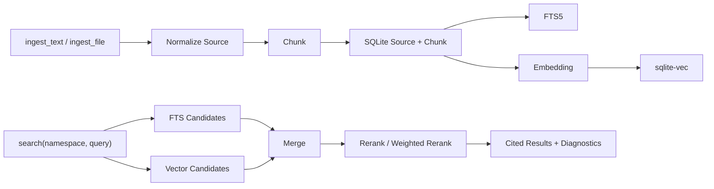

# Knowledge/RAG Runtime

## 读者该带走什么

Knowledge 是已经进入当前基线的通用 RAG runtime capability。任意 agent 可以通过 namespace 使用同一套文本入库、chunk、FTS / vector 检索、rerank、引用、删除、reindex、状态与统计能力。

它与 memory 分工明确：memory 保存用户偏好和稳定事实，Knowledge 保存可检索文档材料。

## 主流程



## 当前能力

Builtin `knowledge` 提供：

- `ingest_text`：同步写入小文本 source。
- `ingest_file`：创建大文件 ingest job。
- `ingest_status` 与 `cancel_ingest`：查询或控制 ingest job。
- `search`：按 namespace 检索并返回 source、chunk、score parts 与 diagnostics。
- `get_chunk`：读取完整 chunk。
- `delete_source`：按 namespace 软删除 source 及其检索内容。
- `reindex`：按当前 embedding 配置重建 namespace 或 source 的向量。
- `stats`：查看 namespace 与存储统计。
- `model_status` 与 `unload_models`：观察或释放懒加载的 embedding / reranker 模型。

## 数据与隔离

- SQLite 主库存放 source、chunk、namespace、embedding、vector map、ingest job 与 search run。
- 所有读写都带 namespace，namespace 是知识库逻辑隔离键。
- FTS5 负责关键词召回，sqlite-vec 负责向量召回。
- Source 删除采用软删除，search 与 get 只返回 active 内容。
- 相同 namespace 内的重复 `uri + version` 更新既有 source，减少重复结果。

## 模型与配置

公开模板位于 `config/knowledge.example.toml`，本地覆盖位于 `config/knowledge.toml`。核心配置区域包括：

- `[knowledge.chunking]`：chunk 尺寸、overlap、最大长度与 batch size。
- `[knowledge.embedding]`：provider、model、local path、dimension 与下载策略。
- `[knowledge.reranker]`：reranker model、local path 与 top N。
- `[knowledge.vector_store]`：sqlite-vec backend。
- `[knowledge.search]`：top K、candidate pool 与 ranking weights。

模型文件保存在被忽略的 `data/models/`。Runtime 启动只创建 adapter，模型在首次相关操作时懒加载；idle TTL 与 `unload_models` 控制释放。

当前默认组合来自第一版自托管与中文场景取舍：

```text
Embedding: BAAI/bge-small-zh-v1.5
Reranker: BAAI/bge-reranker-base
Vector store: SQLite + sqlite-vec
Text index: SQLite FTS5
```

## 降级与恢复

- Embedding 模型缺失：ingest 保留 source、chunk 与 FTS；search 返回 FTS 路径和 embedding diagnostics。
- sqlite-vec 扩展缺失：vector status 标记 disabled，FTS 检索继续工作。
- Reranker 缺失：使用 weighted rerank，并返回 rerank status。
- Embedding config hash 与 namespace 索引不一致：vector status 标记 config mismatch，operator 运行 `knowledge.reindex --namespace <name>` 恢复向量检索。
- Vector 索引记录不一致：返回 backend error 与 reindex 建议。
- 进程启动会把遗留 `queued/reading/chunking/embedding` job 统一收敛为 `failed + KNOWLEDGE_JOB_INTERRUPTED + retryable=true`，并清理 job-owned staging；完成、失败与取消同样走统一终态清理，另有 orphan staging 清理保护。

## Operator 管理面

- 配置 `KNOWLEDGE_OPERATOR_TOKEN` 后注册受 Bearer 保护的 `/knowledge/**` 管理路由；未配置 token 时路由保持关闭。
- Operator 可以分页查询 namespace/source/chunk/job 与 stats，流式上传 `.txt/.md`，执行显式软删除和 source/namespace reindex。
- 上传上限为 `10 MiB`，支持 UTF-8/UTF-8-SIG/GB18030，metadata 至少包含 title、license、provenance、calculation scope 与 reviewed 状态。
- `/knowledge/console` 提供 server-rendered 管理页：Operator token 登录后获得短时签名 HttpOnly/SameSite session，写操作要求 CSRF；可浏览 source/job/chunk、上传 preview、保存草稿、审核发布、检索试查、reindex 与显式删除。
- Console 中 `bazi-theory-sandbox` 显示为“草稿箱”，只承载待审核来源；`bazi-theory` 显示为“正式库”，是 Bazi Agent 唯一检索的理论 namespace。两者是同一经典书籍库的两个内容状态，不是两个同时参与解盘的知识层。
- Console 上传只进入草稿箱。导入任务完成后可预览完整 metadata 与 chunks；点击“审核通过并发布”会原样复制 chunks 和当前 embedding 到正式库，写入审核时间与来源信息，再从草稿箱软删除。正式库页面不提供上传入口。
- UI 中“导入任务”是文件读取、chunk 和 embedding 的处理记录；审核发布是来源详情页上的同步管理动作，不创建第二条导入任务。
- Preview 展示 digest、metadata、source identity、全部 chunks 和长度分布；上传可调整 `target_chars`、`overlap_chars`、`max_chars`，参数随 source metadata 保存。
- `[knowledge.embedding_profiles.<profile_id>]` 声明可选择的 namespace embedding profile；同一 namespace 不混用向量空间。profile 切换先生成全部新向量，成功后一次性替换，失败保留原索引。
- 检索试查支持临时 top K、candidate pool 与归一化 ranking weights，不修改生产默认值。
- Console 与 HTTP 管理面、agent tool 共享同一 KnowledgeService；非法 namespace 直接返回 `422 KNOWLEDGE_NAMESPACE_INVALID`，不得回退到默认 namespace；agent action/namespace scope 不授予 Operator 权限。

## Corpus release 与质量证据

- `corpora/<namespace>/<version>/manifest.toml` 固定 release id、source identity、digest、reviewed metadata、许可、来源、篇章和计算适用范围；validator 在写库前拒绝重复 identity、digest 漂移、非法 namespace 与不完整 metadata。
- `plan/publish` 采用 additive、幂等语义：create/update/unchanged 明确可见，manifest 外的 active source 只报告 drift，不自动删除；已发布 source 缺失当前 embedding 时会显式 reindex 修复。
- `evals/cases/knowledge_corpus/` 与 `scripts/eval_knowledge_corpus.py` 生成 release-bound retrieval 报告，拒绝 manifest 外 drift，并记录 manifest/gold digest、base commit、候选代码树 SHA256、逻辑数据库快照、Knowledge config/model、逐 case evidence 与 Recall@K/MRR/引用完整率。
- 当前正式 release 为 `bazi-theory-classics-structured-v2`：六本经典拆为 9 个证据类型明确的 source、402 chunks；《子平真诠》原文、现代解读和命例分离，manifest drift 为 0。
- v2 的 24-case 概念评估达到 Recall@1 `70.8%`、Recall@3 `95.8%`、Recall@5 `100%`、MRR `82.3%` 和 citation completeness `100%`，默认检索没有课程或命例命中。
- 本地长期运行的 `bazi-theory` 可能同时保留 manifest 外旧 source；它们属于显式 drift，Operator 必须审查后再删除或迁移，release 工具不得替用户自动清理。

## 架构边界

- Knowledge 是 runtime capability，领域 agent 与采集 adapter由上层扩展承担。
- LLM 根据 capability description 与 `knowledge_management` skill 选择调用时机。
- Tool 和 service 承担参数、权限、持久化、检索与诊断。
- 模型资产留在本地目录，普通 runtime 启动保持轻量。
- Embedding 空间切换采用显式 reindex，索引记录保存 model id、dimension 与 config hash。
- `evidence_kind` 区分古籍原文、历代注解、现代注解、Marten 释义、课程讲义和命例；默认理论检索排除课程与命例。
- Console AI 解释最多使用 3 条检索证据，只执行一次模型请求，不进入 Bazi Agent；无直接证据时不调用模型并明确拒答。
- Knowledge 可配置启动预热并保持本地模型常驻；检索与回答结果分别报告 embedding/FTS/vector/rerank 和 retrieval/generation/total 耗时。

## 验证基线

当前测试与 eval 覆盖：

- 配置、chunking、store、embedding、reranker 与 vector adapter。
- Namespace 隔离、软删除、FTS / vector / hybrid retrieval 与 metadata filter。
- Config mismatch、缺模型、缺 sqlite-vec 与 backend error 诊断。
- Ingest job 状态、取消、tool schema、runtime capability 与 skill 行为。
- `knowledge_retrieval` eval 的关键词召回、语义召回、rerank、namespace isolation、config mismatch、进度与 delete behavior。
- Corpus publisher 的首次发布、重复发布、缺向量修复、namespace reindex、显式删除后重放，以及 corpus grader 的版本匹配与指标计算。
- Knowledge Console 的登录/cookie/session、CSRF、非法 namespace、preview/草稿导入、审核发布、正式库检索、source detail、reindex 与显式删除。

## 后续真实性能基准

真实 provider 的端到端延迟基准延期到 RAG 继续完善之后执行。触发条件是目标 namespace 的语料范围、chunking、embedding、reranker、candidate pool、提示词和最终输出契约已经稳定，避免检索与上下文形态持续变化时得到不可复用的延迟结论。

- Scripted eval 继续负责工具顺序、检索降级、引用和输出契约，不作为真实模型延迟证据。
- 稳定性 smoke 先使用同一输入连续运行 3 次，逐次报告耗时、模型请求数、tokens、retry 与 fallback；3 次样本只报告 median 和 max，不计算或宣称可靠 p95。
- 正式 live benchmark 每个固定场景至少完成 20 次有效请求，记录 HTTP/runtime/provider 阶段耗时、p50、p95、失败率、retry/fallback、模型请求数和累计 tokens。
- 基准场景至少覆盖无 RAG、FTS 降级、hybrid rerank 和代表性长上下文检索；不同语料版本、模型 profile 或检索配置不得混入同一统计样本。
- 该基准用于确认 RAG 完善后的生产延迟预算和长尾风险，不阻塞当前 Bazi/RAG 功能提交。

## 当前受管理变化

Knowledge 产品方向分两阶段管理：

- `.cs/epics/002-o-knowledge-corpus-quality/spec.md`：经典书籍 release contract、Knowledge Console、v2 结构化经典、概念问答、AI 解释、模型预热与发布/恢复演练已实现；Epic 保持 open，正式性能基准按用户决策延期。
- `.cs/epics/003-o-bazi-case-library/spec.md`：下一阶段，交付结构化私有/共享案例、对话保存、可重建检索投影和 theory-first/case-second 双层推理。

## 旧迭代材料吸收结论

第一版 design、execution plan 与 selection research 的长期结论已进入本页和 `.cs/notes/005-knowledge-runtime-selection-history.md`。实现证据位于代码、测试、配置与 eval，架构时间线由 `docs/ARCHITECTURE_CHANGELOG.md` 维护。

本页吸收长期仍成立的能力、边界、降级、配置和质量约束。原迭代文档继续保留为历史证据，其 `status: draft` 代表旧文档元数据，当前实现状态由代码、测试、changelog 与本 spec 共同确认。

## 证据索引

- `.cs/notes/005-knowledge-runtime-selection-history.md`
- `docs/ARCHITECTURE_CHANGELOG.md`
- `docs/CONFIG_SURFACES.md`
- `src/marten_runtime/knowledge/`
- `src/marten_runtime/tools/builtins/knowledge_tool.py`
- `skills/knowledge_management/SKILL.md`
- `config/knowledge.example.toml`
- `evals/suites/knowledge_retrieval.toml`
- `tests/test_knowledge_*.py`
