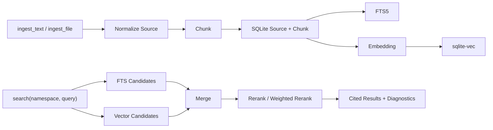

# Knowledge/RAG Runtime

## 读者该带走什么

Knowledge 是已经进入当前基线的通用 RAG runtime capability。任意 agent 可以通过 namespace 使用同一套文本入库、chunk、FTS / vector 检索、rerank、引用、删除、reindex、状态与统计能力。

它与 memory 分工明确：memory 保存用户偏好和稳定事实，Knowledge 保存可检索文档材料。

## 主流程



## 当前能力

Builtin `knowledge` 提供：

- `ingest_text`：同步写入小文本 source。
- `ingest_file`：创建大文件 ingest job。
- `ingest_status` 与 `cancel_ingest`：查询或控制 ingest job。
- `search`：按 namespace 检索并返回 source、chunk、score parts 与 diagnostics。
- `get_chunk`：读取完整 chunk。
- `delete_source`：按 namespace 软删除 source 及其检索内容。
- `reindex`：按当前 embedding 配置重建 namespace 或 source 的向量。
- `stats`：查看 namespace 与存储统计。
- `model_status` 与 `unload_models`：观察或释放懒加载的 embedding / reranker 模型。

## 数据与隔离

- SQLite 主库存放 source、chunk、namespace、embedding、vector map、ingest job 与 search run。
- 所有读写都带 namespace，namespace 是知识库逻辑隔离键。
- FTS5 负责关键词召回，sqlite-vec 负责向量召回。
- Source 删除采用软删除，search 与 get 只返回 active 内容。
- 相同 namespace 内的重复 `uri + version` 更新既有 source，减少重复结果。

## 模型与配置

公开模板位于 `config/knowledge.example.toml`，本地覆盖位于 `config/knowledge.toml`。核心配置区域包括：

- `[knowledge.chunking]`：chunk 尺寸、overlap、最大长度与 batch size。
- `[knowledge.embedding]`：provider、model、local path、dimension 与下载策略。
- `[knowledge.reranker]`：reranker model、local path 与 top N。
- `[knowledge.vector_store]`：sqlite-vec backend。
- `[knowledge.search]`：top K、candidate pool 与 ranking weights。

模型文件保存在被忽略的 `data/models/`。Runtime 启动只创建 adapter，模型在首次相关操作时懒加载；idle TTL 与 `unload_models` 控制释放。

当前默认组合来自第一版自托管与中文场景取舍：

```text
Embedding: BAAI/bge-small-zh-v1.5
Reranker: BAAI/bge-reranker-base
Vector store: SQLite + sqlite-vec
Text index: SQLite FTS5
```

## 降级与恢复

- Embedding 模型缺失：ingest 保留 source、chunk 与 FTS；search 返回 FTS 路径和 embedding diagnostics。
- sqlite-vec 扩展缺失：vector status 标记 disabled，FTS 检索继续工作。
- Reranker 缺失：使用 weighted rerank，并返回 rerank status。
- Embedding config hash 与 namespace 索引不一致：vector status 标记 config mismatch，operator 运行 `knowledge.reindex --namespace <name>` 恢复向量检索。
- Vector 索引记录不一致：返回 backend error 与 reindex 建议。
- 当前进程重启尚未自动收敛 `queued/reading/chunking/embedding` ingest job，旧 job 可能永久停留在中间态。Bazi 变化线将补充统一 `failed + KNOWLEDGE_JOB_INTERRUPTED + retryable=true` 恢复、job-owned staging 清理与 Operator 管理 API；实现完成并关闭后再把该能力毕业为当前真相。

## 架构边界

- Knowledge 是 runtime capability，领域 agent 与采集 adapter由上层扩展承担。
- LLM 根据 capability description 与 `knowledge_management` skill 选择调用时机。
- Tool 和 service 承担参数、权限、持久化、检索与诊断。
- 模型资产留在本地目录，普通 runtime 启动保持轻量。
- Embedding 空间切换采用显式 reindex，索引记录保存 model id、dimension 与 config hash。

## 验证基线

当前测试与 eval 覆盖：

- 配置、chunking、store、embedding、reranker 与 vector adapter。
- Namespace 隔离、软删除、FTS / vector / hybrid retrieval 与 metadata filter。
- Config mismatch、缺模型、缺 sqlite-vec 与 backend error 诊断。
- Ingest job 状态、取消、tool schema、runtime capability 与 skill 行为。
- `knowledge_retrieval` eval 的关键词召回、语义召回、rerank、namespace isolation、config mismatch、进度与 delete behavior。

## 后续真实性能基准

真实 provider 的端到端延迟基准延期到 RAG 继续完善之后执行。触发条件是目标 namespace 的语料范围、chunking、embedding、reranker、candidate pool、提示词和最终输出契约已经稳定，避免检索与上下文形态持续变化时得到不可复用的延迟结论。

- Scripted eval 继续负责工具顺序、检索降级、引用和输出契约，不作为真实模型延迟证据。
- 稳定性 smoke 先使用同一输入连续运行 3 次，逐次报告耗时、模型请求数、tokens、retry 与 fallback；3 次样本只报告 median 和 max，不计算或宣称可靠 p95。
- 正式 live benchmark 每个固定场景至少完成 20 次有效请求，记录 HTTP/runtime/provider 阶段耗时、p50、p95、失败率、retry/fallback、模型请求数和累计 tokens。
- 基准场景至少覆盖无 RAG、FTS 降级、hybrid rerank 和代表性长上下文检索；不同语料版本、模型 profile 或检索配置不得混入同一统计样本。
- 该基准用于确认 RAG 完善后的生产延迟预算和长尾风险，不阻塞当前 Bazi/RAG 功能提交。

## 旧迭代材料吸收结论

`easysdd/features/2026-05-19-knowledge-rag-runtime/` 的 design、execution plan 与 selection research 记录了这项能力进入基线前的方案、推进顺序和技术选型。实现已经存在于代码、测试、配置与 eval 中，架构时间线也在 `docs/ARCHITECTURE_CHANGELOG.md` 记录了 2026-05-19 基线。

本页吸收长期仍成立的能力、边界、降级、配置和质量约束。原迭代文档继续保留为历史证据，其 `status: draft` 代表旧文档元数据，当前实现状态由代码、测试、changelog 与本 spec 共同确认。

## 证据索引

- `easysdd/features/2026-05-19-knowledge-rag-runtime/knowledge-rag-runtime-design.md`
- `easysdd/features/2026-05-19-knowledge-rag-runtime/knowledge-rag-runtime-execution-plan.md`
- `easysdd/features/2026-05-19-knowledge-rag-runtime/knowledge-rag-runtime-selection-research.md`
- `docs/ARCHITECTURE_CHANGELOG.md`
- `docs/CONFIG_SURFACES.md`
- `src/marten_runtime/knowledge/`
- `src/marten_runtime/tools/builtins/knowledge_tool.py`
- `skills/knowledge_management/SKILL.md`
- `config/knowledge.example.toml`
- `evals/suites/knowledge_retrieval.toml`
- `tests/test_knowledge_*.py`
