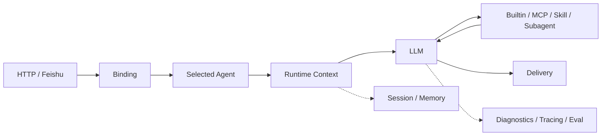

# 运行主链与架构边界

## 读者该带走什么

`marten-runtime` 的核心产品是单条交互式 agent 执行主链。路由、上下文、工具、投递、诊断和窄扩展都围绕这条路径协作。

## 一次 turn 怎样完成

1. Channel 接收结构化 ingress，并提供 channel、user、conversation 与 message identity。
2. Binding 根据声明式规则确定默认 agent；请求也可以携带 `requested_agent_id` 选择已配置 agent。
3. Selected agent 决定 prompt 资产、允许的工具面、prompt mode 与 model profile。
4. Runtime 组装当前请求、session replay、compaction summary、memory、skill heads 与 capability catalog。
5. LLM 直接回答，或选择 builtin family、MCP、skill、Knowledge、memory、automation、session、subagent 等能力。
6. Tool result 回到同一运行时回合，LLM 继续生成最终结果；窄范围 deterministic recovery 只处理已经获得的结构化结果。
7. Channel renderer 与 delivery 完成最终投递，run / trace diagnostics 保存执行证据。

## Thin harness 责任边界

宿主负责：

- Channel ingress、binding、agent selection 与 delivery。
- Runtime context assembly、持久化恢复与有界压缩。
- Capability catalog、tool schema、权限、作用域与副作用检查。
- Tool 执行、timeout、retry、failover、错误归一化与恢复。
- Diagnostics、tracing、eval 接线与机器可验证契约。

模型负责：

- 理解普通自然语言意图。
- 选择能力 family、skill 或 MCP server。
- 组合多步工具调用。
- 基于工具结果形成面向用户的回答。

结构化入口可以采用确定性绑定，例如 slash command、按钮 action、已绑定的 tool follow-up 与 freshness contract。它们由机器可验证协议提供语义。

## Agent 资产模型

Agent 是运行时身份与行为资产边界：

- `config/agents.toml` 声明 runtime-visible agent id、`asset_root`、`allowed_tools`、`prompt_mode` 与 `model_profile`。
- `agents/<agent_id>/` 保存 `AGENTS.md`、`BOOTSTRAP.md`、`SOUL.md`、`TOOLS.md` 等 prompt 资产。
- `config/bindings.toml` 保存 channel / user / conversation 到 agent 的默认路由。
- Diagnostics 暴露 default 与 selected agent，便于确认一次 turn 的真实身份。

## 能力暴露方式

默认能力面采用 progressive disclosure：

- Skill 先暴露摘要，通过 `skill` family 按需加载正文。
- MCP 先暴露 server / family 摘要，通过 `mcp` family 按需查看并调用具体工具。
- Builtin 能力使用稳定 family schema。
- Agent 的 `allowed_tools` 限定当前可见能力边界。

能力数量可以增长，首轮 prompt 仍保持紧凑，宿主也能维持声明式边界。

## 长期约束

- 普通自然语言的 family routing 留在模型路径。
- 新能力优先采用 builtin family、MCP sidecar、skill 或 bounded support slice。
- Channel presentation 保持薄边界，业务语义由模型与能力契约承担。
- Runtime hardening 聚焦真实失败：并发 turn、provider 抖动、长上下文、工具 follow-up、投递与诊断。
- 平台化方向需要主链压力与明确边界作为进入条件。

## 证据索引

- `docs/architecture/adr/0001-thin-harness-boundary.md`
- `docs/architecture/adr/0002-progressive-disclosure-default-surface.md`
- `docs/architecture/adr/0004-llm-first-tool-routing-boundary.md`
- `docs/ARCHITECTURE_EVOLUTION.md`
- `src/marten_runtime/runtime/`
- `src/marten_runtime/interfaces/http/bootstrap_runtime.py`
- `src/marten_runtime/interfaces/http/runtime_tool_registration.py`
- `config/agents.toml`
- `config/bindings.toml`
