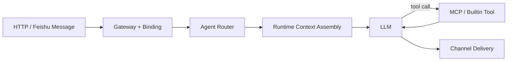

# marten-runtime

<div align="center">

Simplified openclaw-style private agent runtime for `channel -> binding -> agent -> LLM -> MCP -> skill -> LLM -> channel`.

[中文文档](./README_CN.md) · [Docs Index](./docs/README.md) · [Harness Design](./docs/2026-03-29-private-agent-harness-design.md) · [Config Surfaces](./docs/CONFIG_SURFACES.md)


</div>

`marten-runtime` is a lightweight private-agent runtime built around one narrow goal: host your own agents, MCP servers, and skills without turning the harness into a workflow platform. The project keeps the control surface thin and pushes most intelligence into `LLM + agent + MCP + skill`.

## Overview

- `LLM + agent + MCP + skill` first
- `harness-thin, policy-hard, workflow-light`
- Channel-aware binding and multi-agent routing
- Runtime context assembly with replayed session context and live skill activation
- OpenAI-compatible provider support with retry/backoff normalization
- Feishu websocket ingress plus thin HTTP operator surface

## Why This Exists

Many agent projects either stop at prompt demos or expand too early into queues, planners, and heavy orchestration. `marten-runtime` is intentionally narrower: it focuses on the executable private-agent spine first and defers heavier durability and workflow machinery until the main chain is already stable.

Current center of gravity:

`channel -> binding -> agent -> LLM -> MCP -> skill -> LLM -> channel`

That is the path this repository optimizes for. If a change does not make that path clearer, safer, or easier to operate, it is probably not a priority.

## At A Glance

| Layer | Responsibility |
| --- | --- |
| `channel` | HTTP and Feishu ingress, progress, final delivery |
| `binding` | route channel/user/conversation to the intended agent |
| `agent` | app-local policy, allowed tools, bootstrap prompt |
| `runtime` | context assembly, model calls, tool loop, diagnostics |
| `capabilities` | MCP tools and file-based skills |

## Core Flow



## Highlights

- Stable binding rules let one runtime host multiple agents without hard-coded channel logic
- Runtime context assembly replays session history and injects active skill bodies into the live LLM request
- MCP remains a first-class capability surface without turning the harness into a workflow engine
- Feishu delivery keeps hidden progress, single final delivery, dedupe, and self-message ignore semantics
- Provider retry/backoff reduces random upstream timeout breakage on the main chain

## Architecture

`marten-runtime` is optimized around one stable path:

`channel -> binding -> agent -> LLM -> MCP -> skill -> LLM -> channel`

That path is the project center of gravity. If a change does not make this chain clearer, safer, or easier to operate, it should be treated as low priority.

Key references:

- [Private Agent Harness Design](./docs/2026-03-29-private-agent-harness-design.md)
- [Private Agent Harness Plan](./docs/plans/2026-03-29-private-agent-harness-plan.md)
- [Architecture Audit](./docs/ARCHITECTURE_AUDIT.md)
- [Config Surfaces](./docs/CONFIG_SURFACES.md)
- [Live Verification Checklist](./docs/LIVE_VERIFICATION_CHECKLIST.md)

## Current Scope

Milestone A from the private harness plan is implemented:

- gateway binding + multi-agent routing
- runtime context assembly + live context rehydration
- skills as first-class runtime inputs
- provider retry/backoff resilience

Milestone B is intentionally not implemented yet:

- per-conversation serialization
- durable session persistence

Also out of scope for now:

- queue-first execution
- durable delivery outbox
- heartbeat / cron / proactive jobs
- hybrid memory promotion
- planner / swarm orchestration

## Repository Layout

- `src/marten_runtime/`: runtime, channels, MCP, skills, sessions, diagnostics
- `config/*.toml`: runtime-wide policy and defaults
- `config/bindings.toml`: channel/user/conversation to agent binding rules
- `apps/<app_id>/app.toml`: app manifest
- `apps/<app_id>/*.md`: bootstrap assets compiled into the runtime prompt
- `skills/`: shared file-based skills
- `.env.example`: local secret template
- `mcps.example.json`: MCP connection template
- `docs/`: design notes, checklists, plans, and configuration references
- `tests/`: unit and contract coverage for the runtime spine

## Getting Started

### Requirements

- Python `3.11`, `3.12`, or `3.13`
- a working OpenAI-compatible provider credential
- optional Feishu and MCP credentials for live integration tests

### Install

```bash
python3.11 -m venv .venv
source .venv/bin/activate
python -m pip install --upgrade pip
pip install -r requirements.txt
pip install -e .
```

### Configure

```bash
cp .env.example .env
cp mcps.example.json mcps.json
```

Configuration boundaries:

- `.env`: secrets and machine-local overrides only
- `mcps.json`: live MCP server definitions only
- `config/*.example.toml`: published template defaults
- `config/*.toml`: optional local overrides for the corresponding example file
- `apps/<app_id>/*.md`: bootstrap and agent behavior assets

Minimal practical setup:

- set one provider key in `.env`, for example `MINIMAX_API_KEY` or `OPENAI_API_KEY`
- optionally copy `config/*.example.toml` to `config/*.toml` only for local overrides
- add MCP servers to `mcps.json` only when you need external tools
- enable Feishu through a local `config/channels.toml` only when you have a live bot app

Published config shape:

- committed: `config/agents.toml`, `config/bindings.toml`, `config/*.example.toml`
- ignored local overrides: `config/platform.toml`, `config/models.toml`, `config/channels.toml`, `config/mcp.toml`

## Privacy And Open-Source Hygiene

This repository is prepared for public hosting with template-first config:

- commit `.env.example`, never real `.env`
- commit `mcps.example.json`, never real `mcps.json`
- keep secrets in local environment or local ignored files
- keep operator-specific runtime snapshots, tokens, and chat identifiers out of docs

The default `.gitignore` already excludes local secrets, MCP connection files, local databases, and runtime artifacts.

## Run

```bash
PYTHONPATH=src python -m marten_runtime.interfaces.http.serve
```

Useful endpoints:

- `GET /healthz`
- `GET /readyz`
- `GET /metrics`
- `POST /sessions`
- `POST /messages`
- `GET /diagnostics/runtime`
- `GET /diagnostics/session/{session_id}`
- `GET /diagnostics/run/{run_id}`
- `GET /diagnostics/trace/{trace_id}`

## Testing

Targeted Milestone A regression suite:

```bash
PYTHONPATH=src python -m unittest tests.test_bindings tests.test_router tests.test_runtime_context tests.test_skills tests.test_runtime_loop tests.test_provider_retry tests.test_feishu -v
```

Full suite:

```bash
PYTHONPATH=src python -m unittest -v
```

## Documentation

Recommended reading order:

1. [docs/README.md](./docs/README.md)
2. [docs/2026-03-29-private-agent-harness-design.md](./docs/2026-03-29-private-agent-harness-design.md)
3. [docs/plans/2026-03-29-private-agent-harness-plan.md](./docs/plans/2026-03-29-private-agent-harness-plan.md)
4. [docs/CONFIG_SURFACES.md](./docs/CONFIG_SURFACES.md)
5. [docs/ARCHITECTURE_AUDIT.md](./docs/ARCHITECTURE_AUDIT.md)
6. [docs/LIVE_VERIFICATION_CHECKLIST.md](./docs/LIVE_VERIFICATION_CHECKLIST.md)
