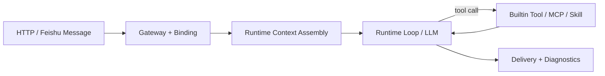

# marten-runtime

<div align="center">

Simplified openclaw-style agent runtime harness for `channel -> binding -> runtime loop -> builtin tool / MCP / skill -> delivery / diagnostics`.

[中文文档](./README_CN.md) · [Docs Index](./docs/README.md) · [Deployment Guide](./docs/DEPLOYMENT.md) · [Architecture Evolution](./docs/ARCHITECTURE_EVOLUTION.md) · [Architecture Changelog](./docs/ARCHITECTURE_CHANGELOG.md) · [ADR Index](./docs/architecture/adr/README.md) · [Config Surfaces](./docs/CONFIG_SURFACES.md)


</div>

`marten-runtime` is a lightweight agent runtime harness built around one narrow goal: host your own agents, MCP servers, and skills without turning the harness into a workflow platform. The project keeps the control surface thin and pushes most intelligence into `LLM + agent + MCP + skill`.

## Overview

- `LLM + agent + MCP + skill` first
- `harness-thin, policy-hard, workflow-light`
- Channel-aware binding and multi-agent routing
- Runtime context assembly with governed replay, compacted working context, and live skill activation
- OpenAI-compatible provider support with retry/backoff normalization
- Feishu websocket ingress plus thin HTTP operator surface

## Why This Exists

Many agent projects either stop at prompt demos or expand too early into queues, planners, and heavy orchestration. `marten-runtime` is intentionally narrower: it focuses on the executable agent runtime spine first and defers heavier durability and workflow machinery until the main chain is already stable.

Current center of gravity:

`channel -> binding -> runtime loop -> builtin tool / MCP / skill -> delivery / diagnostics`

That is the path this repository optimizes for. If a change does not make that path clearer, safer, or easier to operate, it is probably not a priority.

## At A Glance

| Layer | Responsibility |
| --- | --- |
| `channel` | HTTP and Feishu ingress, progress, final delivery |
| `binding` | route channel/user/conversation to the intended agent |
| `agent` | app-local policy, allowed tools, bootstrap prompt |
| `runtime` | context assembly, model calls, tool loop, diagnostics |
| `capabilities` | MCP tools and file-based skills |

## Core Flow



## Highlights

- Stable binding rules let one runtime host multiple agents without hard-coded channel logic
- Runtime context assembly replays session history and injects active skill bodies into the live LLM request
- MCP remains a first-class capability surface without turning the harness into a workflow engine
- Feishu delivery keeps hidden progress, single final delivery, dedupe, and self-message ignore semantics
- Provider retry/backoff reduces random upstream timeout breakage on the main chain

## Upgrade Notes

Latest MVP-facing changes:

- renamed the default runtime app to `main_agent` and repositioned its prompt assets around a primary execution-agent stance
- enabled selected-agent app-manifest / bootstrap switching and per-agent model-profile switching on the live runtime path
- standardized session persistence on SQLite, with bounded restart restore and explicit `session.new` / `session.resume` control
- split provider ownership across `config/providers.toml` and `config/models.toml`, with `provider_ref` and `fallback_profiles` driving failover
- removed the legacy routable `assistant` runtime-agent alias from the live registry surface and canonicalized runtime agent ids to `main`
- added a narrow GitHub hot-repos automation path driven by the `automation` family tool with `action=register`, manual trigger entrypoints, isolated automation turns, and final-channel delivery
- moved automation CRUD and presentation into direct store-backed runtime ownership while keeping automation lifecycle logic outside the tool surface
- added the builtin `automation` family tool for recurring-job register/list/detail/update/delete/pause/resume flows
- added the shared `Automation Management` skill so CRUD intent stays in `LLM + skill`, while store mutation stays in builtin tools
- replaced the temporary GitHub skill approximation with one thin repo-local MCP sidecar for trending retrieval, while keeping the rest of the runtime GitHub surface MCP-first
- added same-conversation FIFO queueing so same `channel_id + conversation_id` turns serialize for HTTP `/messages` and Feishu interactive ingress
- strengthened provider resilience with retryable `429` / `502` / `503` / `504` normalization and stable provider-specific runtime error codes
- strengthened Feishu live-chain observability with run-level `tool_calls`, `llm_request_count`, and websocket diagnostics exposing the latest inbound `session_id`, `run_id`, and runtime trace correlation
- hardened Feishu ingress by suppressing semantic duplicate replays, isolating runtime-handler failures to a single message, ignoring blank-text inbound events, and keeping duplicate websocket replays from clobbering the last accepted status
- added a narrow self-improve loop that records repeated failures plus later recoveries, synthesizes lesson candidates through a dedicated skill, gates them through a structured LLM judgment plus deterministic checks, and injects accepted active lessons from runtime-managed `SYSTEM_LESSONS.md`
- added a direct store-backed self-improve management surface so the default main agent can inspect candidate lessons and delete bad candidates through natural-language turns without exposing raw SQL or table names

## Architecture

`marten-runtime` is optimized around one stable path:

`channel -> binding -> runtime loop -> builtin tool / MCP / skill -> delivery / diagnostics`

That path is the project center of gravity. If a change does not make this chain clearer, safer, or easier to operate, it should be treated as low priority.

Primary reading path:

- [Docs Index](./docs/README.md)
- [Architecture Evolution](./docs/ARCHITECTURE_EVOLUTION.md)
- [Architecture Changelog](./docs/ARCHITECTURE_CHANGELOG.md)
- [ADR Index](./docs/architecture/adr/README.md)
- [Config Surfaces](./docs/CONFIG_SURFACES.md)
- [Live Verification Checklist](./docs/LIVE_VERIFICATION_CHECKLIST.md)

Historical design documents are intentionally secondary. Read them only when the changelog, evolution guide, or ADRs are not enough.

## Current Scope

The current MVP A/B path is implemented:

- multi-main-agent private config loading and stable routing precedence
- explicit HTTP `requested_agent_id` routing from inbound request to selected agent
- selected agent identity propagation into live LLM request inputs
- selected agent app-manifest / bootstrap switching on the live runtime path
- selected agent model-profile switching through `config/agents.toml`
- runtime context assembly with governed replay, compacted working context, and long-dialogue regression coverage
- durable SQLite session persistence with cross-restart bounded restore
- explicit session catalog control through `session.new` and `session.resume`, plus background source-session compaction
- thin file-backed user memory as one bounded continuity slice for explicit cross-session user facts and preferences, separate from session history and self-improve lessons
- skills as first-class runtime inputs
- provider retry/backoff resilience
- profile-level provider failover through `provider_ref` and `fallback_profiles`

Also out of scope for now:

- queue-first execution
- durable delivery outbox
- hybrid memory promotion
- planner / swarm orchestration

Implemented narrow extensions:

- chat-registered recurring digest records plus manual isolated-trigger execution for GitHub hot repos
- direct store-backed automation resource CRUD with the builtin `automation` family surface kept stable for the LLM
- internal self-improve automation that summarizes failure/recovery evidence into candidate lessons
- main-agent-facing self-improve candidate inspection and candidate-only deletion through skill-routed builtin tools backed by runtime-owned stores
- both paths stay on builtin tools plus skills instead of introducing a worker-first platform

## Repository Layout

- `src/marten_runtime/`: runtime, channels, MCP, skills, sessions, diagnostics
- `config/*.toml`: runtime-wide policy and defaults
- `config/bindings.toml`: channel/user/conversation to agent binding rules
- `apps/<app_id>/app.toml`: app manifest
- `apps/<app_id>/*.md`: bootstrap assets compiled into the runtime prompt
- `skills/`: shared file-based skills
- `.env.example`: local secret template
- `mcps.example.json`: MCP connection template
- `docs/`: design notes, checklists, plans, and configuration references
- `tests/`: unit and contract coverage for the runtime spine

## Getting Started

### Fastest local bootstrap

```bash
./init.sh
```

`./init.sh` is the recommended shortest path for a fresh local checkout. It creates or reuses `.venv`, installs dependencies, copies `.env` / `mcps.json` from templates when missing, prints the canonical startup command, and runs a temporary local smoke against `/healthz`, `/readyz`, and `/diagnostics/runtime`.

Useful variants:

- `./init.sh --skip-install`: reuse the existing virtualenv and skip dependency installation, but still run readiness checks and local smoke
- `./init.sh --smoke-only`: assume the workspace is already initialized and run only readiness checks plus the temporary local smoke

If you want the shortest deployment-oriented reading path, start with [docs/DEPLOYMENT.md](./docs/DEPLOYMENT.md).

If you want the shortest container entry, use `docker compose up -d --build` from the repository root.

### Requirements

- Python `3.11`, `3.12`, or `3.13`
- a working OpenAI-compatible provider credential
- optional Feishu and MCP credentials for live integration tests

### Install

```bash
python3.11 -m venv .venv
source .venv/bin/activate
python -m pip install --upgrade pip
pip install -r requirements.txt
pip install -e .
```

Use the manual path above when you want to run each setup step yourself instead of the one-shot `./init.sh`.

### Configure

```bash
cp .env.example .env
cp mcps.example.json mcps.json
```

Configuration boundaries:

- `.env`: secrets and machine-local overrides only
- `mcps.json`: live MCP server definitions and optional tool hints
- `config/agents.toml`: runtime agent registry, app binding, tool surface, and model profile selection
- `config/*.example.toml`: published template defaults
- `config/*.toml`: optional local overrides for the corresponding example file
- `apps/<app_id>/*.md`: bootstrap and agent behavior assets

Minimal practical setup:

- set provider secrets in `.env`; the committed shortest paths are `OPENAI_API_KEY`, `MINIMAX_API_KEY`, and `KIMI_API_KEY`
- keep provider connection metadata in `config/providers.toml`
- keep model/profile selection in `config/models.toml`
- keep per-agent app/profile/tool selection in `config/agents.toml`
- set `default_profile` or update `profiles.openai_gpt5` / `profiles.minimax_m25` / `profiles.kimi_k2` when you want another live profile
- set `LANGFUSE_BASE_URL`, `LANGFUSE_PUBLIC_KEY`, and `LANGFUSE_SECRET_KEY` in `.env` when you want external tracing in Langfuse
- optionally copy `config/*.example.toml` to `config/*.toml` only for local overrides
- add MCP servers to `mcps.json` only when you need external tools
- enable Feishu through a local `config/channels.toml` only when you have a live bot app

Published config shape:

- committed: `config/agents.toml`, `config/bindings.toml`, `config/*.example.toml`
- ignored local overrides: `config/platform.toml`, `config/providers.toml`, `config/models.toml`, `config/channels.toml`

## Privacy And Open-Source Hygiene

This repository is prepared for public hosting with template-first config:

- commit `.env.example`, never real `.env`
- commit `mcps.example.json`, never real `mcps.json`
- keep secrets in local environment or local ignored files
- keep operator-specific runtime snapshots, tokens, and chat identifiers out of docs

The default `.gitignore` already excludes local secrets, MCP connection files, local databases, and runtime artifacts.

## Run

```bash
PYTHONPATH=src python -m marten_runtime.interfaces.http.serve
```

Useful endpoints:

- `GET /healthz`
- `GET /readyz`
- `GET /metrics`
- `POST /sessions`
- `POST /messages`
- `GET /automations`
- `GET /diagnostics/runtime`
- `GET /diagnostics/session/{session_id}`
- `GET /diagnostics/run/{run_id}`
- `GET /diagnostics/trace/{trace_id}`

Run diagnostics include `llm_request_count` and `tool_calls`, so operator checks can verify whether a turn stayed on the intended `LLM -> tool -> LLM` path.
Run diagnostics also expose `provider_ref`, `attempted_profiles`, `attempted_providers`, `failover_trigger`, `failover_stage`, and `final_provider_ref`.

Langfuse observability is now supported as an optional tracing surface:

- `GET /diagnostics/runtime` exposes `observability.langfuse.enabled`, `healthy`, `configured`, `base_url`, and the current config reason
- `GET /diagnostics/run/{run_id}` exposes `external_observability.langfuse_trace_id` and `external_observability.langfuse_url`
- `GET /diagnostics/trace/{trace_id}` exposes `external_refs.langfuse_trace_id` and `external_refs.langfuse_url`
- one runtime turn maps to one Langfuse trace, each LLM round maps to one generation, and builtin/MCP tool calls map to tool spans
- `enabled` reports whether the runtime still has Langfuse capability wired in, while `healthy` reports whether the most recent Langfuse client call succeeded
- live validation in this environment confirmed plain chat, multi-tool, and parent/child subagent traces against Langfuse cloud

For Feishu live debugging, use this correlation path:

- `channels.feishu.websocket.last_run_id` from `GET /diagnostics/runtime`
- `GET /diagnostics/run/{run_id}` to read tool calls and the runtime `trace_id`
- `GET /diagnostics/trace/{trace_id}` using that runtime `trace_id`

Do not treat `channels.feishu.websocket.last_trace_id` as the runtime trace. That field is the raw Feishu websocket trace header. Use `last_runtime_trace_id` or the `trace_id` from run diagnostics for runtime correlation.

## Testing

Targeted Milestone A regression suite:

```bash
PYTHONPATH=src python -m unittest \
  tests.test_bindings \
  tests.test_router \
  tests.test_runtime_context \
  tests.test_skills \
  tests.test_provider_retry \
  tests.runtime_loop.test_forced_routes \
  tests.runtime_loop.test_direct_rendering_paths \
  tests.runtime_loop.test_tool_followup_and_recovery \
  tests.runtime_loop.test_context_status_and_usage \
  tests.runtime_loop.test_automation_and_trending_routes \
  tests.feishu.test_rendering \
  tests.feishu.test_delivery \
  tests.feishu.test_websocket_service \
  -v
```

Full suite:

```bash
PYTHONPATH=src python -m unittest -v
```

Latest local result: `269` tests green.

## Documentation

Recommended reading order:

1. [docs/README.md](./docs/README.md)
2. [docs/ARCHITECTURE_EVOLUTION.md](./docs/ARCHITECTURE_EVOLUTION.md)
3. [docs/ARCHITECTURE_CHANGELOG.md](./docs/ARCHITECTURE_CHANGELOG.md)
4. [docs/architecture/adr/README.md](./docs/architecture/adr/README.md)
5. [docs/CONFIG_SURFACES.md](./docs/CONFIG_SURFACES.md)
6. [docs/LIVE_VERIFICATION_CHECKLIST.md](./docs/LIVE_VERIFICATION_CHECKLIST.md)
7. [docs/archive/README.md](./docs/archive/README.md)

## Recent Updates

- GitHub trending now runs through one thin repo-local MCP sidecar: `github_trending.trending_repositories`.
- The removed legacy `github_hot_repos_digest` skill surface has been cleaned from active code, tests, and automation data.
- Historical `github_hot_repos_digest` automation rows are no longer a supported runtime input; current supported automation data is already canonical `github_trending_digest`.
- Feishu GitHub trending cards now state that ranking follows the GitHub Trending page order and avoid repeating the fetched time in multiple places.
