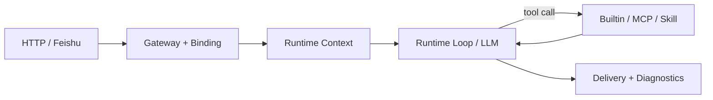
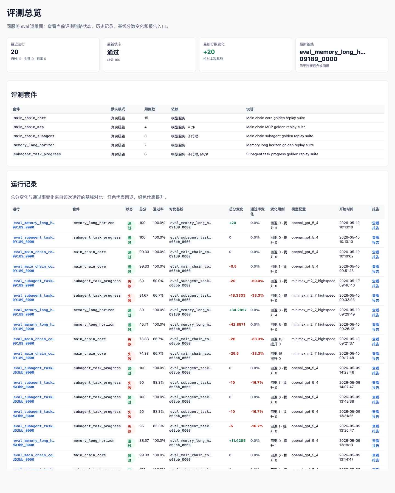
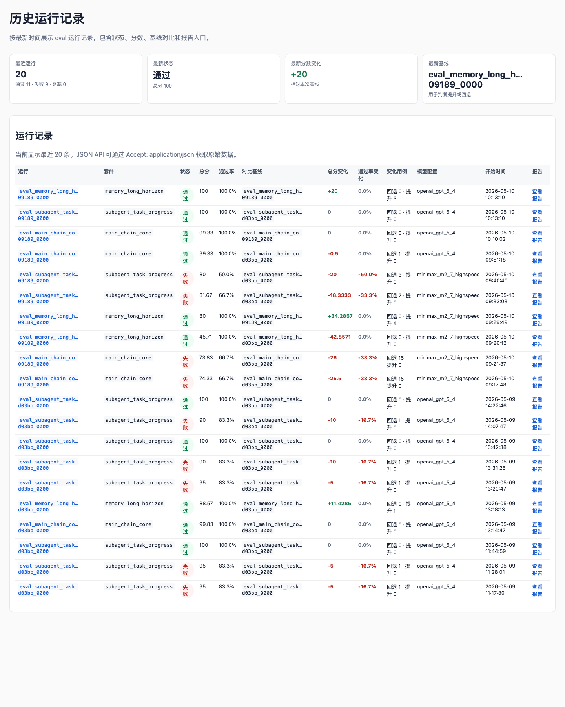

# marten-runtime

<div align="center">

面向自托管场景的 simplified openclaw-style agent runtime harness，聚焦 `channel -> binding -> runtime loop -> builtin tool / MCP / skill -> delivery / diagnostics` 主链。

[文档索引](./docs/README.md) · [部署指南](./docs/DEPLOYMENT.md) · [架构演进](./docs/ARCHITECTURE_EVOLUTION.md) · [架构时间线](./docs/ARCHITECTURE_CHANGELOG.md) · [ADR 索引](./docs/architecture/adr/README.md) · [配置面说明](./docs/CONFIG_SURFACES.md)


</div>

`marten-runtime` 是一个自托管 agent runtime harness，目标是把 agent、MCP、skill、provider 和诊断面放进一条稳定主链：

`channel -> binding -> runtime loop -> builtin tool / MCP / skill -> delivery / diagnostics`

## 核心能力

- LLM-first：意图理解、工具选择和能力组合留在模型路径中
- Thin harness：host 侧负责配置、执行、安全检查、持久化、投递和诊断
- 多入口：HTTP `/messages` 与 Feishu websocket 共享同一 runtime 主链
- 多 agent：支持 channel / user / conversation 绑定与 selected-agent profile 切换
- 上下文治理：支持会话恢复、working context 压缩、thin memory continuity slice
- 工具能力：支持 builtin tools、MCP tools、文件型 skills
- Provider 韧性：支持 OpenAI-compatible provider、retry/backoff 与 profile failover
- 运维面：提供 diagnostics、automation、eval 等轻量 HTTP 页面和 API

## 运行主链


```mermaid
flowchart LR
    A["HTTP / Feishu"] --> B["Gateway + Binding"]
    B --> C["Runtime Context"]
    C --> D["Runtime Loop / LLM"]
    D -->|"tool call"| E["Builtin / MCP / Skill"]
    E --> D
    D --> F["Delivery + Diagnostics"]
```

## 评测运维面

主 HTTP 服务启动后，访问 `/evals` 可以查看评测链路状态、套件清单、历史运行、基线对比、分数变化和 HTML 报告入口。



| 页面 | 用途 |
| --- | --- |
| `/evals` | 总览、套件、最近运行、分数变化 |
| `/evals/suites` | 套件清单、默认模式、依赖、用例数 |
| `/evals/runs` | 历史运行记录、状态、基线、变化趋势 |
| `/evals/runs/{eval_run_id}/view` | 单次运行详情、对比结果、用例明细 |
| `/evals/reports/{eval_run_id}` | 评测报告 HTML |

JSON API 通过 `Accept: application/json` 保持可用。

## 当前基线

- 默认 runtime agent：`main`
- canonical runtime agent id：`main`
- session persistence：SQLite
- 会话控制：`session.new` / `session.resume`
- provider 配置：`config/providers.toml` + `config/models.toml`
- agent 配置：`config/agents.toml` + `agents/<agent_id>/`
- 自动任务：`automation` family builtin tool + operator HTTP surface
- GitHub Trending：repo-local MCP sidecar + skill 行为资产
- Observability：diagnostics + optional Langfuse tracing
- Eval：CLI runner + same-service `/evals` 运维面

## 仓库结构

- `src/marten_runtime/`：runtime、channels、MCP、skills、sessions、diagnostics
- `config/*.toml`：运行时策略和默认值
- `config/bindings.toml`：channel/user/conversation 到 agent 的绑定规则
- `agents/<agent_id>/*.md`：agent prompt 与行为资产
- `skills/`：共享文件型 skills
- `.env.example`：本地 secrets 模板
- `mcps.example.json`：MCP 连接模板
- `docs/`：设计、计划、检查清单与配置说明
- `tests/`：主链相关单元测试与契约测试

## 快速开始

### 最快本地初始化

```bash
./init.sh
```

对 fresh checkout 来说，推荐优先执行 `./init.sh`。它会创建或复用 `.venv`、安装依赖、在缺失时从模板补齐 `.env` 和 `mcps.json`、打印 canonical 启动命令，并对 `/healthz`、`/readyz`、`/diagnostics/runtime` 跑一次临时本地 smoke。

常用变体：

- `./init.sh --skip-install`：复用现有虚拟环境，跳过依赖安装，但仍执行 readiness 检查和本地 smoke
- `./init.sh --smoke-only`：假定 workspace 已完成初始化，只执行 readiness 检查和临时本地 smoke

如果你想走最短的部署阅读路径，直接先看 [docs/DEPLOYMENT.md](./docs/DEPLOYMENT.md)。

如果你想走最短的容器部署入口，直接在仓库根目录执行 `docker compose up -d --build`。

### 环境要求

- Python `3.11`、`3.12` 或 `3.13`
- 一个可用的 OpenAI-compatible provider 凭据
- 如果要跑真实集成，还需要可选的 Feishu 和 MCP 凭据

### 安装

```bash
python3.11 -m venv .venv
source .venv/bin/activate
python -m pip install --upgrade pip
pip install -r requirements.txt
pip install -e .
```

如果你想手动控制每一步初始化过程，可以直接使用上面的显式安装命令，而不是一键 `./init.sh`。

### 配置

```bash
cp .env.example .env
cp mcps.example.json mcps.json
```

配置边界：

- `.env`：只放 secrets 和机器本地 override
- `mcps.json`：放实时 MCP server 定义和可选工具提示
- `config/agents.toml`：放 runtime agent registry、asset root、tool surface 和 model profile 选择
- `config/*.example.toml`：公开提交的模板默认值
- `config/*.toml`：对应模板的本地覆盖文件
- `agents/<agent_id>/*.md`：放 bootstrap 和 agent 行为资产

最小可运行配置：

- 在 `.env` 设置 provider secret；当前最短路径包括 `OPENAI_API_KEY`、`MINIMAX_API_KEY`
- 在 `config/providers.toml` 放 provider 连接元数据
- 在 `config/models.toml` 放 profile 和模型选择
- 在 `config/agents.toml` 放 agent 对应的 asset root / profile / tool 选择
- 提交态示例 profile id 统一采用 `provider + model` 的 slug；runtime 实际只读取 `provider_ref`、`model`、`fallback_profiles`
- 如果你想切换 live profile，更新 `default_profile` 或 `profiles.openai_gpt_5_4` / `profiles.minimax_m2_7_highspeed`
- 如果要启用 Langfuse 外部 tracing，在 `.env` 里补齐 `LANGFUSE_BASE_URL`、`LANGFUSE_PUBLIC_KEY`、`LANGFUSE_SECRET_KEY`
- 只有需要本地覆盖时才把 `config/*.example.toml` 复制成 `config/*.toml`
- 只有需要外部工具时才在 `mcps.json` 配置 MCP
- 只有准备好了 Feishu bot 时才通过本地 `config/channels.toml` 打开 Feishu

当前公开仓库的配置形态：

- 提交：`config/agents.toml`、`config/bindings.toml`、`config/*.example.toml`
- 本地忽略覆盖：`config/platform.toml`、`config/providers.toml`、`config/models.toml`、`config/channels.toml`

## 隐私与开源清洁度

仓库按模板优先的方式准备开源：

- 提交 `.env.example`，不提交真实 `.env`
- 提交 `mcps.example.json`，不提交真实 `mcps.json`
- secrets 只保留在本地环境或被忽略的本地文件里
- 文档不保留本地路径、真实 token、聊天标识或运维快照

默认 `.gitignore` 已经忽略本地 secrets、MCP 连接文件、数据库和运行时产物。

## 运行

```bash
PYTHONPATH=src python -m marten_runtime.interfaces.http.serve
```

常用端点：

- `GET /healthz`
- `GET /readyz`
- `GET /metrics`
- `POST /sessions`
- `POST /messages`
- `GET /automations`
- `GET /diagnostics/runtime`
- `GET /diagnostics/session/{session_id}`
- `GET /diagnostics/run/{run_id}`
- `GET /diagnostics/trace/{trace_id}`

其中 `GET /diagnostics/run/{run_id}` 会暴露 `llm_request_count`、`tool_calls`、`provider_ref`、`attempted_profiles`、`attempted_providers`、`failover_trigger`、`failover_stage`、`final_provider_ref`，便于确认一次 turn 是否真的走了预期的 `LLM -> tool -> LLM` 主链，以及是否发生了 provider failover。

Langfuse 可观测性现在已经是可选的 tracing 面：

- `GET /diagnostics/runtime` 会暴露 `observability.langfuse.enabled`、`healthy`、`configured`、`base_url` 和当前配置原因
- `GET /diagnostics/run/{run_id}` 会暴露 `external_observability.langfuse_trace_id` 和 `external_observability.langfuse_url`
- `GET /diagnostics/trace/{trace_id}` 会暴露 `external_refs.langfuse_trace_id` 和 `external_refs.langfuse_url`
- 一次 runtime turn 对应一条 Langfuse trace，每一轮 LLM 调用对应一条 generation，builtin/MCP tool 调用对应 tool span
- `enabled` 表示当前 runtime 仍然具备 Langfuse 接线能力，`healthy` 表示最近一次 Langfuse client 调用是否成功
- 当前环境的 live 验证已经确认 plain chat、多轮 tool、以及 parent/child subagent tracing 可以在 Langfuse cloud 中看到

## 评测

评测同时支持 CLI 和同服务 HTML 运维面。CLI 负责运行，`/evals` 负责查看状态、历史、基线对比和报告。

```bash
PYTHONPATH=src .venv/bin/python scripts/run_eval.py \
  --suite main_chain_core \
  --mode scripted \
  --profile openai_gpt_5_4 \
  --baseline latest_passed
```



| 套件 | 覆盖范围 |
| --- | --- |
| `main_chain_core` | direct answer、builtin tool、多轮 continuity、上下文压缩 |
| `main_chain_mcp` | GitHub MCP 主链回放 |
| `main_chain_subagent` | 主线程委派、子任务完成通知、父线程总结回放 |
| `memory_long_horizon` | 记住、隔轮召回、跨会话召回、覆盖更新、抗干扰召回 |
| `subagent_task_progress` | 子代理受理、执行、回传、父线程吸收子结果 |

产物位置：

- SQLite 历史：`data/evals.sqlite3`
- 报告目录：`reports/evals/<eval_run_id>/`
- 汇总报告：`summary.md`、`summary.json`、`summary.html`
- 单 case 详情：`cases/<case_id>.json`

## 测试

Milestone A 重点回归：

```bash
PYTHONPATH=src python -m unittest \
  tests.test_bindings \
  tests.test_router \
  tests.test_runtime_context \
  tests.test_skills \
  tests.test_provider_retry \
  tests.runtime_loop.test_forced_routes \
  tests.runtime_loop.test_direct_rendering_paths \
  tests.runtime_loop.test_tool_followup_and_recovery \
  tests.runtime_loop.test_context_status_and_usage \
  tests.runtime_loop.test_automation_and_trending_routes \
  tests.feishu.test_rendering \
  tests.feishu.test_delivery \
  tests.feishu.test_websocket_service \
  -v
```

全量测试：

```bash
PYTHONPATH=src python -m unittest -v
```

建议直接运行上面的命令进行本地全量验证，不要依赖文档中固定的测试数量。

## 文档

建议阅读顺序：

1. [docs/README.md](./docs/README.md)
2. [docs/ARCHITECTURE_EVOLUTION.md](./docs/ARCHITECTURE_EVOLUTION.md)
3. [docs/ARCHITECTURE_CHANGELOG.md](./docs/ARCHITECTURE_CHANGELOG.md)
4. [docs/architecture/adr/README.md](./docs/architecture/adr/README.md)
5. [docs/CONFIG_SURFACES.md](./docs/CONFIG_SURFACES.md)
6. [docs/LIVE_VERIFICATION_CHECKLIST.md](./docs/LIVE_VERIFICATION_CHECKLIST.md)
7. [docs/archive/README.md](./docs/archive/README.md)
