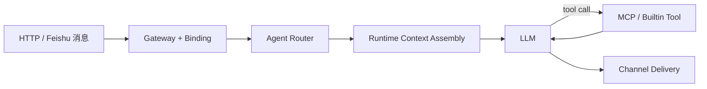

# marten-runtime

<div align="center">

面向私有 agent 场景的 simplified openclaw-style runtime，聚焦 `channel -> binding -> agent -> LLM -> MCP -> skill -> LLM -> channel` 主链。

[English](./README.md) · [文档索引](./docs/README.md) · [Harness 设计](./docs/2026-03-29-private-agent-harness-design.md) · [配置面说明](./docs/CONFIG_SURFACES.md)


</div>

`marten-runtime` 是一个收敛的私有 agent runtime。它的目标不是做重型 workflow 平台，而是先把你自己的 agent、MCP 和 skill 托管到一条稳定、可诊断、可扩展的执行主链上。

## Overview

- `LLM + agent + MCP + skill` first
- `harness-thin, policy-hard, workflow-light`
- 支持 channel/user/conversation 级绑定与多 agent 路由
- 支持 runtime context assembly 与会话回放
- skills 作为运行时一等输入，而不是静态文件摆设
- 支持 OpenAI-compatible provider，并带最小 retry/backoff 韧性
- 提供 Feishu websocket 接入和轻量 HTTP operator surface

## Why This Exists

很多 agent 项目要么停在 prompt demo，要么过早扩张到 queue、planner、复杂 worker 编排。`marten-runtime` 刻意不走那条路线，而是先把真正要跑通的私有 agent 主链打稳。

当前唯一优先的链路是：

`channel -> binding -> agent -> LLM -> MCP -> skill -> LLM -> channel`

如果一个改动不能直接增强这条链路，它就不应该排到高优先级。

## At A Glance

| 层 | 职责 |
| --- | --- |
| `channel` | HTTP / Feishu 输入、进度事件和最终回包 |
| `binding` | 把 channel/user/conversation 稳定绑定到正确 agent |
| `agent` | app 层策略、可用工具和 bootstrap prompt |
| `runtime` | 上下文拼装、模型调用、tool loop、诊断 |
| `capabilities` | MCP 工具和文件型 skills |

## Core Flow



## Current Scope

当前已经完成 private harness 计划中的 Milestone A：

- gateway binding + multi-agent routing
- runtime context assembly + live context rehydration
- skills first-class runtime integration
- provider retry/backoff resilience

当前明确没有进入 Milestone B：

- per-conversation serialization
- durable session persistence

同样明确暂不做：

- queue-first execution
- durable delivery outbox
- heartbeat / cron / proactive jobs
- hybrid memory promotion
- planner / swarm 编排

## Repository Layout

- `src/marten_runtime/`：runtime、channels、MCP、skills、sessions、diagnostics
- `config/*.toml`：运行时策略和默认值
- `config/bindings.toml`：channel/user/conversation 到 agent 的绑定规则
- `apps/<app_id>/app.toml`：app manifest
- `apps/<app_id>/*.md`：bootstrap prompt 资产
- `skills/`：共享文件型 skills
- `.env.example`：本地 secrets 模板
- `mcps.example.json`：MCP 连接模板
- `docs/`：设计、计划、检查清单与配置说明
- `tests/`：主链相关单元测试与契约测试

## Getting Started

### Requirements

- Python `3.11`、`3.12` 或 `3.13`
- 一个可用的 OpenAI-compatible provider 凭据
- 如果要跑真实集成，还需要可选的 Feishu 和 MCP 凭据

### Install

```bash
python3.11 -m venv .venv
source .venv/bin/activate
python -m pip install --upgrade pip
pip install -e .
```

### Configure

```bash
cp .env.example .env
cp mcps.example.json mcps.json
```

配置边界：

- `.env`：只放 secrets 和机器本地 override
- `mcps.json`：只放实时 MCP server 定义
- `config/*.example.toml`：公开提交的模板默认值
- `config/*.toml`：对应模板的本地覆盖文件
- `apps/<app_id>/*.md`：放 bootstrap 和 agent 行为资产

最小可运行配置：

- 在 `.env` 设置一个 provider key，例如 `MINIMAX_API_KEY` 或 `OPENAI_API_KEY`
- 只有需要本地覆盖时才把 `config/*.example.toml` 复制成 `config/*.toml`
- 只有需要外部工具时才在 `mcps.json` 配置 MCP
- 只有准备好了 Feishu bot 时才通过本地 `config/channels.toml` 打开 Feishu

当前公开仓库的配置形态：

- 提交：`config/agents.toml`、`config/bindings.toml`、`config/*.example.toml`
- 本地忽略覆盖：`config/platform.toml`、`config/models.toml`、`config/channels.toml`、`config/mcp.toml`

## Privacy And Open-Source Hygiene

仓库按模板优先的方式准备开源：

- 提交 `.env.example`，不提交真实 `.env`
- 提交 `mcps.example.json`，不提交真实 `mcps.json`
- secrets 只保留在本地环境或被忽略的本地文件里
- 文档不保留本地路径、真实 token、聊天标识或运维快照

默认 `.gitignore` 已经忽略本地 secrets、MCP 连接文件、数据库和运行时产物。

## Run

```bash
PYTHONPATH=src python -m marten_runtime.interfaces.http.serve
```

常用端点：

- `GET /healthz`
- `GET /readyz`
- `GET /metrics`
- `POST /sessions`
- `POST /messages`
- `GET /diagnostics/runtime`
- `GET /diagnostics/session/{session_id}`
- `GET /diagnostics/run/{run_id}`
- `GET /diagnostics/trace/{trace_id}`

## Testing

Milestone A 重点回归：

```bash
PYTHONPATH=src python -m unittest tests.test_bindings tests.test_router tests.test_runtime_context tests.test_skills tests.test_runtime_loop tests.test_provider_retry tests.test_feishu -v
```

全量测试：

```bash
PYTHONPATH=src python -m unittest -v
```

## Documentation

建议阅读顺序：

1. [docs/README.md](./docs/README.md)
2. [docs/2026-03-29-private-agent-harness-design.md](./docs/2026-03-29-private-agent-harness-design.md)
3. [docs/plans/2026-03-29-private-agent-harness-plan.md](./docs/plans/2026-03-29-private-agent-harness-plan.md)
4. [docs/CONFIG_SURFACES.md](./docs/CONFIG_SURFACES.md)
5. [docs/ARCHITECTURE_AUDIT.md](./docs/ARCHITECTURE_AUDIT.md)
6. [docs/LIVE_VERIFICATION_CHECKLIST.md](./docs/LIVE_VERIFICATION_CHECKLIST.md)
