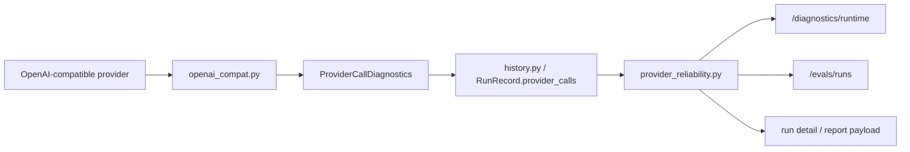

# Provider 可靠性轻量层设计

> 日期：2026-05-11
> 范围：主链 provider 诊断 + `/diagnostics/runtime` + `/evals/runs` / run detail
> 第一阶段目标：把 provider 故障从单次异常处理升级为可诊断、可评估、可回放的 harness 能力

## 1. 设计目标

当前仓库已经有三类基础能力：

- `runtime/loop.py` 记录主链运行、provider failover、tool 调用和 finalization 状态
- `runtime/usage_models.py` 与 `runtime/history.py` 能承载 provider call diagnostics 和 run 级历史
- `interfaces/http/runtime_diagnostics.py` 与 `interfaces/http/eval_routes.py` 已经能把运行状态和评测历史暴露成页面

第一阶段只做一件事：在不改变主链语义的前提下，把 provider 稳定性从“是否失败”扩展成“为什么失败、发生了多少次、是否切换了 provider、是否出现空输出、最终落到哪个 provider”。

## 2. 范围边界

### 2.1 纳入范围

- 主链 provider 失败分类
- provider call diagnostics 结构扩展
- run 级 provider reliability 汇总
- `/diagnostics/runtime` 最近 runs 的 provider 健康摘要
- `/evals/runs` 与 run detail 页面展示 provider 稳定性指标

### 2.2 不纳入范围

- Feishu / WebSocket delivery 层统计
- provider health window / cooldown / 自动熔断
- 新的重试调度策略
- 把 provider 诊断写回主链意图判断

## 3. 方案比较

### 方案 A：把统计逻辑散落在各个 endpoint

- 优点：改动看起来短
- 缺点：`runtime diagnostics`、eval 页面、store 汇总会各自重复同一套规则

### 方案 B：新增 `runtime/provider_reliability.py` 作为统一派生层

- 优点：边界最清楚，适合第一阶段
- 优点：run 汇总、页面数据、后续报告都能复用同一套派生函数
- 优点：便于单测覆盖“分类 -> 汇总 -> 展示”全链路

### 方案 C：只扩展 store 字段，页面直接读原始记录

- 优点：落库直观
- 缺点：汇总规则会继续分散在页面和 diagnostics 里，后续维护成本高

**推荐：方案 B。**

## 4. 模块职责

### 4.1 `runtime/provider_reliability.py`

职责只保留四类：

1. provider error 分类
2. 单次 provider call diagnostics 归一化
3. run 级 provider reliability 汇总
4. 页面/diagnostics 需要的只读数据结构生成

这个模块不负责：

- 发起请求
- 执行重试
- 决定 failover
- 解析用户意图

### 4.2 `runtime/usage_models.py`

`ProviderCallDiagnostics` 在这里扩展成 provider 稳定性的基础载体，新增字段建议如下：

- `provider_name`
- `model_name`
- `profile_name`
- `error_kind`
- `retry_after_seconds`

现有字段保留，用来维持当前历史数据和测试兼容：

- `request_kind`
- `timeout_seconds`
- `max_attempts`
- `completed`
- `final_error_code`
- `attempts`

### 4.3 `runtime/history.py`

`RunRecord.provider_calls` 继续作为原始证据列表。

Run 级派生字段建议直接加在 `RunRecord` 上，便于 diagnostics / eval 页面复用：

- `retry_count`
- `fallback_count`
- `provider_error_count`
- `empty_output_count`
- `final_provider_ref`

这些字段由 `provider_calls`、`attempted_profiles`、`attempted_providers`、`final_provider_ref` 派生得到，不再要求调用方手写。

### 4.4 `interfaces/http/runtime_diagnostics.py`

`/diagnostics/runtime` 增加一个 provider reliability 摘要块，展示最近 runs 的健康概览，例如：

- 最近 N 次 run 的 retry 总量
- fallback 总量
- provider error 总量
- empty output 总量
- 最近一次 final provider
- 最近一次 provider error_kind 分布

这里只展示汇总，不承担复杂分析。

### 4.5 `interfaces/http/eval_routes.py`

`/evals/runs` 和 run detail 页面继续复用 `SQLiteEvalStore` 和 report payload。

展示内容只扩展稳定性维度：

- run 列表展示 `retry_count`、`fallback_count`、`empty_output_count`
- run detail 展示 provider reliability 摘要
- compare / stability 区块继续保留现有分数与回退信息

页面只消费派生结果，不重复做分类。

`evals/report.py` 在写入 `summary.json`、`summary.md`、`summary.html` 时一并落盘 run 级 provider reliability summary，这样 `/evals/runs` 的列表页和 run detail 页都能从同一份评测产物读取稳定性数据。

### 4.6 口径约束

所有派生指标都只从现有运行证据计算：

- `RunRecord.provider_calls`
- `RunRecord.attempted_profiles`
- `RunRecord.attempted_providers`
- `RunRecord.final_provider_ref`

页面和 diagnostics 不再扫描原始异常文本。

## 5. 处理流程

### 5.1 单次 provider 调用

第一阶段只接 OpenAI-compatible adapter 路径。

`runtime/llm_adapters/openai_compat.py` 继续在完成一次真实 provider 调用后生成 `ProviderCallDiagnostics`。

补充的信息来源：

- provider 名称来自 client
- model 名称来自 client
- profile 名称来自 client
- `error_kind` 来自 `provider_reliability.py` 的分类函数
- `retry_after_seconds` 来自错误类型或 provider 反馈

### 5.2 run 级汇总

`runtime/history.py` 或 `provider_reliability.py` 在 run 结束时根据 `provider_calls` 计算：

- `retry_count`
- `fallback_count`
- `provider_error_count`
- `empty_output_count`
- `final_provider_ref`

汇总规则建议保持简单、确定性：

- retry_count：`sum(max(0, len(call.attempts) - 1) for call in provider_calls)`
- fallback_count：`max(0, len(unique_attempted_providers) - 1)`，`unique_attempted_providers` 取 `attempted_providers` 去重后的顺序结果
- provider_error_count：`sum(1 for call in provider_calls if call.completed is False)`
- empty_output_count：`sum(1 for call in provider_calls if call.completed is True and no final text was emitted)`
- final_provider_ref：`RunRecord.final_provider_ref`

推荐补充两个只读摘要字段，供页面直接使用：

- `provider_error_kinds`
- `provider_health_summary`

### 5.3 runtime diagnostics 摘要

`/diagnostics/runtime` 只读取 `history.list_runs()` 的汇总数据，形成一个适合运维扫视的摘要：

- 最近 run 窗口建议固定为 20 条
- 最近 run 数
- provider error 总量
- retry 总量
- fallback 总量
- empty output 总量
- 当前最常见的 error_kind
- 最近一次 final provider
- 最近一次 provider error_kind 分布

## 6. error_kind 规则

第一阶段统一使用五类：

- `transient`
- `auth`
- `quota`
- `protocol`
- `context`

分类输入来自当前已经存在的 provider error 归一化结果，优先使用确定性信号。推荐优先级如下：

1. `auth`
   - HTTP 401 / 403
   - 明确的 credential / api key / unauthorized 语义
2. `quota`
   - HTTP 429
   - rate limit / quota / insufficient credit 语义
3. `context`
   - context length / token limit / request too large
4. `protocol`
   - schema invalid / response malformed / parsing failure / unsupported shape
5. `transient`
   - timeout / connection reset / DNS / 5xx / transport unavailable

归类规则的目标是稳定、单义、可测试。遇到多信号时，优先选择更具体的类；`protocol` 和 `context` 只在确定性信号存在时命中。

`provider_reliability.py` 只做归类，不承担重试策略判定。

### 6.1 `retry_after_seconds` 规则

`retry_after_seconds` 只表达“下一次合理重试的建议等待时间”，单位为秒。

建议来源顺序：

1. provider 或响应头显式给出 `retry-after`
2. provider 返回的 backoff / wait hint
3. 分类规则的默认值

默认值建议如下：

- `quota`：30
- `transient`：2
- `protocol`：0
- `auth`：0
- `context`：0

这个字段是诊断提示，不改变现有 retry policy 的实际行为。

## 7. 数据流

这条数据流保持单向：

- provider 侧只负责产生日志
- 汇总层只负责派生指标
- 页面只负责展示

## 8. 与现有代码的对接点

### 8.1 `runtime/loop.py`

`loop.py` 继续保留主链编排，不新增 provider 分类分支。

它只负责把 provider call 结果和 failover 状态写入 history。

### 8.2 `runtime/provider_flow.py`

继续保留：

- profile 切换
- attempted_profiles / attempted_providers
- final_provider_ref 写回

provider reliability 只读这些字段，不接管切换逻辑。

### 8.3 `evals/compare.py` 与 `evals/report.py`

这两层继续负责评测对比和报告产物。

provider reliability 只提供可复用的派生字段，避免在评测对比里再次手写统计规则。

## 9. 测试设计

### 9.1 单元测试

覆盖以下场景：

- error_kind 分类
- ProviderCallDiagnostics 字段序列化
- retry_after_seconds 默认值和显式值优先级
- run 汇总字段派生
- empty output 识别
- fallback 统计
- 最近 20 条 run 的 health 摘要

### 9.2 HTTP 契约测试

覆盖以下端点：

- `/diagnostics/runtime` 返回 provider reliability 摘要
- `/evals/runs` HTML 中显示 retry / fallback / empty-output
- `/evals/runs/{eval_run_id}/view` 中显示 run 级 provider reliability 摘要
- `/evals/runs` JSON 中保持新增字段可读

### 9.3 回归测试

保持现有主链测试不变，重点确认：

- `/messages` 主链语义保持稳定
- eval 页面仍然可浏览
- 现有 provider failover 契约继续通过

## 10. 验收标准

第一阶段完成后，仓库应满足：

1. provider failure 具备统一的 `error_kind`
2. provider call diagnostics 能记录 provider / model / profile 维度
3. run 级页面能直接看到 retry / fallback / empty-output
4. `/diagnostics/runtime` 能给出最近 runs 的 provider 健康摘要
5. 现有主链和 eval 页面行为保持稳定

## 11. 结论

第一阶段最合适的落点是新增 `runtime/provider_reliability.py`，把 provider 相关统计收敛成一层只读派生能力。

它能同时满足三件事：

- 主链上可诊断
- 运维面上可查看
- 评测面上可比较
