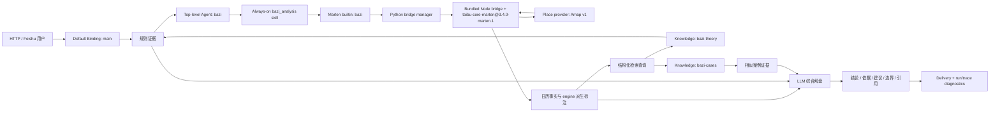

# Bazi Agent 方案设计

> 日期：2026-07-23<br>
> 更新：2026-07-26，明确 main 顶层路由、同级 agent handoff 与 subagent 边界<br>
> 状态：C00-C13 已实现，自动化与真实飞书 main handoff 验收已通过<br>
> 范围：方案设计、实现契约与验收标准

## 1. 设计结论

`marten-runtime` 已经具备实现 Bazi Agent 所需的 selected agent、builtin tool、文件型 skill 与 Knowledge/RAG。推荐沿现有主链组合这些能力：

```text
用户 -> 默认 Binding -> main 路由 -> Bazi Agent（always-on Skill）-> builtin bazi -> bundled taibu-core -> Knowledge -> LLM 回答与诊断
```

核心选择：

1. **Marten 提供内置 `bazi` family tool**：公开稳定的 `chart`、`dayun`、`resolve_pillars` 三个 action。
2. **Taibu 计算内核随 Marten 构建产物交付**：本地 Node bridge 固定依赖 `taibu-core@3.4.0` 并应用 `sect1-v1` 窄补丁，运行阶段通过 JSON stdin/stdout 调用。
3. **出生地点由 bundled bridge 自动解析**：复用 Taibu `14860a2` 的 MIT `place-resolution` 模块，高德作为首个可替换 provider；用户和模型只提交地点文本。
4. **Bazi Agent 成为独立顶层运行时身份**：main 识别领域意图后同步 handoff，Bazi 使用单独的 agent 资产、tool surface、Skill、RAG scope、敏感观测策略与模型配置。
5. **解盘流程由 Marten 专用 `bazi_analysis` skill 负责**：吸收 `bazi-skill` 的分析顺序与输出结构，并强制依赖 builtin 返回的计算事实。
6. **经典规则与案例进入 Marten Knowledge**：规则与案例分 namespace 检索，输出保留 `source_id` 与 `chunk_id` 引用。

这套分工符合当前 thin harness 与 LLM-first 边界：Marten builtin 负责稳定 schema、输入校验、进程管理、timeout、结果归一化和诊断；Taibu 负责确定性计算；模型负责收集信息、选择 action、组合证据和形成解释。

## 2. 上游能力判断

### 2.1 Taibu

截至 2026-07-24，Taibu 默认分支最新提交为 `14860a2`，提交日期为 2026-07-24。仓库同时包含完整 Web 应用、`taibu-core` SDK、stdio/HTTP 适配层、地点解析和 divination skill。

本方案的运行实现依赖 MIT 许可的 `taibu-core`：

- `taibu-core`：确定性命理计算引擎，当前包版本 `3.4.0`。
- `taibu-mcp`：上游 stdio 适配包，当前包版本 `3.4.1`；本方案只把它作为调用方式与工具契约的参考证据。
- `taibu-mcp-server`：仓库源码版本 `3.0.0`，npm 当前版本 `2.0.0`；最新源码的 `place-resolution.ts` 已支持高德地点解析，尚未进入已发布 npm 包。
- Taibu Web 与其他应用代码采用 AGPL 边界；`packages/core`、`packages/mcp` 与 `packages/mcp-server` 使用 MIT。Marten 内置实现打包 MIT `taibu-core`、从固定上游 commit 复用并适配地点解析模块，以及本地 bridge。

Bazi 相关 canonical core 工具：

| 工具 | 用途 | 关键输入 |
| --- | --- | --- |
| `bazi` | 根据出生信息生成四柱、十神、藏干、神煞与关系 | 性别、年月日时；可选分钟、历法、闰月、出生地；经度由 bridge 内部解析 |
| `bazi_dayun` | 计算起运、大运、小运与流年链路 | 性别、年月日时；可选分钟、历法、闰月；接收统一后的有效出生时间 |
| `bazi_pillars_resolve` | 根据四柱反查出生时间候选 | 年柱、月柱、日柱、时柱 |

Taibu 仓库内置 divination skill 当前仍引用 `dayun_calculate`、`liuyao_analyze` 等旧别名，而当前 core contract 只保留 `bazi_dayun`、`liuyao` 等 canonical 名称。Marten bridge 固定映射 canonical 名称，Bazi skill 只面向 Marten 的 `chart`、`dayun`、`resolve_pillars` action。

证据：

- [Taibu 仓库](https://github.com/hhszzzz/taibu)
- [Taibu stdio 入口](https://github.com/hhszzzz/taibu/blob/14860a26e3c428bb9c0a3eee3ba88e7cb57b1e6c/packages/mcp/src/index.ts)，用于确认 core 的调用方式
- [Taibu HTTP MCP 地点解析](https://github.com/hhszzzz/taibu/blob/14860a26e3c428bb9c0a3eee3ba88e7cb57b1e6c/packages/mcp-server/src/place-resolution.ts)，用于复用地点到经纬度的运行时适配
- [高德 Web 服务 API 开发指南](https://lbs.amap.com/api/webservice/gettingstarted)，用于确认应用与 Web 服务 Key 的申请路径
- [高德地理编码 API](https://lbs.amap.com/api/webservice/guide/api/georegeo/)，用于确认 geocode 请求、必填 `key` 与地址参数
- [Bazi 工具定义](https://github.com/hhszzzz/taibu/blob/14860a26e3c428bb9c0a3eee3ba88e7cb57b1e6c/packages/core/src/mcp/domains/bazi/definition.ts)
- [Bazi 大运工具定义](https://github.com/hhszzzz/taibu/blob/14860a26e3c428bb9c0a3eee3ba88e7cb57b1e6c/packages/core/src/mcp/domains/bazi-dayun/definition.ts)
- [Core 执行入口](https://github.com/hhszzzz/taibu/blob/14860a26e3c428bb9c0a3eee3ba88e7cb57b1e6c/packages/core/src/mcp/execute.ts) 与 [canonical renderer](https://github.com/hhszzzz/taibu/blob/14860a26e3c428bb9c0a3eee3ba88e7cb57b1e6c/packages/core/src/mcp/payloads.ts)
- [Bazi 真太阳时实现](https://github.com/hhszzzz/taibu/blob/14860a26e3c428bb9c0a3eee3ba88e7cb57b1e6c/packages/core/src/domains/bazi/calculate.ts) 与 [大运实现](https://github.com/hhszzzz/taibu/blob/14860a26e3c428bb9c0a3eee3ba88e7cb57b1e6c/packages/core/src/domains/bazi-dayun/calculate.ts)
- [`lunar-javascript@1.7.7`](https://github.com/6tail/lunar-javascript/tree/v1.7.7) 与 [MIT 许可证](https://github.com/6tail/lunar-javascript/blob/v1.7.7/LICENSE)

### 2.2 `bazi-skill`

`jinchenma94/bazi-skill` 是 MIT 许可的提示词与 Markdown 参考资料集合。它提供较完整的信息收集、旺衰、十神、五行、格局、大运、流年、历史事件校准和输出结构。

它适合作为 Marten 专用 skill 的流程输入，直接安装会遇到三项运行时差异：

- 第二阶段要求模型读取表格并手工排盘，bundled `taibu-core` 已经提供更稳定的确定性计算。
- 交互流程依赖 Claude Code 的 `AskUserQuestion`，Marten 通过普通 channel 对话收集信息。
- Marten 当前 `SkillLoader` 只加载目标目录中的 `SKILL.md` 正文，`references/*.md` 需要进入 Knowledge 或合并进 skill。

推荐吸收它的分析结构、经典目录与风险提示，重写工具调用和数据来源规则，并在复制实质内容时保留 MIT 版权声明。

证据：

- [`bazi-skill` 仓库](https://github.com/jinchenma94/bazi-skill)
- [`bazi-skill` 主流程](https://github.com/jinchenma94/bazi-skill/blob/bdd7f863d4450bf0e2fac84579ad6b45cfdfa25c/SKILL.md)

### 2.3 排盘实现交叉核对

2026-07-24 进一步对照了 [`ai-freer/fortune-skill`](https://github.com/ai-freer/fortune-skill)、`lunar-javascript@1.7.7`、`lunar-python` 与 `china-testing/bazi` 的实际代码。它们能够提供实现交叉证据，但共同依赖同一套 6tail 历法算法，属于同源复核。

| 计算点 | Taibu / Marten 选定口径 | 对照结论 |
| --- | --- | --- |
| 四柱与节气月柱 | `lunar-javascript@1.7.7` `EightChar` exact year/month | `fortune-skill` 同样直接调用 `lunar-javascript@1.7.7`；`china-testing/bazi` 使用同系列 `lunar-python`，有效出生时间相同时四柱口径一致 |
| 真太阳时 | 东经 120° 标准子午线 + 出生地经度差 + Taibu 均时差公式，最终按整数分钟生效 | `fortune-skill` 当前脚本包含经度差和夏令时校正，均时差尚未进入脚本；它适合作为差异样例来源，Taibu 固定实现是 Marten 的运行权威 |
| 历史夏令时 | 来源民用钟表时间先归一为 UTC+8 北京标准时，再进入真太阳时 | `fortune-skill` 已覆盖中国 1986-1991 夏令时；原方案需要补充来源钟表语义与归一化责任 |
| 23 点换日 | 固定 `EightChar sect=1`：子初 23:00 换日，23:00-00:59 整个子时使用次日日柱 | `lunar-javascript` 与 `lunar-python` 默认采用 sect 2；`fortune-skill` 文字参考和产品确认口径采用 23:00 换日，因此 Marten 对 Taibu 增加固定 sect 1 窄补丁 |
| 起运 | `eightChar.getYun(gender)` 默认 Yun `sect=1`，保留起运年、月、日与起运日期 | Taibu、`fortune-skill` 和 `china-testing/bazi` 都调用同一默认方法；“天数除以 3 后取整岁”只适合作为概念解释，不能覆盖 engine 返回值 |
| 五行统计、神煞与关系 | 作为带 engine/version 的派生标注 | Taibu 与 `china-testing/bazi`/`fortune-skill` 的五行权重不同；这类数字属于方法相关指标，不能提升为跨流派通用事实 |

交叉核对形成三条约束：

1. 日历事实由锁定 engine 和固定 fixture 判定，外部 README、教学口诀与预计算命盘承担参考和差异发现职责。
2. `bazi-theory` 可以解释起运、换日与五行方法，必须携带适用口径；检索内容不能覆盖 builtin 已返回的 engine 事实。
3. 升级 `taibu-core`、`lunar-javascript`、换日口径、Yun sect 或真太阳时实现版本都属于排盘兼容性变化，需要提升 schema/algorithm version 并重跑边界 corpus；真太阳时公式与子初换日均为固定产品契约。

## 3. 目标架构



### 3.1 顶层 Agent 路由契约

服务启动时把 `config/agents.toml` 中所有启用的 agent 注册为同级顶层 agent。`main` 是默认入口与协调 agent；`bazi` 是领域执行 agent；`spawn_subagent` 创建的临时执行单元归属于当前顶层 agent。

自然语言请求使用同步 handoff：

1. 默认 HTTP/Feishu binding 选择 `main`，main 使用紧凑的 agent catalog 判断本轮由 `main` 或某个已授权顶层 agent 处理。
2. handoff 结果采用结构化协议，只包含目标 agent id；宿主校验目标已启用且在 main 的允许列表内。
3. 目标 agent 在同一 trace 内启动独立 run，接收原始用户消息和受控会话上下文，使用自己的 prompt、Skill、工具、Knowledge scope、模型 profile 与 observation policy。
4. main 路由 run 只保存路由元数据和 usage；用户消息持久化一次，目标 agent 的最终回复持久化并投递一次。
5. 每个用户 turn 最多发生一次顶层 handoff，目标 agent 直接完成本轮。自然语言 handoff 只改变当前 turn 的执行 agent，session 默认入口继续保持 `main`，下一轮结合最近会话重新判断；目标 agent 可以按自身 `allowed_tools` 使用 `spawn_subagent` 处理并行或隔离子任务。
6. `requested_agent_id` 与 conversation/user 精确 binding 继续提供显式入口并跳过 main 路由，服务调试、专用入口和自动化任务使用该路径。

顶层 agent catalog 由 `AgentSpec.routing_description` 和 main 的 `allowed_handoff_agents` 生成。`fanqie` 当前是 Knowledge namespace；增加对应 AgentSpec 与 agent 资产后才能进入 catalog。

### 3.2 能力分工

| 能力 | 归属 | 职责 |
| --- | --- | --- |
| 出生信息收集与确认 | `bazi_analysis` skill | 只收集排盘和当前问题所需字段 |
| 出生地点解析 | bundled bridge + provider adapter | 将地点文本解析为内部经纬度；高德为首个 provider |
| 四柱与大运计算 | builtin `bazi` + bundled `taibu-core` | 生成确定性命盘事实和错误信息 |
| 分析顺序与证据优先级 | `bazi_analysis` skill | 固定分析检查点、调用顺序和输出契约 |
| 经典规则检索 | Knowledge `bazi-theory` | 返回经过整理的规则、出处和适用条件 |
| 案例类比检索 | Knowledge `bazi-cases` | 返回匿名、带标签、经过审核的相似案例 |
| 综合解释 | LLM | 组合命盘事实、规则证据、案例差异与用户问题 |
| 会话连续性 | Session | 保存当前咨询过程与工具结果摘要 |
| 长期个人事实 | 用户显式授权后的 Memory | 保存用户明确要求跨会话复用的少量信息 |
| 执行证明 | Marten diagnostics / eval | 保存工具调用、降级、引用和最终结果证据 |

### 3.2 证据优先级

解盘时统一使用以下优先级：

1. builtin `bazi` 返回的日历事实：有效出生时间、四柱、藏干、十神映射、起运时间、大运与流年序列。
2. `bazi-theory` 中带出处、适用条件和审核状态的规则。
3. `bazi-cases` 中的相似案例与明确差异。
4. 模型自身的一般表达与组织能力。

Taibu 返回的五行统计、神煞和关系分析属于带 `engine/version` 的派生标注，模型可以引用其确定输出，并明确它们的算法口径。旺衰、格局、喜用与现实事件含义进入 theory/LLM 解释层。案例承担类比和反例职责。最终回答需要说明“相似点、差异点、可支持的判断范围”，并让日历事实保持最高优先级。

## 4. Marten 接入设计

### 4.1 Builtin `bazi`

新增 `src/marten_runtime/tools/builtins/bazi_tool.py`，由现有 `ToolRegistry` 注册稳定 family schema。三个 action 使用可判别 union，模型和 host validation 共享同一份 required / optional 字段契约：

```json
{
  "$schema": "https://json-schema.org/draft/2020-12/schema",
  "$defs": {
    "birthRequest": {
      "type": "object",
      "properties": {
        "action": { "type": "string", "enum": ["chart", "dayun"] },
        "gender": { "type": "string", "enum": ["male", "female"] },
        "birthYear": { "type": "integer", "minimum": 1901, "maximum": 2100 },
        "birthMonth": { "type": "integer", "minimum": 1, "maximum": 12 },
        "birthDay": { "type": "integer", "minimum": 1, "maximum": 31 },
        "birthHour": { "type": "integer", "minimum": 0, "maximum": 23 },
        "birthMinute": { "type": "integer", "minimum": 0, "maximum": 59, "default": 0 },
        "calendarType": { "type": "string", "enum": ["solar", "lunar"], "default": "solar" },
        "isLeapMonth": { "type": "boolean", "default": false },
        "birthPlace": { "type": "string", "minLength": 2, "maxLength": 200 },
        "timeBasis": { "type": "string", "enum": ["clock", "true_solar"], "default": "clock" },
        "timezone": {
          "type": "string",
          "const": "Asia/Shanghai",
          "default": "Asia/Shanghai"
        },
        "sourceTimeStandard": {
          "type": "string",
          "enum": ["recorded_civil", "beijing_standard"],
          "default": "recorded_civil"
        },
        "detailLevel": { "type": "string", "enum": ["default", "full"], "default": "default" }
      },
      "required": ["action", "gender", "birthYear", "birthMonth", "birthDay", "birthHour"],
      "allOf": [
        {
          "if": {
            "required": ["isLeapMonth"],
            "properties": { "isLeapMonth": { "const": true } }
          },
          "then": {
            "required": ["calendarType"],
            "properties": { "calendarType": { "const": "lunar" } }
          }
        },
        {
          "if": {
            "required": ["timeBasis"],
            "properties": { "timeBasis": { "const": "true_solar" } }
          },
          "then": {
            "required": ["birthPlace"]
          }
        }
      ],
      "additionalProperties": false
    },
    "resolveRequest": {
      "type": "object",
      "properties": {
        "action": { "const": "resolve_pillars" },
        "yearPillar": { "type": "string", "pattern": "^[甲乙丙丁戊己庚辛壬癸][子丑寅卯辰巳午未申酉戌亥]$" },
        "monthPillar": { "type": "string", "pattern": "^[甲乙丙丁戊己庚辛壬癸][子丑寅卯辰巳午未申酉戌亥]$" },
        "dayPillar": { "type": "string", "pattern": "^[甲乙丙丁戊己庚辛壬癸][子丑寅卯辰巳午未申酉戌亥]$" },
        "hourPillar": { "type": "string", "pattern": "^[甲乙丙丁戊己庚辛壬癸][子丑寅卯辰巳午未申酉戌亥]$" }
      },
      "required": ["action", "yearPillar", "monthPillar", "dayPillar", "hourPillar"],
      "additionalProperties": false
    }
  },
  "oneOf": [
    { "$ref": "#/$defs/birthRequest" },
    { "$ref": "#/$defs/resolveRequest" }
  ]
}
```

Action 映射：

| Marten action | Taibu core tool | Result schema | 说明 |
| --- | --- | --- | --- |
| `chart` | `bazi` | `bazi.chart.v1` | 四柱、十神、藏干、神煞和关系 |
| `dayun` | `bazi_dayun` | `bazi.dayun.v1` | 起运、大运、小运和流年链路 |
| `resolve_pillars` | `bazi_pillars_resolve` | `bazi.resolve_pillars.v1` | 四柱反查出生时间候选 |

Builtin 负责：

- 校验 action、真实公历/农历日期、实际闰月、固定 `1901-2100` 中国民用时间范围、四柱格式和六十甲子组合；非 `Asia/Shanghai` 输入归一为 `bazi_timezone_unsupported`。`resolve_pillars` 的候选年份同样限制为 `1901-2100`，过滤上游可能产生的 1900 年候选。
- 明确 `sourceTimeStandard`、`timeBasis` 与 `timezone`；`recorded_civil` 按历史 `Asia/Shanghai` UTC offset 归一为 UTC+8 北京标准时，`beijing_standard` 表示用户已完成该换算。
- `true_solar` 要求用户提供出生地点文本，拒绝用户和模型直接提交经度；Bridge 解析地点并生成内部经纬度，省级精度、歧义地点和解析失败返回稳定输入错误。
- 调用本地 bridge，设置 timeout 和最大输出大小。
- 将 Node 退出码、stderr、超时和 Taibu 业务错误归一成稳定错误码。
- 返回 Marten-owned envelope、action-specific `resultSchemaVersion`、engine version、`inputFingerprint`、计算结果与 degraded diagnostics。
- 让模型 follow-up 使用省略精确坐标的完整 Marten-owned 结果，让 run history、Langfuse 与运维 diagnostics 使用字段级脱敏视图。

Builtin 稳定成功 envelope：

```json
{
  "ok": true,
  "protocolVersion": "1",
  "requestId": "req_01JEXAMPLE",
  "action": "chart",
  "resultSchemaVersion": "bazi.chart.v1",
  "engine": {
    "name": "taibu-core-marten",
    "version": "3.4.0-marten.1",
    "sourceCommit": "1f7f8920ef2c2b032401427623ac0b9a7496c68d",
    "patchId": "sect1-v1"
  },
  "inputFingerprint": "sha256:example",
  "timeBasis": {
    "requested": "clock",
    "timezone": "Asia/Shanghai",
    "sourceTimeStandard": "recorded_civil",
    "sourceUtcOffsetMinutes": 480,
    "dstAdjustmentMinutes": 0,
    "placeResolution": null,
    "sourceCalendarType": "solar",
    "sourceIsLeapMonth": false,
    "effectiveCalendarType": "solar",
    "effectiveBirthDateTime": "1990-05-15T15:00:00",
    "trueSolarAlgorithm": null,
    "dayBoundaryPolicy": "lunar_javascript_sect1",
    "qiyunMethod": "lunar_javascript_yun_sect1"
  },
  "result": {},
  "degradedDiagnostics": []
}
```

`resultSchemaVersion` 按 action 固定为 `bazi.chart.v1`、`bazi.dayun.v1` 或 `bazi.resolve_pillars.v1`。`result` 接收 Taibu canonical renderer 的 `structuredContent`；`dayun` 由 bridge 使用同一 EightChar/Yun 的 `getStartYear/getStartMonth/getStartDay/getStartSolar` 修正上游基于公历天数近似形成的 `startAgeDetail`，并补充精确 `起运时间`。`content` 仅用于 bridge 调试和兼容测试，Marten 对外契约独立于上游 Markdown 文案。错误 envelope 保持同样的 `protocolVersion`、`requestId`、`action`、`engine`、`resultSchemaVersion` 和 `inputFingerprint`，并增加 `error.code`、`error.message`、`error.retryable` 与脱敏 diagnostics。输入在 canonical payload 形成前失败，或 bridge 响应缺失/损坏且无法信任其 fingerprint 时，`inputFingerprint` 固定为 `null`；action 无法识别时，`resultSchemaVersion` 固定为 `null`。

### 4.2 Bundled Taibu Bridge

建议增加：

```text
third_party/taibu_bridge/
  package.json
  package-lock.json
  index.mjs
  place-resolution.mjs
  providers/amap.mjs
  PROTOCOL.md
  UPSTREAM.md
  PATCHES.md
  patches/taibu-core+3.4.0-sect1.patch
  LICENSE-taibu-core
  LICENSE-lunar-javascript
  LICENSE-taibu-mcp-server
```

`package.json` 精确固定 `taibu-core@3.4.0` 与 `lunar-javascript@1.7.7`。后者作为 bridge 的直接依赖，只承担农历输入到公历基准时间的确定性转换，避免依赖隐式的传递依赖解析。Engine `sourceCommit` 固定为 npm 包 `taibu-core@3.4.0` 的 `gitHead=1f7f8920ef2c2b032401427623ac0b9a7496c68d`；地点解析来源独立固定为 Taibu commit `14860a26e3c428bb9c0a3eee3ba88e7cb57b1e6c`。`place-resolution.mjs` 从该 commit 的 MIT `packages/mcp-server/src/place-resolution.ts` 复用 provider 请求与响应解析，并按 Marten 产品契约调整精度判断、移除公开坐标输入、手动坐标优先和 fallback 继续计算。`UPSTREAM.md` 分别记录 engine npm gitHead、地点模块来源 commit、原文件摘要、Marten 适配点和许可证，SBOM 与运行结果不得把两个来源标识混用。

构建阶段对锁定的 `taibu-core@3.4.0` 应用 Marten-owned `sect1-v1` 窄补丁并校验补丁前后的文件摘要；补丁在 `bazi` 命盘 EightChar、`bazi_dayun` 原局 EightChar 与 `bazi_pillars_resolve` 最终候选强校验 EightChar 三个实际运行点调用 `setSect(1)`。四柱反查中的年、月、日午夜预筛选保持上游实现，并由 fixture 证明 sect 1/2 在这些午夜调用上结果一致；最终候选枚举对子时 `23:00` 使用目标日柱前一民用日、对子时 `00:00` 使用目标日柱当日，使两个合法民用时刻都进入 sect 1 强校验。其余上游算法保持原样。运行结果以 `taibu-core-marten@3.4.0-marten.1` 和 `patchId=sect1-v1` 标识，避免与未修改的上游包混淆。

`index.mjs` 从 stdin 读取一行 UTF-8 JSON 请求。请求字段固定为 `protocolVersion`、`requestId`、`tool`、`arguments`、`detailLevel` 与可选的 Marten-internal `resolvedPlace`；响应字段固定为 `protocolVersion`、`requestId`、`ok`、`engine` 与可空 `inputFingerprint`。成功时包含 `structuredContent` 和可空 `normalizedTime`，失败时包含 `error.code`、`error.message` 与 `error.retryable`。`engine` 完整返回 `name`、`version`、`sourceCommit` 与 `patchId`。

`chart`/`dayun` 的 `normalizedTime` 完整返回 `requested`、`timezone`、`sourceTimeStandard`、`sourceUtcOffsetMinutes`、`dstAdjustmentMinutes`、可空 `placeResolution`、`sourceCalendarType`、`sourceIsLeapMonth`、`effectiveCalendarType`、`effectiveBirthDateTime`、`trueSolarAlgorithm`、`dayBoundaryPolicy` 与 `qiyunMethod`。内部 `placeResolution` 包含 `provider`、`resolverVersion`、`formattedAddress`、`adcode`、`level`、`coordinateSystem`、`resolvedLongitude` 与 `resolvedLatitude`；`clock` 和 `resolve_pillars` 的 `placeResolution` 固定为 `null`。Builtin 在模型可见结果中保留 provider、resolver version、标准化地点、行政区编码、精度级别与坐标系，精确经纬度仅用于 bridge 内部计算、fingerprint 和一致性校验。协议规则：

- `protocolVersion="1"` 是首版唯一接受值，版本不匹配返回 `bazi_bridge_protocol_mismatch`。
- stdout 只输出一行协议 JSON，日志与受限诊断只写 stderr。
- stderr 按字节上限截断并经过出生字段脱敏；Marten diagnostics 保存截断标记、退出码和耗时。
- Node 非零退出、信号退出、空输出、多行输出、JSON 损坏与输出超限分别映射稳定错误码。
- Node 非零退出或信号退出返回 `bazi_bridge_process_failed`，诊断 reason 分别为 `nonzero_exit`、`signal_exit`；运行取消返回 retryable `bazi_bridge_cancelled`。空输出、多行输出、JSON 损坏与输出超限统一返回 `bazi_bridge_invalid_output` 并保留受限 reason。
- bridge 通过 `executeTool` 获得 raw result，再调用 `renderToolResult` 或 `buildToolSuccessPayload` 并传入 `detailLevel`；成功响应以 `structuredContent` 为权威结果。
- Bridge contract test 校验 `requestId` 原样回传、engine metadata 完整、birth action 的 fingerprint/normalizedTime 必填、resolve action 的 fingerprint 必填，以及校验前失败时 fingerprint 为 `null`。

### 4.2.1 出生地点解析

Marten 的产品输入只接受出生地点文本。用户和模型均不提交 `longitude`、`latitude` 或其他坐标字段，Builtin schema 的 `additionalProperties=false` 直接拒绝这些字段。`timeBasis=true_solar` 时，Bridge 按以下流程解析地点：

1. 对 `birthPlace` 执行 Unicode 规范化、首尾空白清理和长度限制，地点文本至少包含城市，推荐提供省、市、区县。
2. 通过 provider adapter 调用地点解析服务。首个 provider 为高德 Web 服务，部署者需要在高德开放平台创建应用并申请 Web 服务 Key，再通过 secret `AMAP_WEB_SERVICE_KEY` 注入；provider 接口固定输入地点文本和 deadline，固定输出标准化地点、行政区编码、级别、坐标系与经纬度。
3. 复用 Taibu 的高德 endpoint 与响应解析，并在 Marten adapter 中收窄精度规则。高德 endpoint 固定为代码常量 `https://restapi.amap.com/v3/geocode/geo`，只允许 `restapi.amap.com:443`，请求使用 `redirect="error"`，日志与错误信息省略完整 query URL。Marten 扩展多结果检查：同名地点出现多个有效候选时返回候选的标准化地点、行政区编码与级别，让用户确认所属城市或区县。
4. 首版 `supportedRegion` 固定为 `cn_mainland`。provider 结果通过代码内中国大陆行政区 allowlist 校验；香港、澳门、台湾与海外地点返回 `bazi_birth_place_unsupported`。普通省、自治区、国家级结果返回 `bazi_place_precision_insufficient`；北京 `110000`、天津 `120000`、上海 `310000`、重庆 `500000` 四个直辖市 adcode 作为城市等价精度通过校验。无结果返回 `bazi_place_resolution_failed`；多候选返回 `bazi_place_ambiguous`；非法坐标返回 `bazi_place_invalid_result`。
5. 缺少 key 或 provider 判定 key 无效时返回 `bazi_place_resolver_unavailable`，`retryable=false`，内部 reason 分别为 `credential_missing`、`credential_invalid`。限流、配额、网络故障和服务端故障返回同一稳定错误码并按 provider 响应设置 `retryable=true`；网络 deadline 到期返回 `bazi_place_resolution_timeout`，`retryable=true`。地址无结果、歧义、精度不足、地域越界和非法坐标均为 `retryable=false`。
6. 解析成功后，Bridge 将内部 `resolvedLongitude` 传给 `taibu-core` 的真太阳时计算。解析失败时停止排盘，不使用默认经度，不切换到 `clock`，也不要求用户自行查询坐标。

Provider adapter 是可替换边界。首版只实现 `amap`，provider 与 timeout 均为经过测试的代码常量，配置面不增加 provider 选择项；后续出现第二个 provider 或生产环境产生明确调参需求时，再引入共享工具配置。新 provider 需要返回同一 canonical result、声明坐标系、增加独立 contract fixture，并提升 `resolverVersion`。高德返回 GCJ-02 坐标，真太阳时只使用经度；纬度用于地点结果完整性检查和未来复核，不进入当前算法。首版地域范围、endpoint、行政区 allowlist、直辖市等价精度表、候选数量上限和 `resolverVersion` 均属于代码所有的产品契约。

`RuntimeLoop.run()` 为每个 run 创建独立的 `turn_tool_state` 字典，并在每次工具调用时通过 `tool_context["turn_tool_state"]` 传递同一个对象。Bazi builtin 使用 `provider + resolverVersion + NFKC/空白归一化后的 birthPlace` 作为地点缓存键；成功结果和本轮失败结果都保存在 `turn_tool_state["bazi.place_resolution"]`，同一 run 的 `chart`、`dayun` 或重复调用只触发一次 provider 请求。新的 run 使用新的字典并重新解析地点；缓存停留在当前 run 的受控内存边界。

首个 birth action 可以让 Node bridge 完成地点解析并返回 canonical `placeResolution`；Python bridge manager 校验后写入 turn cache。后续 action 在 bridge 协议的 Marten-internal `resolvedPlace` 字段中传入缓存结果，Node 再次校验 provider、resolver version、行政区、坐标系和坐标范围后跳过 provider 请求。`resolvedPlace` 只在 Python manager 与 bundled bridge 的受控内存协议中存在，builtin JSON Schema 保持地点文本输入契约。

地点解析结果示例：

```json
{
  "provider": "amap",
  "resolverVersion": "taibu-14860a2-marten-v1",
  "formattedAddress": "四川省成都市武侯区",
  "adcode": "510107",
  "level": "区县",
  "coordinateSystem": "gcj02",
  "resolvedLongitude": 104.04,
  "resolvedLatitude": 30.64
}
```

### 4.2.2 统一时间口径

Bridge 在调用 canonical tool 前生成一次标准化的有效公历时间：

1. 首版出生年份固定为 `1901-2100`，`timezone` 固定为 `Asia/Shanghai`。1900 年上海本地平均时包含秒级 UTC offset，当前分钟精度审计字段无法无损表达，因此输入统一返回 `bazi_birth_year_unsupported`；`resolve_pillars` 同样过滤 1900 年候选。`sourceTimeStandard=recorded_civil` 表示用户提供出生记录上的中国民用钟表时间，Bridge 使用显式 `Asia/Shanghai` 时区规则解析该 civil time，再归一为 UTC+8 北京标准时；`beijing_standard` 表示输入已经是 UTC+8 标准时。
2. `calendarType=solar` 直接形成来源 civil date；`calendarType=lunar` 通过精确固定的 `lunar-javascript` 转为对应公历来源 date，再执行同一钟表标准归一化。民用时间落在夏令时跳跃造成的不存在区间或时区回拨造成的歧义区间时，返回 `bazi_source_time_invalid` 或 `bazi_source_time_ambiguous`。
3. Node bridge 进程固定使用 `TZ=UTC`。所有传给 `lunar-javascript` 的年月日时仍表达无 offset 的中国 civil components；固定进程时区用于消除 Taibu 内部 `Date` 日序计算和起运日期格式化对宿主机时区、历史 DST 的依赖。
4. `timeBasis=clock` 使用归一后的 UTC+8 北京标准时。`timeBasis=true_solar` 以东经 120° 标准子午线为基准，使用地点解析得到的内部经度、Taibu 经度修正与均时差公式计算有效时间；`trueSolarAlgorithm` 固定为 `taibu_true_solar_v1`。
5. `chart` 调用 `bazi` 时统一传入归一后的公历北京时间；`true_solar` 传入 bridge 内部解析的 `resolvedLongitude`，`clock` 跳过地点解析。来源农历字段、来源钟表标准、DST 调整和地点解析审计事实由 Marten envelope 保存，避免上游 canonical result 承担来源审计职责。
6. Taibu 实际生效的有效时间从 `trueSolarTimeInfo.trueSolarTime` 与 `dayOffset` 组合得到。`correctionMinutes` 只承担可读诊断，因为上游将它保留到 0.1 分钟，而实际位移按整数分钟执行；Bridge 不使用该展示字段反推有效时间。
7. `dayun` 使用同一个有效公历时间调用 `bazi_dayun`，`calendarType` 固定为 `solar`。Bridge 对标准化字段进行 canonical JSON 序列化，并生成 `inputFingerprint=sha256(...)`；`chart` 和 `dayun` 在同一出生输入与时间口径下必须返回相同 fingerprint。

`bazi_dayun` 接收 Bridge 已统一的有效出生时间。它使用出生年月日时重新生成四柱，再通过 `eightChar.getYun(gender)` 计算顺逆、起运时间和大运序列。Bridge 先完成地点解析和真太阳时修正，再把修正后的有效出生时间传给 `bazi_dayun`；这样月令、时柱和起运边界与命盘保持一致。

首版固定两个上游算法开关：

- `dayBoundaryPolicy=lunar_javascript_sect1`：`EightChar` 在 `chart`、`dayun` 与 `resolve_pillars` 三条路径统一显式调用 `setSect(1)`，日柱在子初 23:00 换日，23:00-00:59 整个子时归入次日。`1988-02-15 23:30` 固定得到日柱 `辛丑`、时柱 `戊子`；22:59 仍使用当日日柱，23:00、23:59 与次日 00:00 使用次日日柱。
- `qiyunMethod=lunar_javascript_yun_sect1`：调用 `eightChar.getYun(gender)`，即 Yun 默认 sect 1；保留 `startYear`、`startMonth`、`startDay` 与 `startSolar`。`2022-03-09 20:51` 男命固定起运为 `8年9月10天`、`2030-12-19 20:51`，用于阻止整岁取整或切换到 minute-based sect 2。

子初换日与 Yun sect 1 均为首版固定产品契约，schema 只接受上述固定值。任何口径变化都需要新增 algorithm version 和独立 fixture，避免同一个 `inputFingerprint` 对应两套命盘。

`chart` 与 `dayun` 的 fingerprint payload 固定为以下字段及顺序，缺省值在序列化前显式展开：

```text
schemaVersion = "bazi.input.v1"
gender
sourceCalendarType
sourceIsLeapMonth
sourceTimeStandard
sourceUtcOffsetMinutes
dstAdjustmentMinutes
effectiveBirthDateTime
timeBasis
timezone
placeProvider
placeResolverVersion
placeAdcode
placeLevel
coordinateSystem
resolvedLongitude
trueSolarAlgorithm
dayBoundaryPolicy
qiyunMethod
```

`sourceIsLeapMonth` 在公历输入中固定为 `false`；`sourceUtcOffsetMinutes` 是来源 civil time 的实际 UTC offset，`dstAdjustmentMinutes=480-sourceUtcOffsetMinutes`。首版从 1901 年开始，保证受支持范围内的历史 UTC offset 可由分钟字段完整表达。`placeProvider`、`placeResolverVersion`、`placeAdcode`、`placeLevel`、`coordinateSystem`、`resolvedLongitude` 与 `trueSolarAlgorithm` 在 `clock` 口径中固定为 `null`。`effectiveBirthDateTime` 使用无 UTC offset 的 `YYYY-MM-DDTHH:mm:ss`，表达归一化后参与排盘的有效中国 civil time，秒固定为 `00`。Canonical JSON 使用 UTF-8、固定键顺序和无额外空白。`action`、`detailLevel`、原始 `birthPlace`、标准化地点文案、纬度与用户问题不进入 fingerprint；解析 provider、版本、行政区、精度、坐标系和实际参与计算的经度发生变化时会生成新的出生事实标识。`resolve_pillars` 使用独立的 `bazi.resolve-input.v1` payload，由 `schemaVersion`、`yearPillar`、`monthPillar`、`dayPillar`、`hourPillar` 构成。

固定 fixture 需要证明：归一后的北京时间调用 `bazi` 得到的四柱，与有效公历时间再次调用 `bazi` 得到的四柱完全一致；随后 `bazi_dayun` 使用同一有效时间。覆盖 1900 年输入与反查候选拒绝、1901 年下限、1919 年时制变化、1940-1949 历史夏令时、中国 1986-1991 夏令时、公历、农历、真实闰月、非法日期、非法六十甲子、非上海 timezone、民用时间跳跃/歧义、地点解析成功、普通省级精度、四个直辖市城市等价精度、同名歧义、无结果、非法坐标、provider key 缺失、限流、超时、节气交界、22:59/23:00/23:59/00:00、上游默认 sect 2 与 Marten sect 1 差异、Yun sect 1/2 差异、真太阳时跨时辰与跨日、`correctionMinutes` 展示精度无法还原整数位移，以及 `TZ=UTC`/其他宿主时区下结果一致。边界 fixture 同时校验 `chart`、`dayun` 原局和 `resolve_pillars` 最终候选强校验一致采用 sect 1，证明年、月、日午夜预筛选无需修改，并确认同一子时四柱可反查到前一民用日 `23:00` 与当日 `00:00`。出现四柱一致性失败时返回 `bazi_time_basis_mismatch`，并停止输出大运解释。

构建阶段执行锁文件安装并把 Node 依赖放入应用镜像或部署产物。运行阶段的命理计算使用 bundled bridge、本地 Node runtime 与锁定依赖；`true_solar` 在计算前通过 provider adapter 发起一次受控地点解析 HTTPS 请求。系统无需 `npx` 下载、独立 MCP server 配置或远程命理计算服务。

首版生产交付固定为 Docker 镜像：多阶段构建在 Node 阶段执行 `npm ci --omit=dev`，再把 bridge、生产依赖、许可证和 Node runtime 一并放入最终镜像。Node major 写入 `third_party/taibu_bridge/.node-version`，构建使用相同 Debian family 的 Python/Node 基础镜像并固定 release digest；bridge 子进程显式注入 `TZ=UTC`，启动自检验证 `Intl` 可解析 `Asia/Shanghai` 历史 offset。构建产物生成全部 npm 传递依赖的 SPDX 或 CycloneDX SBOM 与第三方许可证清单。

本地源码开发通过项目 bootstrap 命令在 `third_party/taibu_bridge/` 执行同一锁文件安装。源码发布包保留 bridge 源码、lockfile、直接依赖许可证和 SBOM 生成配置；独立 Python wheel 进入发布范围时，再补充 package-data、Node runtime 探测和可复现安装契约。

首版每次 builtin 调用启动一次 Node 进程，接口简单且故障隔离清楚。Python 使用 `start_new_session=True` 启动子进程，timeout 取 `min(bazi_timeout, turn_remaining_timeout)`；超时或取消时终止整个进程组并回收 stdout/stderr。已知上限是高并发场景的进程启动开销。Release benchmark 固定执行 1 次 warm-up、50 次顺序 `clock/chart` 和 8 路并发调用，记录 p50、p95、进程启动占比、timeout 与 orphan process；连续 3 次发布基准出现 p95 超过 1 秒、进程启动占 p95 至少 40%，或 8 路并发出现任何 timeout/orphan 时，下一变化线升级为单个长驻 worker，builtin schema 保持稳定。

### 4.2.3 启动与固定默认值契约

首版采用代码所有的固定默认值，保持配置面与现有 runtime 一致：

| 默认值 | 首版取值 | 归属 |
| --- | --- | --- |
| Bridge timeout | `10.0s` | `BaziBridgeManager` 常量 |
| 地点解析 timeout | `3.0s` | Amap provider 常量 |
| stdout 上限 | `1,048,576 bytes` | Bridge manager 常量 |
| stderr 上限 | `16,384 bytes` | Bridge manager 常量 |
| 地点 provider | `amap` | Provider registry 常量 |
| Secret 环境变量 | `AMAP_WEB_SERVICE_KEY` | Amap provider 常量 |
| Endpoint | `restapi.amap.com:443` | Amap provider 常量 |
| 支持地域 | `cn_mainland` | Bazi 产品契约常量 |
| 直辖市等价精度 | `110000/120000/310000/500000` | Bazi 产品契约常量 |

地点 timeout 小于 bridge timeout；所有 timeout 和输出上限通过单元测试锁定。Endpoint、redirect policy、行政区 allowlist、候选数量上限和 resolver version 同样固定在 provider 实现中。首版每次地点解析只发起一次 provider 请求；错误 envelope 的 `retryable` 指示上层何时可以在后续 run 重新发起。

启动与运行时落点固定为：

1. `.env.example` 增加 `AMAP_WEB_SERVICE_KEY=`；部署者把高德 Web 服务 Key 写入本地 `.env` 或 secret manager。
2. `build_http_runtime()` 把已有 `resolved_env` 交给 `BaziBridgeManager`，manager 使用代码默认值构建。测试通过 `env={...}` 注入的 key 与 `.env`/进程环境使用同一条解析链。
3. `HTTPRuntimeState` 保存 `BaziBridgeManager`；`register_family_tools()` 用 manager 和 `tool_context` 注册 builtin `bazi`。
4. `docs/CONFIG_SURFACES.md` 与 `docs/DEPLOYMENT.md` 在实现阶段加入高德 Key 类型、Docker 注入和诊断路径；`compose.yaml` 已整体注入 `.env`。

Python bridge manager 在启动时把 Node 可执行文件解析为绝对路径，再为每个子进程显式构造 child env。child env 采用严格 allowlist，只包含 `TZ=UTC`、受控 locale、必要的 TLS/代理变量；需要实际调用高德的进程额外接收 resolved `AMAP_WEB_SERVICE_KEY`，使用缓存 `resolvedPlace` 的进程保持最小环境。命令行、stdout、stderr、异常、trace 与 diagnostics 均省略 key；代理变量同样按 secret 处理。

有界简化：首版代码默认值服务单一 Bazi builtin 和单一 Amap provider。第二个 builtin 出现相同 operator 调参需求，或生产基准证明 Bazi timeout/输出上限需要按环境调整时，再引入共享 `config/tools.example.toml` 与 `[tools.bazi]`，统一承载 builtin 运行参数。

`/diagnostics/runtime` 增加脱敏配置状态：

```text
bazi.bridge: configured, node_version, protocol_version, timeout_seconds,
             max_stdout_bytes, max_stderr_bytes
bazi.place_resolution: provider, configured, reason, api_key_env,
                       endpoint_host, timeout_seconds, supported_region,
                       resolver_version
```

Diagnostics 只展示配置状态和版本信息。Key 缺失时 `reason=credential_missing`；provider 明确返回无效凭据时记录 `credential_invalid`。全局 `/readyz` 继续表示 runtime 主链可用，Bazi `clock` action 仍可运行；生产 Bazi 验收额外要求 `bazi.bridge.configured=true`、`bazi.place_resolution.configured=true` 和一次真实地点解析 smoke 通过。

配置增量总表：

| 配置面 | 新增内容 | 是否必需 |
| --- | --- | --- |
| `.env` / secret manager | `AMAP_WEB_SERVICE_KEY` | 使用 `true_solar` 时必需 |
| `.env` / secret manager | `KNOWLEDGE_OPERATOR_TOKEN` | 启用 Knowledge 管理 HTTP 路由时必需 |
| `config/agents.toml` | `bazi` agent；新增通用 `routing_description`、`allowed_handoff_agents`、Knowledge scope 与 observation policy 字段 | Bazi Agent 启用时必需 |
| `config/bindings.toml` | HTTP/Feishu 默认 binding 保持 `main`；conversation/user 精确 binding 用于专用入口 | 自然语言领域路由由 main 完成；HTTP 穿刺可用 `requested_agent_id=bazi` |
| `config/models.toml` | 复用已有 `openai_gpt_5_4` profile | 保持现有配置即可 |
| `config/knowledge.toml` | 复用现有 Knowledge runtime；namespace 由 ingest 数据声明 | 保持现有配置即可 |
| `mcps.json` | 保持现有 MCP server 定义 | 保持现有配置即可 |

### 4.3 Bazi Agent

建议新增独立 agent：

```toml
[agents.bazi]
enabled = true
role = "bazi_consultant"
asset_root = "agents/bazi"
allowed_tools = ["bazi", "knowledge", "time"]
allowed_knowledge_namespaces = ["bazi-theory", "bazi-cases"]
allowed_knowledge_actions = ["search", "get_chunk", "model_status"]
observation_policy = "sensitive_bazi"
prompt_mode = "full"
model_profile = "openai_gpt_5_4"
```

`agents/bazi/` 负责角色语气、文化研究定位、输出边界和工具使用提示。普通用户消息和 assistant 回复由现有 HTTP/Feishu handler 自动写入 session persistence，因此 Bazi Agent 无需获得 `session` family 的目录、切换和新建能力。

`main` 在同一份 `config/agents.toml` 中声明 handoff 权限，Bazi 声明用于意图判断的紧凑描述：

```toml
[agents.main]
allowed_handoff_agents = ["bazi"]

[agents.bazi]
routing_description = "八字排盘、四柱、子平格局、盲派、大运与相关文化分析"
```

HTTP 调试可显式传 `requested_agent_id=bazi`。HTTP 与 Feishu 各保留一个 `main` default binding；专用会话可以增加精确 binding。首版 tool surface 省略 `memory`，出生信息与解盘内容停留在 session persistence。用户明确要求跨会话保存时，再通过受控设计加入 Memory。

### 4.4 共享实例的作用域约束

Builtin `bazi` 通过 `allowed_tools` 获得独立 family 权限，Bazi Agent 无需访问通用 `mcp` family。Knowledge family 同时包含读取、入库、删除、reindex 和模型卸载操作，共享生产实例需要 namespace 与 action 两层 scope。

垂直穿刺可以使用只包含 builtin `bazi`、只读 Bazi Knowledge 与 `time` 的隔离运行实例，Bazi channel 只绑定 `bazi` agent。

共享生产实例推荐增加通用 agent capability scope：

```toml
[agents.bazi]
allowed_tools = ["bazi", "knowledge", "time"]
allowed_knowledge_namespaces = ["bazi-theory", "bazi-cases"]
allowed_knowledge_actions = ["search", "get_chunk", "model_status"]
observation_policy = "sensitive_bazi"
```

Knowledge scope 变化应保持领域无关：

- `AgentSpec` 增加 `allowed_knowledge_namespaces: list[str] | None` 与 `allowed_knowledge_actions: list[str] | None`。`None` 保留历史 family-level 行为，显式空列表代表拒绝全部对应能力。
- `agents_loader` 保留并校验两个字段，`RuntimeLoop` 将解析后的 scope 放入 `tool_context`。
- `runtime_tool_registration` 把 `tool_context` 传给 `run_knowledge_tool`；Knowledge 在 dispatch 前同时校验 action 与 namespace。
- `search`、`get_chunk` 等 namespace action 必须命中两层 allowlist；`model_status` 作为无 namespace 的只读 action 只校验 action scope。
- 越权统一返回 `KNOWLEDGE_ACTION_FORBIDDEN` 或 `KNOWLEDGE_NAMESPACE_FORBIDDEN`，并进入脱敏 diagnostics。
- Diagnostics 展示解析后的 capability scope，便于确认一次 turn 的真实权限。
- Agent 未声明细粒度 scope 时沿用当前 family-level 行为，提供兼容迁移路径；Bazi Agent 必须显式声明两层 scope。
- 共享 Bazi 生产实例要求所有启用 Knowledge family 的 agent 都迁移到显式 action/namespace scope；存在 `None` family-level scope 时 Bazi production readiness 标记为失败。`bazi-theory` 与 `bazi-cases` 不向任何 agent 授予 ingest/delete/reindex/unload 写权限，公共语料只通过 Operator API 维护。

### 4.5 Marten 专用 Skill

建议新增 `skills/bazi_analysis/SKILL.md`：

```yaml
---
name: bazi_analysis
description: 使用 Marten builtin bazi 排盘，并结合 Knowledge 完成有引用的八字文化分析。
agents: ["bazi"]
always_on: true
trust_tier: trusted
---
```

Skill 正文保持紧凑，负责以下稳定规则：

- 先确认出生日期、出生记录时间、出生地点、性别、历法类型、闰月状态、`sourceTimeStandard` 与 `timeBasis`；默认把中国大陆出生记录解释为 `recorded_civil`，用户明确提供 UTC+8 标准时后使用 `beijing_standard`。真太阳时地点至少确认到城市，推荐确认到区县；首版只处理中国大陆出生记录，港澳台与海外地点返回稳定的地域越界错误。
- 只有四柱时携带性别调用 builtin `bazi.resolve_pillars`。候选列表中只有一个不晚于当前年份的出生日期时，直接采用该候选调用 `dayun`；存在多个已出生候选时集中要求用户确认。
- 基础命盘问题调用 `chart`；涉及起运、大运、流年或人生阶段节奏时再调用 `dayun`。
- 同一轮的 `chart` 与 `dayun` 必须使用相同出生字段、`birthPlace`、`timeBasis` 与 timezone，并核对 `inputFingerprint`；地点解析结果或 fingerprint 不一致时停止综合解释并重新计算。
- 普通咨询先使用 `detailLevel=default`；需要展开神煞、藏干或详细关系时使用 `full`。
- 工具失败时返回可修正字段或“计算暂不可用”，输出保持事实完整性。
- 形成盘面特征摘要后检索 theory，再按需检索 cases。
- 回答区分日历事实、engine 派生标注、规则引用、案例类比、综合判断和现实建议。
- 健康、财务、法律和重大人生决策采用低风险建议，并指向对应专业支持。

经典规则、长表格和案例正文进入 Knowledge，保证 always-on skill 的上下文成本稳定。

### 4.6 哪些代码进入 Marten

| 内容 | 推荐落点 | 理由 |
| --- | --- | --- |
| Bazi 稳定工具接口 | `tools/builtins/bazi_tool.py` | 统一 schema、校验、timeout、错误与 diagnostics |
| Taibu 版本固定与执行桥 | `third_party/taibu_bridge/` | 锁定 MIT 计算内核、地点解析、时间标准化与进程协议 |
| Agent 权限与 Knowledge scope | Marten 通用 runtime/config | 提供 family、action 与 namespace 边界 |
| Bazi 流程、调用顺序、输出格式 | `skills/bazi_analysis/SKILL.md` | 属于模型可读的领域工作流 |
| 角色与文化研究定位 | `agents/bazi/` | 属于 agent-owned prompt 资产 |
| 经典规则与案例 | Marten Knowledge | 需要检索、引用、版本与重建能力 |
| 排盘与大运算法 | bundled `taibu-core` | 上游已经提供确定性实现、测试和 MIT 包 |
| 兼容与质量证明 | Marten tests / evals | 保护主链、action 映射、引用和风险边界 |

领域算法继续由 `taibu-core` 承担。Bridge 的地点与时间适配负责出生地点解析、来源 civil time、历史 UTC offset、UTC+8 标准时与 Taibu 有效时间的确定性转换，并直接采用 Taibu 返回的 `trueSolarTime + dayOffset`；四柱、大运、换日和均时差算法由锁定的上游内核承担。纯 Python 排盘内核在 Node 运行时成为明确部署障碍时重新评估。

### 4.7 注册、错误与观测落点

实现清单必须同时覆盖：

- `runtime/capabilities.py`：声明 `bazi` capability、action schema 和 provider description。
- `interfaces/http/runtime_tool_registration.py`：注册 handler、schema、敏感观测策略与 `tool_context`。
- `interfaces/http/bootstrap_runtime.py`：把 capability declaration 纳入 catalog 并完成 runtime 注册。
- `agents/specs.py`、`config/agents_loader.py`、`runtime/loop.py` 与 `knowledge_tool.py`：贯通 Knowledge scope。
- `tools/registry.py`：为 descriptor 增加通用 observation policy，提供模型完整视图与 diagnostics 脱敏视图。
- `agents/specs.py` 与 `config/agents_loader.py`：增加通用 `observation_policy` 标识；Bazi Agent 固定为 `sensitive_bazi`。
- `runtime/loop.py`、`runtime/run_lifecycle.py`、`runtime/run_outcome_flow.py`、`observability/langfuse.py`、`runtime/history.py`、`self_improve/recorder.py` 与 `self_improve/review_payloads.py`：在 trace 创建前解析 agent policy，并把 trace、generation、tool span、history 与 self-improve evidence 统一投影为脱敏视图或禁采结果。

可修正的输入、Taibu validation 和业务错误由 builtin 返回 `{ok:false,is_error:true,error:{...}}`，让模型继续收集或修正字段。Bridge 缺失、进程超时、协议损坏和内部一致性失败也返回稳定错误 envelope。RuntimeLoop 根据 `tool_result.ok` 设置 tool span status，避免把业务失败记录为成功；仅编程错误与违反 handler contract 的异常进入 `ToolExecutionFailed`。

## 5. RAG 设计

### 5.1 Namespace

推荐两个 namespace：

| Namespace | 内容 | 信任级别 |
| --- | --- | --- |
| `bazi-theory` | 经典原文、现代整理、规则适用条件、流派差异 | 高；人工审核后入库 |
| `bazi-cases` | 匿名案例、盘面特征、已知事件、分析过程、事后复盘 | 中；只承担类比证据 |

分 namespace 可以独立 ingest、reindex、统计、评测和回滚，也让模型清楚区分规则与案例。

`bazi-theory` 与 `bazi-cases` 是部署方维护的共享审核语料。用户上传资料进入用户或知识库实例专属 namespace，并通过授权 scope 决定哪些 Agent 可以检索；共享语料与用户私有语料分开管理。服务启动不会自动把 eval fixture 写入生产 Knowledge，生产写入只通过带 Operator 权限的显式 ingest 操作完成；eval fixture 只服务隔离评测。

Agent 的工具顺序、逐年扫描、证据门槛、输出栏目和降级行为属于 skill/code 契约，不通过 RAG source 隐式控制。Knowledge 承担可检索的原典、稳定方法资料和经授权案例，模型结合实际召回正文综合回答，并在用户侧显示来源标题与篇章。

#### 目标 theory 书目

当前仓库只提供经过许可核验的最小 theory fixture，不代表完整生产语料。后续完善 `bazi-theory` 时采用以下固定书目范围，先完成来源、版本、版权与内容审核，再通过 Operator 显式入库。

子平核心书目限定为六本：

| 书目 | 主要覆盖 |
| --- | --- |
| 《渊海子平》 | 干支五行、十神、日主体象与格局基础 |
| 《子平真诠》 | 月令取格、成格、破格、救应与行运 |
| 《穷通宝鉴》 | 十天干十二月的寒暖燥湿与调候 |
| 《滴天髓》及可追溯注本 | 五行气势、旺衰、流通、体用与六亲 |
| 《三命通会》 | 格局、六亲、行运及传统命理资料汇总 |
| 《神峰通考》 | 病药、格局辨析与命例 |

盲派目标资料限定为三套：

| 资料 | 主要覆盖 | 入库前提 |
| --- | --- | --- |
| 《段氏理象学》 | 理象、体用、宾主、宫位与做功 | 核验作者、正式版本和使用授权 |
| 杨清娟盲派系列资料 | 盲派基础、宫位、十神取象与做功方法 | 以获得授权的正式书名和版本登记，不使用来历不明的网络整理本 |
| 夏仲奇盲派系列资料 | 高阶命例、具体事件取象与综合判断 | 以获得授权的正式书名和版本登记，案例同时完成隐私与来源审核 |

前三本近现代盲派资料不标记为古籍，也不因进入目标清单而自动获得复制或入库许可。无法确认授权时只保留书目记录，不保存正文、扫描件或第三方摘要。古籍使用固定公共版本，原文与 Marten 释义分开；近现代资料使用独立 source，并保留作者、出版社或发布方、版次、页码或章节、授权依据和审核状态。

### 5.2 语料元数据

每个 source 至少记录：

- `source_id`：稳定标识。
- `title`、`uri`、`version`：来源与版本。
- `metadata.corpus_type`：`theory` 或 `case`。
- `metadata.school`：子平、盲派、调候或其他明确流派。
- `metadata.review_status`：`reviewed`、`draft`。
- `metadata.license`：许可与版权状态。
- `metadata.provenance`：原典、现代整理、用户授权案例或公开案例。
- `metadata.calculation_scope`：`calendar_fact`、`engine_annotation`、`theory_interpretation`。
- `metadata.method`：涉及真太阳时、换日、起运、五行权重或神煞时记录具体口径。

经典原文条目还必须记录 `metadata.work`、`metadata.chapter`、`metadata.edition_or_source`、包含固定版本标识的 `metadata.source_url`、`metadata.verification_status` 与 `metadata.content_type`。正文固定分为“古籍原文”和“Marten 释义”；第三方 skill 只承担发现线索，原文须从可追溯公共古籍来源独立核验。现代整理使用 Marten 标题，避免在用户侧引用中呈现为古籍原文。

案例还应记录匿名化状态、可观察事件区间、来源可靠度和适用限制。出生信息、姓名、地址和可识别事件只进入经过授权与匿名化的语料。

`version` 只在 source 正文、关键元数据或外部固定来源版本发生变化时更新。搜索、重排、重新分块和 reindex 不改变 source 版本；每次版本变化都通过 Operator 操作进入审计记录。

### 5.3 检索顺序

1. 从 Taibu 输出提取有效出生时间、日主、月令、主要十神、透干、藏干、engine 标注的合冲刑害、当前大运和目标流年；五行统计与神煞同时携带 engine/version 口径。
2. 结合用户问题生成 theory query，例如“甲木 酉月 身弱 官杀旺 印比 喜用 事业 当前辛巳大运”。
3. 调用 builtin `knowledge`，payload 使用 `{"action":"search","namespace":"bazi-theory","query":"..."}`。`source_id/chunk_id` 留在运行时做校验与追踪，用户侧引用显示 `source_title` 与 `heading`，格式为 `《书名》·篇章`。
4. 用户需要案例对照时，再生成 case query 并调用 `bazi-cases`。
5. 综合时逐条说明规则的适用条件、案例的相似点和差异点。

当前 Knowledge metadata filter 使用精确相等匹配。第一版把复杂盘面特征写入正文和 heading，metadata 只保存稳定单值字段。多值标签与范围检索可以在实际召回评测出现明确需求后升级。

### 5.4 RAG 收益定义

RAG 的主要收益指标：

- 解盘观点带可追溯出处。
- 同类盘面的分析顺序和术语更一致。
- 流派分歧和适用条件更清楚。
- 案例类比同时呈现相似点与差异点。
- 模型生成的无依据断语更少。

命理预测准确率属于缺少科学验证基础的主张。本项目的评测聚焦排盘计算正确性、证据一致性、引用质量、输出稳定性和风险表达。

用户对历史事件的反馈可以帮助确认输入、流派假设和表达重点。它保留在当前 session，作为后续追问上下文；共享 theory/cases 语料只接收经过独立授权、匿名化和审核的材料。

### 5.5 Knowledge 最小管理后端

当前 Knowledge 已经具备 `ingest_text`、`ingest_file`、`ingest_status`、`cancel_ingest`、`search`、`get_chunk`、`delete_source`、`reindex`、`stats`、`model_status` 与 `unload_models` 等 runtime action，并由 agent 的 `allowed_tools` 决定是否暴露。现有入口主要服务 LLM tool 调用，管理侧仍需要补齐 namespace、source、job、上传、恢复和诊断契约，才能稳定维护 Bazi theory 语料并为后续通用管理页面提供单一后端。

Bazi 垂直穿刺同期建设以下最小管理后端：

| 能力 | 最小契约 |
| --- | --- |
| Namespace 查询 | 列出 namespace、active source/chunk 数、当前索引 hash、当前配置 hash 与 mismatch 状态；固定按 namespace 升序 |
| Source 查询 | 按 namespace 分页列出 source，返回 title、kind、uri、version、metadata、状态、chunk 数与更新时间；固定按 `updated_at DESC, source_id ASC` 排序；支持读取 source 下的 chunk 摘要 |
| Ingest job 查询 | 按 namespace 分页列出 job，返回状态、进度、`error_code`、`retryable`、创建时间与更新时间；固定按 `updated_at DESC, job_id ASC` 排序；保留现有单 job status 与 cancel 语义 |
| 文本文件上传 | Operator HTTP 接口使用 `multipart/form-data` 接收单个 UTF-8/UTF-8-SIG/GB18030 `.txt` 或 `.md`；单文件硬上限 `10 MiB`，以流式字节计数执行，`Content-Length` 只承担提前拒绝；扩展名是格式判定权威，media type 只承担诊断 |
| Source 操作 | Operator HTTP 接口复用同一 service 执行软删除、source/namespace reindex 与 stats，避免形成平行 RAG 实现 |
| 重启恢复 | Runtime 启动时将遗留 `queued/reading/chunking/embedding` job 统一转为 `status=failed`、`error_code=KNOWLEDGE_JOB_INTERRUPTED`、`retryable=true`，记录进程重启原因；重试创建新 job 并保留旧 job 证据 |
| 运行诊断 | `/diagnostics/runtime` 增加 Knowledge 区块，展示配置来源、模型可用性与加载状态、`sqlite-vec` 状态、当前 embedding hash、namespace mismatch 数、active/stale job 数；敏感绝对路径使用受限展示 |
| 权限边界 | Agent tool 继续使用 action/namespace scope；Bazi Agent 固定只读 `search/get_chunk/model_status`。所有 `/knowledge/**` 管理接口使用统一 HTTP Bearer operator token，覆盖查询、上传、删除与 reindex |

建议的最小 HTTP 资源面：

```text
GET    /knowledge/namespaces
GET    /knowledge/namespaces/{namespace}/sources
GET    /knowledge/namespaces/{namespace}/sources/{source_id}/chunks
GET    /knowledge/namespaces/{namespace}/jobs
POST   /knowledge/namespaces/{namespace}/uploads
DELETE /knowledge/namespaces/{namespace}/sources/{source_id}
POST   /knowledge/namespaces/{namespace}/reindex
```

管理路由固定使用以下 HTTP 契约：

- Secret 名称固定为 `KNOWLEDGE_OPERATOR_TOKEN`，由现有 `.env` / secret manager 和 runtime `resolved_env` 注入，不新增独立 TOML。缺少 token 时不注册 `/knowledge/**` router，`/diagnostics/runtime.knowledge.operator_api` 返回 `configured=false, reason=credential_missing`。请求使用 `Authorization: Bearer <token>`；缺失或校验失败统一返回 HTTP 401、`WWW-Authenticate: Bearer` 与 `KNOWLEDGE_OPERATOR_UNAUTHORIZED`，token 比较使用恒定时间比较，日志、trace、错误和 diagnostics 均不记录 token。
- 成功响应沿用 Marten `{ "ok": true, ... }` envelope；失败响应固定为 `{ "ok": false, "error": { "code": "...", "message": "...", "retryable": false } }`。GET 查询、DELETE 软删除与同步 reindex 成功返回 HTTP 200；上传接受后返回 HTTP 202；资源不存在返回 404；参数、metadata 与格式校验返回 422；文件超限返回 413；认证失败返回 401。列表接口接受 `page` 与 `page_size`，默认 `1/50`，`page_size` 范围 `1-100`，返回 `items/page/page_size/total`；排序由资源契约固定，不开放自由排序表达式。
- 上传使用 `multipart/form-data`，字段为单个 `file`、必填 `title`、`license`、`provenance`、`calculation_scope`，以及可选 `uri`、`version`、`school`、`method`。首版只接受 `review_status=reviewed`，保证进入 active namespace 的材料已经审核；缺省 `uri` 使用 `upload://<namespace>/<upload_id>/<filename>`，缺省 `version` 使用文件内容 `sha256`。实现 FastAPI `UploadFile` / `File` / `Form` 时在 `pyproject.toml` 显式增加 `python-multipart`。
- 上传流写入 `data/knowledge/uploads/<upload_id>/`，目录权限固定为仅 runtime 用户可读写，服务端生成存储文件名并保留原文件名到 metadata。Ingest job 持久化相对 `staged_file_path`、`error_code` 与 `retryable`；completed、failed、cancelled 终态立即 best-effort 删除其 staging 目录。启动恢复先收敛遗留中间态 job，再删除对应 staging 目录，并清理超过 24 小时且没有 job 所有权记录的孤儿目录。
- 首版上传统一使用当前 `config/knowledge.toml` 的 chunking、embedding 与 reranker 配置，保持同一 namespace 的处理口径稳定。按上传任务自由调整 chunk 参数与完整 Knowledge Console UI 进入 Bazi Agent 完成后的独立讨论和设计阶段。

## 6. 端到端运行流程

### 6.1 信息确认

首版最小输入：

- 性别。
- 出生年月日时与分钟精度。
- 公历或农历。
- 农历闰月状态。
- `sourceTimeStandard`；默认使用出生记录上的中国民用钟表时间，用户已换算到 UTC+8 时显式选择 `beijing_standard`。
- `timeBasis`；`clock` 使用归一后的北京标准时，`true_solar` 结合 bridge 自动解析的出生地经度与均时差修正。
- 出生地文本；真太阳时场景至少提供城市，推荐提供省、市、区县。
- 用户当前关心的问题。

姓名、曾用名和在世状态只在明确分析目标需要时收集，降低个人信息暴露面。

### 6.2 排盘

- 日期输入：确认 `sourceTimeStandard`、`timeBasis` 与 timezone 后调用 builtin `bazi` 的 `chart` action。
- 大运与流年问题：使用相同出生字段、`birthPlace`、`sourceTimeStandard`、`timeBasis` 与 timezone 调用 `dayun`，并核对两个结果的 `inputFingerprint`。
- 四柱输入：携带性别调用 builtin `bazi.resolve_pillars`；唯一已出生候选按候选公历时间、北京时间、`timeBasis=clock` 继续调用 `dayun`。四柱已经表达出生时刻形成的干支结果，地点不再作为反查大运的必要输入；候选只给出时辰代表时刻时，起运精确时刻标记为近似值，大运顺逆与干支序列继续用于分析。
- 临界输入：在历史夏令时切换、节气交界、22:59-00:00、出生时间模糊或真太阳时敏感场景中标记不确定性，并展示固定的换日与起运算法标识。

`taibu-core` 的 Bazi contract 使用经度执行真太阳时计算。Marten builtin 对外只接收 `birthPlace`，bundled bridge 通过固定 provider adapter 解析内部经纬度，再把 `resolvedLongitude` 传入 core。用户和模型的输入契约保持地点语义，provider 替换与坐标系处理留在 bridge 边界。

### 6.3 检索与解盘

1. 将 Taibu 结果压缩成“日历事实 + engine 派生标注”卡片。
2. 检索 `bazi-theory`，形成有出处的规则候选。
3. 用户要求案例对照时检索 `bazi-cases`。
4. 出生资料完整解盘按 `chart -> dayun -> knowledge.search`；四柱完整解盘按 `resolve_pillars -> dayun -> knowledge.search`。四柱反查选择唯一已出生候选并在命盘中说明候选依据；只要求排盘事实时省略 `dayun` 与理论检索。
5. 固定按命盘、原局格局喜用、大运、健康注意、学历、事业、婚姻、六亲、财富等级、过三关、参考依据输出；六亲合并父母与子女。
6. 原局格局喜用合并子平格局法与盲派观察，覆盖格局、旺衰、调候、病药、财官、体用、做功和喜忌；子平取格先看月令本气、司令及透藏会局，月干透出不能覆盖月令本气；十神阴阳、真实制化与喜用进入顺序逐项核对。
7. 应期先由大运筛选十年主题，再逐年核对流年干支；同年出现两项以上相互支持的触发信号时直接给具体年份，连续相邻年份形成同一事件链时使用一至两年窗口。
8. 婚恋应期核对配偶星出现、得根或被合，按命局日支公式核准的桃花流年，以及夫妻宫被合冲刑害、伏吟；健康应期核对身体病位与岁运引动，并单独判断住院、开刀或手术应期，信号充分时给最强候选年，证据不足时写明判断边界；父亲与母亲各给独立健康候选年并结合父母星、年柱和身体取象。检查、治疗、住院或开刀只作为待核验事件并保留医学边界。过三关每项使用独立 Markdown 列表行，每行只写一个人生主题和一个待核验事件。
9. 过三关从全部已发生年份中给出三至五个证据最强、可供用户核验的大事，不按主题数量加入较弱事件；每项写明流年干支、所在大运及其对原局的引动；缺少可计算行运时明确说明无法定位流年。
10. 输出中逐层标记排盘事实、传统命理推断、资料依据与现实建议。兄弟姐妹数量、父母健康和品行写明推断依据、具体应期与待核验点；学历、婚姻和财富按固定分析口径给出具体判断。
11. 学历固定判断高中、大专、本科、顶级本科四档；婚姻重点判断恋爱与首次结婚年份或窄窗口，只有夫妻宫持续受损、配偶星严重受制并被岁运重复引动时才讨论二婚或外缘。婚姻桃花以日支所属三合局为准，年支桃花只作一般社交信号，流年支只合年支不算夫妻宫被合。财富采用固定 9 分多路径模型：成局路径 0-3 分、日主承载与结构流通 0-2 分、当前及未来十年大运 0-3 分、制约扣 0-3 分。财星清而可用、食伤生财与无财暗成财局均可构成财富路径；官印、杀印、食神制杀、归禄等成格时作为职位或专业变现路径，但官杀、印、禄不直接改称财星。无现实数据时仍输出结构分和命理年收入能力区间，并标明不等同现实收入；用户收入事实优先用于校验。净积累和总资产仍需储蓄率、资产与负债，资料完整后才按低于 300 万元普通积累、300 万元小康、1000 万元小富、5000 万元中富分级。
12. Bazi 模型只生成普通 Markdown；Feishu channel 由宿主按固定栏目构造卡片，避免模型重复生成正文和卡片 JSON。
13. 过三关只保留当前年份及以前的待核验窗口，未来阶段进入大运分析。大运、健康注意、学历、事业、婚姻、六亲和财富等级能够定位具体事项时，写明年份或区间、具体结论和流年、大运、原局推算原因。

### 6.4 输出契约

```text
1. 命盘
2. 原局格局喜用
3. 大运
4. 健康注意
5. 学历
6. 事业
7. 婚姻
8. 六亲
9. 财富等级
10. 过三关
11. 参考依据
```

## 7. 故障与降级

| 场景 | 行为 |
| --- | --- |
| Builtin 输入校验失败 | 指出具体字段与有效范围，继续收集或修正输入 |
| 出生年份为 1900 或超出 `1901-2100` | 返回 `bazi_birth_year_unsupported`；四柱反查过滤范围外候选 |
| Node runtime 或 bridge 缺失 | 返回稳定的 `bazi_bridge_unavailable`，startup diagnostics 展示缺失路径与版本 |
| Bridge 执行超时 | 终止子进程并返回 `bazi_bridge_timeout`，保留 action、耗时与脱敏诊断 |
| Bridge 执行取消 | 终止整个进程组并返回 retryable `bazi_bridge_cancelled` |
| Bridge 非零或信号退出 | 返回 `bazi_bridge_process_failed`，诊断 reason 区分退出类型 |
| Bridge 输出损坏或超限 | 丢弃不可信结果并返回 `bazi_bridge_invalid_output`，记录退出码与受限 stderr |
| Bridge protocol 版本不匹配 | 返回 `bazi_bridge_protocol_mismatch`，startup diagnostics 展示双方版本 |
| 真太阳时缺少出生地点 | 返回 `bazi_birth_place_required`，要求提供至少到城市的出生地点 |
| 地点只解析到普通省级 | 返回 `bazi_place_precision_insufficient`，要求补充城市或区县；四个直辖市省级 adcode 作为城市等价精度通过 |
| 地点存在多个候选 | 返回 `bazi_place_ambiguous` 和受限候选列表，要求确认所属城市或区县 |
| 地点无结果或坐标非法 | 返回 `bazi_place_resolution_failed` 或 `bazi_place_invalid_result`，要求核对地点文本 |
| 地点超出中国大陆首版地域 | 返回 `bazi_birth_place_unsupported`，提示当前地域范围 |
| 地点 provider 缺少 key 或 key 无效 | 返回 non-retryable `bazi_place_resolver_unavailable`，diagnostics 标明 `credential_missing` 或 `credential_invalid` |
| 地点 provider 限流、配额、网络或服务端故障 | 返回 retryable `bazi_place_resolver_unavailable`，保持 `true_solar` 口径并提示稍后重试 |
| 地点解析超时 | 返回 retryable `bazi_place_resolution_timeout`，按独立 deadline 取消请求 |
| 输入 timezone 超出首版中国时间范围 | 返回 `bazi_timezone_unsupported`，提示先换算到首版支持的 `Asia/Shanghai` civil time 或 UTC+8 北京标准时 |
| 来源 civil time 落入 DST 跳跃或歧义区间 | 返回 `bazi_source_time_invalid` 或 `bazi_source_time_ambiguous`，要求核对出生记录与标准时换算 |
| chart/dayun 时间口径不一致 | 返回 `bazi_time_basis_mismatch`，停止大运解释并要求重新计算 |
| Node 宿主时区或 ICU 不满足固定约束 | 启动自检失败并返回 `bazi_bridge_environment_invalid`，不进入排盘调用 |
| `taibu-core` contract 变化 | lockfile、action 映射测试与固定 fixture 在构建阶段阻止不兼容升级 |
| Knowledge action 或 namespace 越权 | 返回 `KNOWLEDGE_ACTION_FORBIDDEN` 或 `KNOWLEDGE_NAMESPACE_FORBIDDEN`，保留脱敏 scope 诊断 |
| Knowledge Operator token 缺失 | 不注册 `/knowledge/**` 管理 router，diagnostics 标记 `credential_missing` |
| Knowledge Operator token 无效 | 返回 HTTP 401 与 `KNOWLEDGE_OPERATOR_UNAUTHORIZED`，不执行 service 调用 |
| Knowledge 上传超限或格式非法 | 返回 HTTP 413 `KNOWLEDGE_UPLOAD_TOO_LARGE`，或 HTTP 422 `KNOWLEDGE_UPLOAD_FORMAT_UNSUPPORTED`；删除未完成 staging 文件 |
| Knowledge ingest job 因进程重启中断 | 启动恢复为 `failed`、`KNOWLEDGE_JOB_INTERRUPTED`、`retryable=true`，清理 job 所有的 staging 目录 |
| Knowledge embedding 模型缺失 | 保留 Taibu 事实与 skill 流程，明确知识引用当前不可用 |
| Knowledge config mismatch | 使用返回的 degraded reason，执行受控 reindex 后恢复 hybrid retrieval |
| theory 无召回 | 输出限定在盘面事实与通用解释，并明确证据覆盖范围 |
| cases 无召回 | 省略案例段，保留 theory 解释 |
| 用户输入时间模糊 | 展示候选盘或影响范围，避免单一确定结论 |

## 8. 信息安全性与安全性

### 信息安全性

- 出生日期、出生时间、出生地点和咨询内容属于敏感个人信息。
- `timeBasis=true_solar` 时，bundled bridge 只把出生地点文本发送给配置的地点 provider。出生年月日时、性别、命盘、咨询内容、session 标识和用户标识均不进入该请求。
- 高德是首个 provider，部署隐私说明需要披露地点文本会通过受控 HTTPS 请求发送给高德；provider key 只从 secret 配置读取，不进入日志、trace、session 或模型上下文。
- Selected model provider 会接收当前用户消息、必要 session 上下文和工具结果摘要；Bazi 入口文案与隐私说明需要明确该数据处理边界。
- 首版 Bazi Agent 省略 Memory tool，session 按现有持久化与访问边界保存，并配置明确的保留周期。
- 用户命盘与咨询文本保持在个人 session，Knowledge namespace 只保存版本化公共资料和经过授权、匿名化的案例。
- Bazi Agent 声明 `observation_policy="sensitive_bazi"`，让 trace 创建前即可保护用户消息、generation 与最终文本；`ToolDescriptor` 为 `bazi` 声明同类敏感策略，保护工具 payload/result。模型 follow-up 使用完整内存结果；Langfuse、RunHistory、runtime diagnostics、日志和 self-improve evidence 使用统一脱敏视图。
- 脱敏视图保留 action、request id、fingerprint、time basis 类型、engine version、place provider、resolver version、地点级别、adcode 哈希、错误码、耗时和降级状态；出生年月日时、原始地点、标准化地点、精确经纬度、完整命盘与咨询文本使用掩码、哈希或省略。
- 原始地点与精确坐标只停留在当前 builtin/bridge 调用的受控内存边界；模型可见 envelope 省略精确坐标，session tool outcome 只保存脱敏摘要和 fingerprint。
- Langfuse trace input、trace output/final text、generation input/output 和 tool span 对 Bazi turn 使用脱敏摘要；部署策略也可对这些字段关闭采集。原始 message、tool payload、tool result 与最终解盘全文不进入观测后端。
- Self-improve 的 failure evidence 与 candidate evidence 默认关闭 Bazi 原文采集；启用时只写入脱敏错误分类、能力标识、fingerprint、grader 结果和受限摘要。
- 生产发布前提供按 session 删除用户消息、assistant 回复、tool outcome summary、compacted context 与相关 binding 的受控路径，并定义备份同步删除周期。
- 外部语料入库前记录来源、许可、版本和审核状态。

### 安全性

- 输出采用文化研究与自我反思定位。
- 死亡、重大疾病、灾祸、投资收益和法律结果统一表达为不确定性与现实风险管理。
- 健康问题指向医学专业支持，财务问题指向独立信息核验与风险承受能力，法律问题指向专业法律意见。
- 建议保持可逆、低风险、可观察，避免恐惧驱动和绝对化断语。

## 9. 实施顺序

### 第一阶段：Bazi 核心与 Knowledge 最小后端穿刺

1. 新增 `third_party/taibu_bridge/`，固定 Node major、`taibu-core@3.4.0`、`lunar-javascript@1.7.7`、Taibu `14860a2` 地点解析来源、`sect1-v1` 补丁、lockfile、协议与许可证。
2. 增加 `.env.example` 的 `AMAP_WEB_SERVICE_KEY` 与 `KNOWLEDGE_OPERATOR_TOKEN`、代码默认值、runtime state、bridge manager、脱敏 diagnostics 与 child env allowlist。
3. 先建立补丁与上游来源摘要校验、bridge protocol、canonical renderer、地点 provider adapter、中国大陆地域门槛、省级/歧义/失败/凭据/限流/超时、turn cache、source civil time/DST、`TZ=UTC`、标准子午线、有效时间提取、chart/dayun/resolve_pillars 子初换日一致性、Yun sect、fingerprint、输出上限、timeout 与进程组回收的固定 fixture。
4. 新增 builtin `bazi` 及 action-specific schema、Marten-owned envelope、错误归一化和敏感观测策略。
5. 补齐 capability declaration、ToolRegistry、HTTP bootstrap 注册、turn-level tool state 以及 Knowledge action/namespace scope 传播链。
6. 使用只暴露 builtin `bazi`、只读 Bazi Knowledge 与 `time` 的隔离 runtime 配置。
7. 新增 `bazi` 顶层 agent、agent 资产、main handoff catalog 与 always-on `bazi_analysis` skill。
8. 补齐 Knowledge 最小管理后端：统一 Bearer operator auth、namespace/source/job 分页查询、`10 MiB` 流式 `.txt/.md` 上传、staging 所有权与清理、遗留 job 单一终态恢复、Knowledge runtime diagnostics 与受控删除/reindex；复用现有 `KnowledgeService` 和 `config/knowledge.toml`，并增加 `python-multipart` 与向后兼容的 SQLite schema migration。
9. 通过最小管理后端录入一小批已确认许可的 theory source，并确认 source metadata、索引 hash 与 job terminal 状态。
10. 打通一次 `HTTP/Feishu -> main dispatch -> bazi handoff -> skill -> builtin bazi -> bundled bridge -> Knowledge -> answer -> redacted diagnostics`。

退出信号：输入确认、出生地点解析、时间口径、排盘、大运、fingerprint、理论引用、最终回答、bridge 版本、权限拒绝与脱敏 run/trace 证据在一条真实主链中闭环；Knowledge 管理后端能够列出实际 theory source/job、识别索引 mismatch，并在进程重启后消除永久中间态 job。

### 第二阶段：契约与评测

- 扩展三个 builtin action 的固定 fixture，覆盖 schema 分支、真实日期/闰月、六十甲子、配置 loader、child env、地点 provider、中国大陆地域门槛、省级精度、同名歧义、凭据缺失/无效、限流、provider 故障、turn cache、source civil time、历史 DST、timezone、sect 1 子初换日与上游 sect 2 差异、Yun sect、bridge fingerprint/normalizedTime 回传、canonical structuredContent、Marten result schema 和升级兼容。
- 新增 `bazi_agent` eval suite，覆盖公历、农历、闰月、地点解析成功与失败、节气边界、22:59/23:00/23:59/00:00、Yun sect 1/2 差异、真太阳时跨时辰/跨日、展示校正分钟与实际有效时间差异、宿主时区一致性、四柱反查、bridge 缺失、超时、损坏输出和 Knowledge 降级。
- 校验 chart/dayun fingerprint 精确字段与一致性、Knowledge action/namespace 拒绝、Langfuse/RunHistory/self-improve 字段级脱敏或禁采、工具调用顺序、引用存在性、事实与解释分离、风险边界和 diagnostics。
- 记录首版逐调用进程启动延迟与并发预算，为长驻 worker 升级提供触发证据。
- 使用相同问题比较“builtin Bazi + Skill”与“builtin Bazi + Skill + RAG”的引用质量、稳定性和矛盾率。
- 真实 provider 端到端性能基准在 RAG 语料、chunking、embedding/reranker、candidate pool、提示词和输出契约稳定后执行。先以连续 3 次同输入 smoke 报告逐次结果、median 与 max；正式 p50/p95 每个固定场景至少采集 20 次有效请求，并同时记录失败率、retry/fallback、模型请求数和累计 tokens。Scripted eval 不作为真实延迟证据。

### 条件性第三阶段：案例库（不阻塞 Bazi 核心交付）

该阶段在 theory-only 基线评测完成，并确认案例许可、匿名化标准与审核责任人后启动。条件未满足时保持 `bazi-cases` 空 namespace，Skill 省略案例段；Bazi 核心、Knowledge 最小后端与生产封装继续推进。

- 定义案例授权、匿名化、审核和版本规则。
- 先加入少量高质量、差异明确的案例。
- 增加相似点与差异点 grader，观察案例是否改善解释或放大确认偏差。
- 评测证明收益后扩大语料。

### 第四阶段：生产封装

- 用固定基础镜像 digest 的多阶段 Docker 构建交付 Node runtime、bridge、锁定依赖、全部第三方许可证与 SBOM。
- 为本地源码安装提供可重复 bootstrap，并在启动时检查 bridge 路径、Node 版本和 engine version。
- 对第一阶段已经实现的 Knowledge action/namespace agent scope 执行共享实例 rollout、旧 AgentSpec 兼容迁移和越权诊断验证；所有启用 Knowledge family 的 agent 使用显式 scope，Bazi namespace 的写入只经过 Operator API。
- 配置高德 Web 服务 Key `AMAP_WEB_SERVICE_KEY`、地点 provider outbound allowlist、独立 timeout 和 provider 健康诊断。
- 增加 package/version、action 映射、timeout、输出上限和 degraded diagnostics 检查。
- 建立 `taibu-core` 升级兼容测试与 Knowledge corpus/reindex 发布步骤。
- 提供 session 数据删除路径、保留周期配置与备份清理运行手册。
- 独立 wheel 成为正式交付物时，增加 bridge package-data 与 Node runtime 安装契约。

### Bazi 完成后的独立阶段：Knowledge Console UI

Knowledge Console UI 在 Bazi Agent 完成上述实现、评测与生产验收后单独讨论和设计。届时以真实 theory 入库任务、失败恢复、索引漂移、source 审核与检索质量证据确定页面结构、角色权限、Ingest Profile 和支持的文档格式；当前 Bazi 设计只固定可复用的最小管理后端契约。

## 10. 验收标准

- 服务启动后 `main` 与 `bazi` 均作为顶层 agent 注册；默认 HTTP/Feishu 消息先进入 main 路由阶段。
- main 根据 agent catalog 把八字意图同步 handoff 给 `bazi`；本轮只产生一条 Bazi 最终回复。
- 同一 channel 只有一个 `main` default binding；conversation/user 精确 binding 与显式 requested agent 提供受控直达路径。
- 顶层 handoff 与 `spawn_subagent` 使用独立协议、状态和测试；Bazi agent 获得自己的完整 tool scope，subagent 继续服从父 agent 的 child profile 权限。
- 隔离实例只暴露 builtin `bazi`、只读 Bazi Knowledge 与 `time`；共享实例通过 action/namespace scope 获得同等权限边界。
- 每次排盘事实来自 builtin `bazi` 返回的 `taibu-core` 计算结果，并在 bridge 不可用时保持透明失败。
- `chart`、`dayun`、`resolve_pillars` 分别固定映射 `bazi`、`bazi_dayun`、`bazi_pillars_resolve`。
- 三个 action 的 required 字段由 schema 和 host validation 同时保护，四柱反查不接受出生时间字段。
- `chart`/`dayun` 只接受 `1901-2100`，1900 年返回 `bazi_birth_year_unsupported`；`resolve_pillars` 不返回 1900 年候选，历史时制 fixture 覆盖 1901 下限、1919、1940-1949 与 1986-1991。
- 用户和模型输入只接受出生地点文本；Builtin schema 拒绝 `longitude`、`latitude` 和其他未声明坐标字段。
- `timeBasis=true_solar` 必须完成地点解析；首版高德 provider 复用 Taibu `14860a2` MIT 模块并通过 Marten adapter 调用，provider 可按同一 canonical contract 替换。
- 地点只到普通省级、同名歧义、无结果、非法坐标、provider 不可用和超时均返回稳定错误；北京、天津、上海、重庆的省级 adcode 作为城市等价精度通过；所有失败保持用户选择的 `true_solar` 口径并停止排盘。
- 港澳台与海外地点返回 `bazi_birth_place_unsupported`；首版时间与地点契约保持在中国大陆出生记录范围。
- Bridge timeout、地点 timeout 与输出上限由代码常量锁定；高德 Web 服务 Key 只从 resolved runtime env 进入受控 child env。
- 同一 run 的 `chart` 与 `dayun` 对相同标准化地点只发起一次 provider 请求，复用 canonical `resolvedPlace`；新 run 重新解析，地点 cache 停留在当前 run 内存边界。
- Host validation 拒绝无效公历/农历日期、虚假闰月、非法六十甲子组合、来源 civil time 跳跃/歧义和不支持的 timezone；`isLeapMonth=true` 只接受农历输入。
- `detailLevel` 经过 canonical renderer 生效，Marten `result` 只使用 `structuredContent`。
- Bridge 成功响应回传 `requestId`、包含 `patchId` 的 engine、`inputFingerprint` 与 `normalizedTime`，Builtin 将其装入 Marten-owned envelope；协议 fixture 覆盖缺字段、错 request id 与校验前失败。
- chart/dayun 共享有效公历时间、time basis、地点解析结果和 input fingerprint；fingerprint 精确包含 `schemaVersion`、`gender`、`sourceCalendarType`、`sourceIsLeapMonth`、`sourceTimeStandard`、`sourceUtcOffsetMinutes`、`dstAdjustmentMinutes`、`effectiveBirthDateTime`、`timeBasis`、`timezone`、`placeProvider`、`placeResolverVersion`、`placeAdcode`、`placeLevel`、`coordinateSystem`、`resolvedLongitude`、`trueSolarAlgorithm`、`dayBoundaryPolicy`、`qiyunMethod`；临界 fixture 证明四柱一致。
- `recorded_civil` 按历史 `Asia/Shanghai` offset 归一为 UTC+8，`beijing_standard` 直接使用输入；`timeBasis=clock` 使用该标准时间，`true_solar` 再以东经 120° 标准子午线、出生地经度与 Taibu 均时差修正。
- 真太阳时有效时间来自 Taibu `trueSolarTime + dayOffset`，`correctionMinutes` 只用于诊断展示；测试覆盖 0.1 分钟展示精度与整数分钟实际位移落在不同舍入结果的输入。
- `dayBoundaryPolicy=lunar_javascript_sect1` 与 `qiyunMethod=lunar_javascript_yun_sect1` 出现在 normalizedTime、fingerprint 与固定 fixture 中；`chart`、`dayun`、`resolve_pillars` 在 22:59/23:00/23:59/00:00 边界产生一致结果；升级这些算法必须提升兼容版本。
- bridge 子进程固定 `TZ=UTC`，启动自检验证 `Asia/Shanghai` 历史 offset；不同宿主时区运行同一 corpus 得到相同结果。
- 运行阶段排盘计算只访问 bundled bridge、本地 Node runtime 与锁定的本地 npm 依赖；`true_solar` 额外通过 allowlist HTTPS 访问配置的地点 provider。
- Skill 固定信息确认、排盘、检索、解盘和输出顺序。
- 完整解盘按 `chart -> dayun -> knowledge.search` 或 `resolve_pillars -> dayun -> knowledge.search` 补齐证据；四柱反查携带性别并选择唯一已出生候选，大运列表向模型保留起运年份、年龄、干支和十神。
- Theory 结论的内部证据保留 `source_id` 与 `chunk_id`，用户侧显示真实书名与篇章；案例内容标明类比性质。
- 完整解盘覆盖命盘、原局格局喜用、大运、健康注意、学历、事业、婚姻、六亲、财富等级、过三关与参考依据；六亲合并父母与子女；可见正文不展示卡片 JSON、内部检索 ID 或结尾问题菜单。
- 宿主只整理栏目、引用和过三关年份范围，不承担命理术语判定或专门词语过滤。
- 学历、婚姻和其他可定位主题包含具体结论、年份或窄窗口及推算原因；财富必须显示可复算的 9 分结构评分和对应命理年收入能力区间。现实收入用于校验区间；净积累、总资产和资产分级只在现实资产负债资料足够时计算。
- 子平格局法从月令本气与司令起步，十神阴阳和喜用条件准确；参考依据只支撑其实际覆盖的分析点。
- Feishu 卡片由宿主从 Markdown 标题确定性构造，固定栏目不使用无标题“详情”；过三关过滤当前年份之后的窗口。
- Bazi Agent 只有 Knowledge `search`、`get_chunk`、`model_status` 权限，越权测试覆盖删除、入库、reindex 与模型卸载。
- 共享 Bazi 生产实例中所有启用 Knowledge family 的 agent 都声明显式 action/namespace scope；任何 agent 都无法对 `bazi-theory`、`bazi-cases` 执行写 action，存在 family-level `None` scope 时 production readiness 失败。
- Knowledge 最小管理后端能够通过受保护的 `/knowledge/**` 查询 namespace/source/job、上传 `.txt/.md`、执行受控删除/reindex、展示模型与向量诊断；缺少 operator token 时 router 保持关闭，无效 token 无法执行任何 service 调用；GET/DELETE/reindex 成功为 200，upload accepted 为 202，401/404/413/422 错误语义固定。
- 上传接口以流式字节计数执行 `10 MiB` 上限，固定分页与响应 envelope；source metadata 包含许可、来源、版本和审核状态，首版 active 上传只接受 `reviewed`；`python-multipart` 作为显式运行依赖。
- Runtime 重启把遗留 `queued/reading/chunking/embedding` job 统一收敛为 `failed + KNOWLEDGE_JOB_INTERRUPTED + retryable=true`；完成、失败、取消与启动恢复均清理 job-owned staging，24 小时 orphan cleanup 通过 fixture。
- Knowledge 管理接口复用同一 `KnowledgeService` 与 `config/knowledge.toml`；Bazi Agent 只读权限无法进入 operator HTTP 路径或 Knowledge 写 action。
- 用户出生信息保持在 session 边界，公共 Knowledge 中只出现授权语料；session 具备保留周期与受控删除路径。
- 地点 provider 只接收出生地点文本；出生年月日时、性别、咨询内容和 session/user 标识均不离开 Marten 地点解析边界。
- Agent-level `sensitive_bazi` policy 在 trace 创建前生效，ToolDescriptor policy 覆盖工具 payload/result，两者共同覆盖整个 Bazi turn。
- Builtin bridge、Knowledge 与 provider 降级都能从脱敏 run/trace diagnostics 定位；Langfuse generation/trace 最终文本与 self-improve evidence 同样执行脱敏或 Bazi 策略禁采。
- 官方 Docker 镜像包含可执行 bridge、固定 Node major、锁定依赖、全部第三方许可证和 SBOM。
- Eval 能发现手工排盘、旧工具名、用户或模型坐标输入、地点解析静默降级、来源钟表/DST 漂移、真太阳时漂移、换日/Yun sect 漂移、派生指标冒充通用事实、权限越界、敏感数据泄露、缺失引用、事实冲突和高风险断语。

## 11. 当前评审结论

内置排盘架构与实现契约已经完成第二轮质量门复核，结果为 `PASS`。本变化跨越 Python、Node、SQLite migration、HTTP 授权、Docker 与真实主链，实施采用 `.cs/epics/001-o-bazi-agent/spec.md` 的受管理执行计划；编码从可独立验证的 Taibu sect patch 与 bridge protocol 切片开始。

1. Marten 对模型公开稳定的 builtin `bazi`，bundled bridge 固定使用基于 `taibu-core@3.4.0` 的 `taibu-core-marten@3.4.0-marten.1`。
2. Action-specific schema、出生地点解析、固定启动默认值、turn cache、canonical renderer、来源 civil time/DST、固定换日与起运算法、Marten-owned envelope 和 input fingerprint 共同保护排盘事实。
3. Knowledge action/namespace scope、敏感观测策略、session 数据生命周期和精确 binding 形成生产权限与信息安全性边界。
4. 首版生产交付采用包含 Node runtime、锁定依赖、许可证与 SBOM 的 Docker 镜像，本地源码安装使用 lockfile bootstrap。
5. 逐调用 Node 进程属于首版有界简化；eval 延迟或并发预算触发长驻 worker 升级。
6. 首版出生与反查范围固定为 `1901-2100`，直辖市采用城市等价精度，Knowledge Operator 管理面默认关闭并由 Bearer token 显式启用。
7. Knowledge 上传资源上限、staging 所有权、SQLite migration 与 job 重启终态已经形成单一可测试契约。

### 11.1 质量门复证

2026-07-24 的复核直接对照固定 Taibu commit 与当前 Marten 源码：

| 复核项 | 已确认的当前事实 | 本方案的闭环位置 |
| --- | --- | --- |
| Action schema | `bazi_pillars_resolve` 要求四柱字段，出生时间 schema 无法覆盖；上游字符串 contract 也无法单独保证真实日期、闰月与六十甲子 | 4.1 可判别 union、条件 schema 与 host validation |
| Detail level | `executeTool` 返回 raw result，canonical renderer 负责 default/full 裁剪 | 4.1 result 契约、4.2 bridge protocol |
| 出生地点解析 | Taibu `14860a2` 的 MIT `place-resolution` 已提供高德调用、响应解析与省级精度判断；上游同时保留手动坐标和 fallback | 4.1 只接受 `birthPlace`、4.2.1 Marten provider adapter、稳定错误和透明失败契约 |
| 直辖市精度 | Taibu 将 `省` 统一判为精度不足，北京、天津、上海、重庆会与“至少到城市”的产品语义冲突 | 4.2.1 四个直辖市 adcode 城市等价精度与独立 fixture |
| 1900 历史时间 | Node 将 `1900-01-01 00:00 Asia/Shanghai` 映射为带 43 秒差的本地平均时，分钟 offset 字段无法无损审计 | 4.1/4.2.2 固定 `1901-2100`、范围错误、反查过滤与历史 fixture |
| Bazi 配置归属 | 现有 agent 共享 `config/agents.toml` 和 `config/bindings.toml`；单个 builtin 建立独立配置文件会增加新的配置类别 | 4.2.3 代码默认值、共享 agent/binding registry、resolved env、bridge manager 与 diagnostics |
| 子进程 secret | `build_http_runtime(env={...})` 可以使用独立 resolved env，子进程依赖进程全局环境会丢失测试/嵌入式注入并扩大 secret 暴露面 | 4.2.3 显式 child env allowlist 与 resolved secret 传播 |
| 地点事实复用 | 首版逐调用 Node 进程会让 `chart` 与 `dayun` 分别请求 provider，无法保证同一 run 使用同一解析事实 | 4.2.1 `turn_tool_state`、canonical `resolvedPlace` 与单请求 fixture |
| 地域范围 | 固定 `Asia/Shanghai` 时间口径无法覆盖港澳台与海外历史民用时规则 | 4.2.1 `supportedRegion=cn_mainland`、`bazi_birth_place_unsupported` 与 adcode allowlist |
| 来源钟表时间 | `fortune-skill` 覆盖中国 1986-1991 夏令时，原方案只写“北京时间”，出生记录时间可能产生 60 分钟偏差 | 4.1 `sourceTimeStandard`、4.2.2 civil time 到 UTC+8 的归一化与错误码 |
| 真太阳时 | `bazi` 以东经 120° 标准子午线叠加经度差与均时差；`fortune-skill` 当前脚本只含经度差；Taibu 展示的 `correctionMinutes` 精度无法始终还原实际整数分钟位移 | 2.3 交叉核对、4.2.2 使用 `trueSolarTime + dayOffset` 的有效时间契约 |
| 换日与起运 | `lunar-javascript` EightChar 默认 sect 2，产品确认采用子初换日 sect 1；Yun 默认 sect 1 | 4.2 Marten-owned `sect1-v1` 窄补丁、4.2.2 `dayBoundaryPolicy`、三路径边界 fixture 与兼容升级规则 |
| 宿主时区 | Taibu 均时差日序和起运详情使用本地 `Date`；历史 DST 下宿主时区可改变中间日序或日期差 | 4.2.2 `TZ=UTC`、启动自检与跨宿主时区 corpus |
| 派生指标 | Taibu 与 `china-testing/bazi`/`fortune-skill` 的五行权重不同，神煞和关系也属于方法相关输出 | 2.3、3.2、5.2 的 `calendar_fact` / `engine_annotation` / `theory_interpretation` 分层 |
| Fingerprint | chart/dayun 需要共享出生事实标识，原方案未定义字段集合、缺省展开、时间格式与 action 排除规则 | 4.2.2 `bazi.input.v1` canonical payload |
| Knowledge 权限 | 当前 family 同时包含 search、ingest、delete、reindex、unload_models | 4.3、4.4 action/namespace scope |
| Knowledge Operator 授权 | 当前 HTTP runtime 默认监听 `0.0.0.0` 且管理路由没有统一认证边界 | 5.5 `KNOWLEDGE_OPERATOR_TOKEN`、router 开关、全路由 Bearer auth 与 401 contract |
| Knowledge 上传恢复 | 当前 file ingest 没有 HTTP 资源上限、staging 所有权和启动 reconciliation，job 可永久停留中间态 | 5.5 `10 MiB` 流式上传、job schema migration、统一 interrupted terminal 与 orphan cleanup |
| Scope 传播 | 当前 `AgentSpec(extra="ignore")`、tool context 与 Knowledge handler 只贯通 family 权限 | 4.4、4.7 完整传播链 |
| Builtin 注册 | 当前 capability declaration、HTTP registration 与 bootstrap 使用显式注册 | 4.7 注册清单 |
| Bridge 协议 | 原方案只有“单个 JSON 请求/结果”，缺少版本、request id、错误、输出边界及 fingerprint/normalizedTime 回传 | 4.1 envelope、4.2 protocol |
| 敏感观测 | 当前 trace 在工具调用前创建；Langfuse 接收 trace/generation/tool/final 原文，RunHistory 保存 tool/final 内容，self-improve 使用用户消息、tool history 与 final text | 4.3 agent policy、4.7 propagation、8 信息安全性 |
| 错误与 timeout | 当前 RuntimeLoop 把 handler 异常统一包装为 `ToolExecutionFailed` | 4.2 进程回收、4.7 返回/异常边界 |

以上缺口均已转化为明确责任、接口、配置字段、错误码、状态迁移、测试入口和验收条件。实现阶段以本文与 `.cs/epics/001-o-bazi-agent/spec.md` 为编码标准；六个 issue 提供可关闭的执行边界。

生产语料扩展前需要确认两项产品责任：

1. Bazi Agent 对外采用“传统文化研究与参考”的定位与展示文案。
2. Theory 与案例语料的来源、许可、匿名化标准和审核责任人。

第一阶段可以使用许可已确认的最小 theory fixture 启动穿刺；共享案例库和生产语料扩展在责任人、许可与匿名化规则确认后进入。
