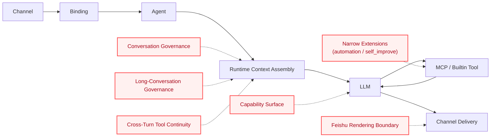
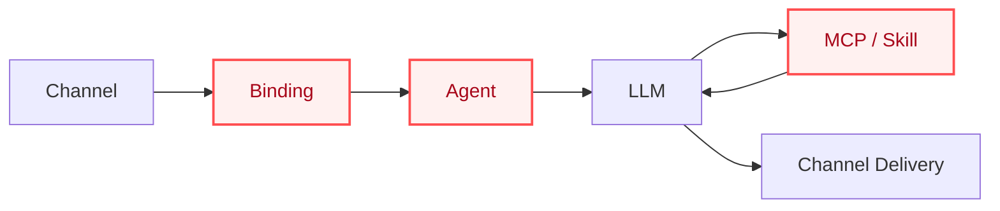
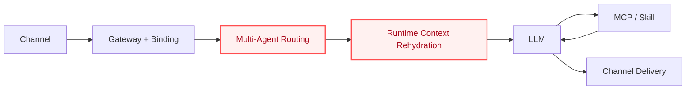
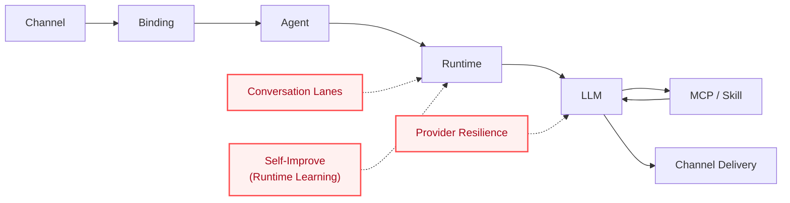
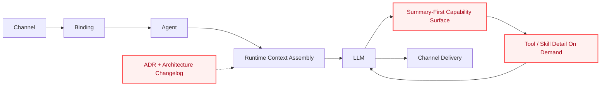
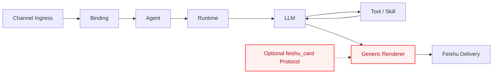
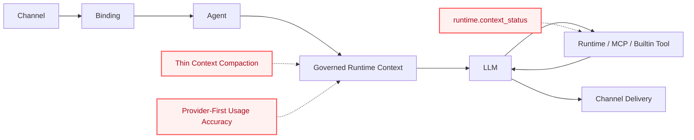
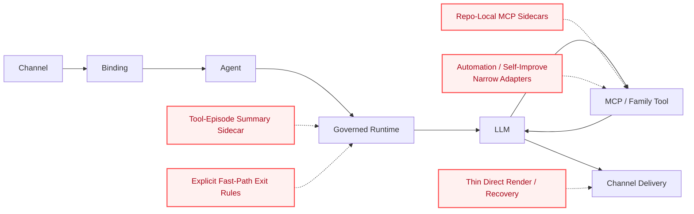

# Architecture Evolution

This document is a reader-first guide to how `marten-runtime` evolved into its current shape.

It is **not** a replacement for:

- [`ARCHITECTURE_CHANGELOG.md`](./ARCHITECTURE_CHANGELOG.md), which is the append-only time-ordered record
- [`architecture/adr/README.md`](./architecture/adr/README.md), which holds stable decisions
- a small set of historical design docs, which may still explain detailed reasoning for selected slices when the changelog summary is not enough

Instead, this guide answers a simpler question:

**How did the runtime spine become the current architecture, and why do the current boundaries look the way they do?**

## Evolution At A Glance

From the beginning, the project optimized for one narrow execution spine:

`channel -> binding -> agent -> LLM -> MCP -> skill -> LLM -> channel`

Everything else was added only when it made that path clearer, safer, or easier to operate.

> **Legend**
> - **Red nodes / red borders** = the key boundaries introduced or formalized in that stage
> - **Dashed edges** = support or governance layers that strengthen the spine without replacing it

| Stage | Focus | What became part of the baseline |
| --- | --- | --- |
| 1 | Runtime spine | the main execution chain |
| 2 | Harness baseline | routing, context rehydration, skills, transport resilience |
| 3 | Governance | conversation lanes, provider resilience, runtime learning |
| 4 | Capability surface | progressive disclosure, LLM-first selection, ADR + changelog truth |
| 5 | Channel boundary | generic Feishu rendering instead of renderer proliferation |
| 6 | Long conversations | compaction, usage accuracy, runtime context status |
| 7 | Continuity and narrow extensions | tool summaries, MCP sidecars, direct render, bounded extensions |

## Architectural Guardrails

All later stages sit under a small set of non-negotiable architecture constraints. The most important one is the thin-harness boundary from [ADR 0001](./architecture/adr/0001-thin-harness-boundary.md):

- the host may assemble context, expose capabilities, execute tools, normalize retries/errors, and provide diagnostics
- the host must **not** turn into:
  - a turn-level message classifier
  - a host-side intent router
  - a generic workflow or durable worker platform
  - a mutable capability policy center
  - a general memory platform

This is why many later changes look narrow by design: even useful additions are accepted only when they strengthen the runtime spine without recentering the system away from it.

## Stage 1 · Baseline Runtime Spine

### Period

Before March 29, 2026.

### What changed

The project established one explicit center of gravity:

- receive messages from a channel
- bind them to the intended agent
- assemble runtime context
- let the LLM choose tools and skills
- return through the channel without turning the host into a workflow platform

### Why it mattered

This stage defined the repo's lasting filter for later work:

- optimize the main execution spine first
- keep the harness thin
- defer worker-heavy, planner-heavy, or memory-platform-like expansion until the main chain is already stable

### Main path at this stage

`channel -> binding -> agent -> LLM -> MCP -> skill -> LLM -> channel`

### Key references

- [`README.md`](../README.md)
- [`2026-03-29-private-agent-harness-design.md`](./2026-03-29-private-agent-harness-design.md)

## Stage 2 · Private-Agent Harness Became The First Real Baseline

### Period

March 29, 2026.

### What changed

The runtime was explicitly narrowed around a first milestone that prioritized:

- gateway binding and multi-agent routing
- live context rehydration
- skills as first-class runtime inputs
- provider transport resilience

At the same time, several tempting expansions were deliberately deferred, including durable delivery queues, proactive job systems, hybrid memory promotion, and full worker backbones.

### Why it mattered

This was the moment the project stopped being just a private-agent idea and became a concrete runtime program with a strict execution order:

- first make the spine executable
- then add hardening around it
- do not widen the system center just because adjacent capabilities are interesting

### Main path at this stage

`channel -> binding -> agent -> runtime context -> LLM -> MCP / skill -> LLM -> channel`

### Key references

- [`2026-03-29-private-agent-harness-design.md`](./2026-03-29-private-agent-harness-design.md)
- [`ARCHITECTURE_CHANGELOG.md`](./ARCHITECTURE_CHANGELOG.md)

## Stage 3 · Conversation Governance And Runtime Learning Were Added Without Changing The Spine

### Period

March 30, 2026.

### What changed

Two narrow but important control-plane additions arrived around the same time:

- **conversation governance** through same-conversation FIFO lanes and stronger provider retry / diagnostics
- **runtime learning** through the narrow `self_improve` slice, which records failure/recovery evidence and promotes accepted lessons into runtime-managed prompt material

Neither slice replaced the main execution path. Both were added as bounded support layers around it.

### Why it mattered

The project moved from “the spine exists” to “the spine can survive real interactive usage”:

- overlapping turns no longer had to race each other inside one conversation
- provider jitter became a runtime concern instead of an operator surprise
- repeated failures could be turned into reviewed lessons without expanding into a general memory platform

### Main path at this stage

`channel -> binding -> agent -> runtime -> LLM -> MCP / skill -> LLM -> channel`

### Key references

- [`ARCHITECTURE_CHANGELOG.md`](./ARCHITECTURE_CHANGELOG.md)
- [`architecture/adr/0001-thin-harness-boundary.md`](./architecture/adr/0001-thin-harness-boundary.md)
- [`architecture/adr/0003-self-improve-runtime-learning-not-architecture-memory.md`](./architecture/adr/0003-self-improve-runtime-learning-not-architecture-memory.md)

## Stage 4 · Capability Exposure Was Narrowed Around Progressive Disclosure

### Period

March 31 to April 1, 2026.

### What changed

The runtime stopped drifting toward host-side intent routing and instead tightened around a thinner capability surface:

- summary-first exposure instead of eager full detail
- LLM-first choice of skill loading and MCP expansion
- a stable family-level surface instead of wider host-side routing rules
- ADR + architecture changelog became the durable architecture source of truth, replacing tracked task-state files for long-term decisions
- even narrow fixes such as natural-language `time` queries were kept inside capability semantics rather than widened into new host-side routing policy

### Why it mattered

This stage made the harness more scalable without making it heavier:

- capability count can grow without turning the host into a chat classifier
- the model remains responsible for capability selection
- the runtime stays focused on assembly, execution, governance, and diagnostics
- architecture truth moved away from local task continuity and into stable public documents

### Main path at this stage

`channel -> binding -> agent -> runtime context assembly -> LLM -> family tools / MCP / skill -> LLM -> channel`

### Key references

- [`2026-03-31-progressive-disclosure-llm-first-capability-design.md`](./2026-03-31-progressive-disclosure-llm-first-capability-design.md)
- [`ARCHITECTURE_CHANGELOG.md`](./ARCHITECTURE_CHANGELOG.md)
- [`architecture/adr/README.md`](./architecture/adr/README.md)

## Stage 5 · Feishu Was Kept As A Thin Channel Boundary, Not A Separate Product Layer

### Period

April 1, 2026.

### What changed

The Feishu path gained a stronger presentation boundary without growing a business-specific rendering system:

- one optional `feishu_card` protocol
- one generic renderer
- clean separation between rendering and delivery responsibilities
- no renderer taxonomy by business type
- no delivery-side semantic classification as a substitute for model reasoning

### Why it mattered

The project improved the channel experience while protecting the same core architecture principles:

- richer output is allowed
- but channel presentation still remains a thin boundary
- rendering does not become a second orchestration layer beside the runtime

### Main path at this stage

`channel -> binding -> agent -> runtime -> LLM -> tool / skill -> LLM -> generic channel rendering`

### Key references

- [`2026-04-01-feishu-generic-card-protocol-design.md`](./2026-04-01-feishu-generic-card-protocol-design.md)
- [`ARCHITECTURE_CHANGELOG.md`](./ARCHITECTURE_CHANGELOG.md)

## Stage 6 · Long-Conversation Governance Became Part Of The Runtime Baseline

### Period

April 7, 2026.

### What changed

The runtime gained a thin but explicit governance layer for long conversations:

- thin context compaction for oversized history prefixes
- provider-first usage accuracy with payload-based preflight estimation
- one bounded runtime inspection path through `runtime.context_status`
- replay and follow-up tightening so context-status questions stay grounded in current runtime truth

### Why it mattered

Long threads are where thin runtimes are most likely to bloat or drift. This stage mattered because it solved real pressure without changing the architectural center:

- compaction stayed a thin continuity slice instead of becoming a memory platform
- context status became a safe builtin inspection path instead of always-on telemetry narration
- usage truth became much more trustworthy without turning prompt accounting into a new subsystem

### Main path at this stage

`channel -> binding -> agent -> governed runtime context -> LLM -> runtime / MCP / builtin tool -> LLM -> channel`

### Key references

- [`ARCHITECTURE_CHANGELOG.md`](./ARCHITECTURE_CHANGELOG.md)
- [`archive/2026-04-06-thin-llm-context-compaction-design.md`](./archive/2026-04-06-thin-llm-context-compaction-design.md)
- [`archive/2026-04-07-context-usage-accuracy-design.md`](./archive/2026-04-07-context-usage-accuracy-design.md)
- [`archive/plans/2026-04-07-thin-llm-context-compaction-plan.md`](./archive/plans/2026-04-07-thin-llm-context-compaction-plan.md)

## Stage 7 · Cross-Turn Tool Continuity And Narrow Extensions Were Added Without Changing The Center

### Period

April 5 to April 10, 2026.

### What changed

#### Tool continuity became a first-class runtime concern

- a repo-local GitHub Trending MCP sidecar replaced a looser skill-only approximation
- cross-turn tool continuity moved toward LLM-first tool-episode summaries instead of a growing rules-first parser path
- deterministic recovery was added where the runtime already had enough result to answer safely

#### Narrow extensions were kept narrow

- the `automation` family converged into a thin internal adapter and later into a bounded direct-render follow-up seam
- `self_improve` remained a narrow runtime-learning slice rather than becoming a general architecture-memory layer
- direct render was used as a thin follow-up seam, not as a new orchestration layer

#### Temporary deviations also became explicit architecture knowledge

- the repo started documenting which host-side fast paths were temporary deviations rather than silently letting them become permanent architecture
- examples included runtime-context forced routes, `time` forced routes, and request-specific GitHub instruction shaping
- this made later shrink/remove decisions part of the architecture story instead of leaving them implicit in historical code

### Why it mattered

This stage shows the mature form of the repo's architecture discipline:

- the runtime can add useful extensions
- but each extension must justify itself as a bounded seam around the main chain
- when a feature can be modeled as MCP, family tool, sidecar, summary sidecar, or narrow adapter, it should stay that way instead of becoming a new platform center
- even temporary deviations are stronger once they are named, bounded, and given exit conditions

### Main path at this stage

`channel -> binding -> agent -> governed runtime -> LLM -> MCP / family tool / summary sidecar -> LLM or direct render -> channel`

### Key references

- [`ARCHITECTURE_CHANGELOG.md`](./ARCHITECTURE_CHANGELOG.md)
- [`archive/2026-04-07-llm-tool-episode-summary-design.md`](./archive/2026-04-07-llm-tool-episode-summary-design.md)
- [`archive/plans/2026-04-07-llm-tool-episode-summary-plan.md`](./archive/plans/2026-04-07-llm-tool-episode-summary-plan.md)
- [`archive/plans/2026-04-05-github-trending-mcp-plan.md`](./archive/plans/2026-04-05-github-trending-mcp-plan.md)
- [`2026-04-09-fast-path-inventory-and-exit-strategy.md`](./archive/branch-evolution/2026-04-09-fast-path-inventory-and-exit-strategy.md)

## Deliberately Excluded Capabilities

| Capability | Status | Why it stays out of the baseline |
| --- | --- | --- |
| Durable delivery queue | Deferred | the repo keeps prioritizing the interactive spine before durable workflow machinery |
| Planner / swarm orchestration | Rejected for now | it would move the host away from the thin-harness role |
| Hybrid memory promotion | Deferred | it risks widening the runtime into a memory platform too early |
| Full async worker backbone | Deferred | the current baseline still prefers interactive execution over worker-first architecture |
| Host-side intent classifier | Rejected | capability choice stays with the model, not the host |

## Current Architecture Direction

Today, `marten-runtime` can be summarized like this:

- the main execution spine is still the product center
- the harness remains intentionally thin
- the model remains responsible for capability choice
- long-thread and cross-turn governance now exist, but as bounded runtime slices
- channel formatting, automation, self-improve, and deterministic recovery are all treated as narrow extensions, not as excuses to recenter the system around orchestration

In practice, that means new work is favored when it does one of three things:

1. clarifies the main spine
2. hardens the runtime around the main spine
3. adds a narrow extension without moving the architectural center away from the spine

## Where To Read Next

- [`../README.md`](../README.md)
- [`ARCHITECTURE_CHANGELOG.md`](./ARCHITECTURE_CHANGELOG.md)
- [`architecture/adr/README.md`](./architecture/adr/README.md)
- [`2026-03-29-private-agent-harness-design.md`](./2026-03-29-private-agent-harness-design.md)
- [`2026-03-31-progressive-disclosure-llm-first-capability-design.md`](./2026-03-31-progressive-disclosure-llm-first-capability-design.md)
- [`archive/README.md`](./archive/README.md)
