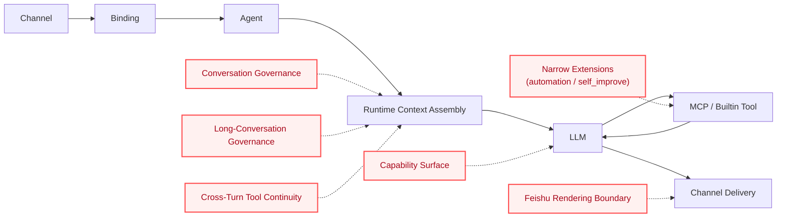
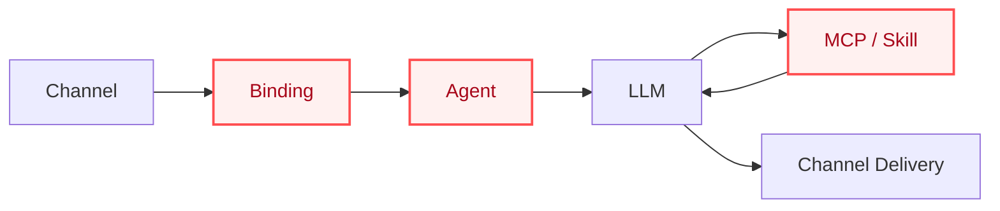
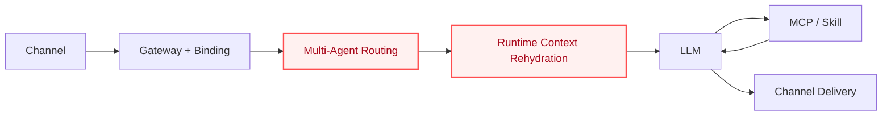
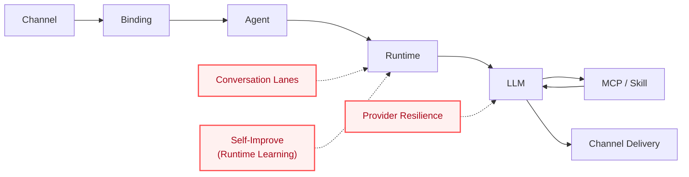
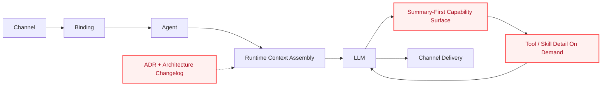
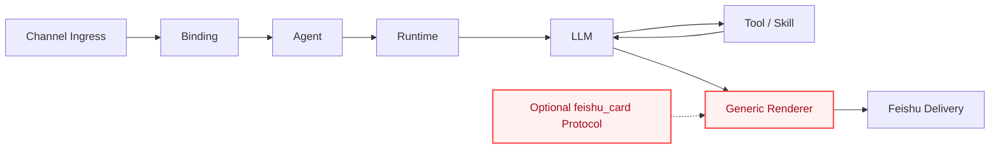
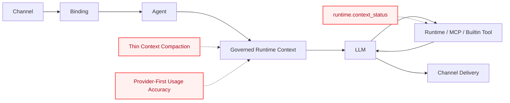
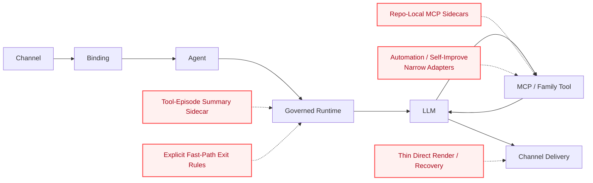
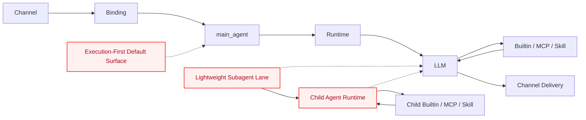
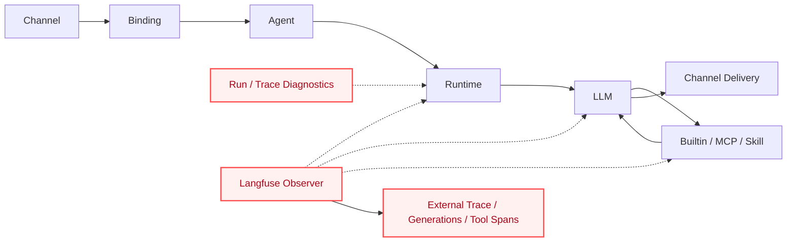

# 架构演进

本文是一份面向新读者的 `marten-runtime` 架构演进说明。

它**不是**以下文档的替代品：

- [`ARCHITECTURE_CHANGELOG.md`](./ARCHITECTURE_CHANGELOG.md)：按时间追加的架构变更记录
- [`architecture/adr/README.md`](./architecture/adr/README.md)：稳定架构决策的归档位置
- 少量保留下来的历史 design 文档：当 changelog 摘要仍不足时，用来补充关键阶段的细节推理

这份文档要回答的是一个更直接的问题：

**`marten-runtime` 是如何沿着一条主链逐步演进成现在这个样子的？为什么当前边界会收敛成今天这样？**

## 这份文档对 Harness 工程化的价值

这份文档不只是在描述一个仓库。它也在记录一个 agent runtime harness 是怎样一步步工程化出来的：

- 每个阶段新增了什么边界
- 哪类真实压力或失败促成了这次演进
- 仓库是怎样在增强可靠性、连续性、可观测性的同时，始终把 runtime spine 放在中心
- 哪些看起来很诱人的平台化方向，被刻意留在基线之外

如果你想学习怎样把 agent harness 做成可运行、可治理、可诊断的系统，同时又避免它膨胀成 workflow platform，可以把每个阶段同时看成项目历史和可复用的工程模式。

## 演进总览

从一开始，这个项目就围绕一条非常明确的执行主链展开：

`channel -> binding -> agent -> LLM -> MCP -> skill -> LLM -> channel`

后续新增的边界，只有在它们能让这条链路更清晰、更稳定、更可操作时，才会被接受进入基线。

> **图例说明**
> - **红色节点 / 红色边框** = 在该阶段新增或正式收敛出来的关键边界
> - **虚线连接** = 支撑层或治理层，用于增强主链，但不替代主执行 spine

| 阶段 | 关注点 | 成为基线的内容 |
| --- | --- | --- |
| 1 | Runtime spine | 主执行链 |
| 2 | Harness baseline | 路由、上下文回灌、skills、传输韧性 |
| 3 | Governance | conversation lanes、provider resilience、runtime learning |
| 4 | Capability surface | progressive disclosure、LLM-first 选择、ADR + changelog 真相 |
| 5 | Channel boundary | generic Feishu rendering，而不是渲染器扩张 |
| 6 | Long conversations | compaction、usage accuracy、runtime context status |
| 7 | Continuity & extensions | tool summaries、MCP sidecars、direct render、窄扩展 |
| 8 | Execution surfaces | `main_agent`、lightweight subagents、执行型默认 prompt |
| 9 | Observability hardening | Langfuse tracing、run/trace correlation、实链验证 |

## 当前架构快照

今天这套架构最适合按“五层主面 + 四个支撑切片”来理解：

- **执行主链**
  - `channel -> binding -> agent -> runtime context -> LLM -> builtin/MCP/skill -> LLM -> channel`
- **治理层**
  - same-conversation FIFO lanes
  - provider retry/backoff normalization + profile-level failover
  - durable SQLite session persistence 与 bounded replay restore
  - source-session compaction、replay budgeting，以及 current-turn context-usage accounting
- **能力面**
  - LLM-first tool selection
  - builtin family tools、MCP servers、file-based skills
- **窄扩展**
  - automation
  - self-improve
  - lightweight subagents
- **可观测性**
  - runtime diagnostics
  - run / trace correlation
  - 可选的 Langfuse tracing

当前部署相关的结论也很直接：

- runtime 主链已经完整到可以进入部署阶段
- durable session continuity、显式 session switch，以及 replay-bounded restore 已经进入当前 continuity baseline
- queue-first execution、planner/swarm orchestration、general memory-platform growth 继续留在当前基线之外

## 架构护栏

后续所有阶段都运行在一组很小但很硬的架构约束之下。其中最关键的是 [ADR 0001](./architecture/adr/0001-thin-harness-boundary.md) 定义的 thin-harness boundary：

- 宿主可以做上下文组装、能力暴露、工具执行、重试/错误归一化，以及诊断观察
- 宿主**不能**演进成：
  - turn-level message classifier
  - host-side intent router
  - generic workflow / durable worker platform
  - mutable capability policy center
  - general memory platform

这也是为什么后续很多演进看起来都“刻意收敛”：即使某个能力有价值，只有在它能增强 runtime spine、而不会把系统中心从主链上挪走时，它才会进入基线。

后续 continuity hardening 也遵守同一条规则：SQLite-backed sessions、`session.new` / `session.resume`、单一 replay-turn budget、switch-triggered compaction、background compaction jobs，以及 thin file-backed memory 都是以 bounded runtime continuity seam 的形态进入，而没有把系统推向 worker platform 或通用 memory system。

## 第 1 阶段：Baseline Runtime Spine

### 时间范围

2026-03-29 之前。

### 新增了什么

项目首先建立的是一个非常明确的中心：

- 从 channel 接收消息
- 通过 binding 命中正确 agent
- 组装运行时上下文
- 让 LLM 选择工具与 skill
- 再经由 channel 返回结果，而不是把宿主扩成 workflow 平台

### 为什么重要

这一阶段定义了之后几乎所有演进都要遵守的过滤条件：

- 优先优化主执行链
- 保持 harness thin
- 在主链没稳之前，不提前扩到 worker、planner、memory platform 这类更重的系统中心

### 这一阶段的主链

`channel -> binding -> agent -> LLM -> MCP -> skill -> LLM -> channel`

### 关键引用

- [`README_CN.md`](../README_CN.md)
- [`Agent Runtime Harness Design`](./2026-03-29-private-agent-harness-design.md)

## 第 2 阶段：Agent Runtime Harness 成为第一层正式基线

### 时间范围

2026-03-29。

### 新增了什么

runtime 被明确收敛到一个第一里程碑：

- gateway binding 与 multi-agent routing
- live context rehydration
- skills first-class runtime integration
- provider transport resilience

同时，也明确延后了若干容易让系统中心膨胀的能力，例如 durable delivery queue、主动任务系统、hybrid memory promotion、full worker backbone。

### 为什么重要

这一阶段意味着项目从“agent runtime harness 的想法”变成了“有严格执行顺序的真实 program”：

- 先打通主链
- 再围绕主链补硬化
- 不因为旁边的能力也有价值，就把系统中心一起做大

### 这一阶段的主链

`channel -> binding -> agent -> runtime context -> LLM -> MCP / skill -> LLM -> channel`

### 关键引用

- [`Agent Runtime Harness Design`](./2026-03-29-private-agent-harness-design.md)
- [`ARCHITECTURE_CHANGELOG.md`](./ARCHITECTURE_CHANGELOG.md)

## 第 3 阶段：会话治理与 Runtime Learning 在不改变主链的前提下加入

### 时间范围

2026-03-30。

### 新增了什么

这一阶段同时加入了两类窄而关键的控制面：

- **会话治理**：通过 same-conversation FIFO lanes、provider retry 与更细 diagnostics，让 interactive chain 真正稳定下来
- **runtime learning**：通过窄范围的 `self_improve` 机制记录 failure/recovery evidence，并把被接受的 lessons 注入 runtime-managed prompt 材料

这两者都没有替代主执行链，而是作为围绕主链的受控支撑层存在。

### 为什么重要

项目从“主链能跑”走向了“主链能经得住真实交互场景”：

- 同一会话的重叠 turn 不再互相踩踏
- provider 抖动变成 runtime 自己要处理的问题，而不是 operator 事后补救的问题
- 重复失败可以沉淀为经过 gate 的 lessons，但不会顺势扩成通用 memory platform

### 这一阶段的主链

`channel -> binding -> agent -> runtime -> LLM -> MCP / skill -> LLM -> channel`

### 关键引用

- [`ARCHITECTURE_CHANGELOG.md`](./ARCHITECTURE_CHANGELOG.md)
- [`architecture/adr/0001-thin-harness-boundary.md`](./architecture/adr/0001-thin-harness-boundary.md)
- [`architecture/adr/0003-self-improve-runtime-learning-not-architecture-memory.md`](./architecture/adr/0003-self-improve-runtime-learning-not-architecture-memory.md)

## 第 4 阶段：Capability Surface 围绕 Progressive Disclosure 收敛

### 时间范围

2026-03-31 到 2026-04-01。

### 新增了什么

runtime 不再朝 host-side intent routing 漂移，而是收敛到一个更薄的 capability surface：

- 默认只暴露 summary-first 的能力面
- 由 LLM 自主决定 skill loading 与 MCP expansion
- 以 family-level surface 替代更重的 host-side routing rules
- ADR + architecture changelog 成为长期的架构 source of truth，用于替代 tracked task-state 文件承担架构真相
- 即使是自然语言 `time` 查询这类窄修复，也仍然放在 capability semantics 内完成，而不是扩成新的 host-side routing policy

### 为什么重要

这一阶段让 harness 在“能力更多”的同时，反而更薄、更可扩展：

- capability 数量增长，不必把宿主变成聊天语义分类器
- capability 选择继续由模型承担
- runtime 更专注于 assembly、execution、governance 与 diagnostics
- 架构真相从本地任务连续性转移到了稳定的公开文档中

### 这一阶段的主链

`channel -> binding -> agent -> runtime context assembly -> LLM -> family tools / MCP / skill -> LLM -> channel`

### 关键引用

- [`2026-03-31-progressive-disclosure-llm-first-capability-design.md`](./2026-03-31-progressive-disclosure-llm-first-capability-design.md)
- [`ARCHITECTURE_CHANGELOG.md`](./ARCHITECTURE_CHANGELOG.md)
- [`architecture/adr/README.md`](./architecture/adr/README.md)

## 第 5 阶段：Feishu 被保持为薄 channel boundary，而不是单独的产品层

### 时间范围

2026-04-01。

### 新增了什么

Feishu 路径的表现力被增强了，但没有扩成一套业务型渲染平台：

- 一个可选的 `feishu_card` protocol
- 一个 generic renderer
- rendering / delivery 清晰分责
- 不为业务类型建立 renderer taxonomy
- 不在 delivery 层做语义分类来替代模型决策

### 为什么重要

这一阶段说明：channel 体验可以增强，但不能因此破坏项目的核心约束：

- richer output 是允许的
- 但 channel presentation 仍应是一个薄边界
- 渲染层不应变成 runtime 之外的第二套 orchestration 系统

### 这一阶段的主链

`channel -> binding -> agent -> runtime -> LLM -> tool / skill -> LLM -> generic channel rendering`

### 关键引用

- [`2026-04-01-feishu-generic-card-protocol-design.md`](./2026-04-01-feishu-generic-card-protocol-design.md)
- [`ARCHITECTURE_CHANGELOG.md`](./ARCHITECTURE_CHANGELOG.md)

## 第 6 阶段：长对话治理成为 runtime 基线的一部分

### 时间范围

2026-04-07。

### 新增了什么

runtime 增加了一层薄但明确的长对话治理边界：

- 针对超长历史前缀的 thin context compaction
- provider-first usage accuracy + payload-based preflight estimation
- 通过 `runtime.context_status` 暴露一个受控的 runtime inspection path
- replay 与 tool follow-up 规则收紧，保证 context-status 问题回到当前 runtime truth，而不是复述旧记忆

### 为什么重要

长对话是 thin runtime 最容易膨胀或漂移的地方。这一阶段重要之处在于：

- compaction 仍然只是 continuity slice，而不是 memory platform
- context status 被做成了一个安全的 builtin inspection path，而不是常驻频道遥测
- usage truth 显著变准，但没有把 prompt accounting 扩成新的系统中心

### 这一阶段的主链

`channel -> binding -> agent -> governed runtime context -> LLM -> runtime / MCP / builtin tool -> LLM -> channel`

### 关键引用

- [`ARCHITECTURE_CHANGELOG.md`](./ARCHITECTURE_CHANGELOG.md)
- [`archive/2026-04-06-thin-llm-context-compaction-design.md`](./archive/2026-04-06-thin-llm-context-compaction-design.md)
- [`archive/2026-04-07-context-usage-accuracy-design.md`](./archive/2026-04-07-context-usage-accuracy-design.md)
- [`archive/plans/2026-04-07-thin-llm-context-compaction-plan.md`](./archive/plans/2026-04-07-thin-llm-context-compaction-plan.md)

## 第 7 阶段：跨轮工具连续性与窄扩展能力被加入，但系统中心没有改变

### 时间范围

2026-04-05 到 2026-04-10。

### 新增了什么

#### 工具连续性成为正式 runtime 议题

- repo-local GitHub Trending MCP sidecar 替代了更松散的 skill-only approximation
- 跨轮工具连续性逐步转向 LLM-first 的 tool-episode summaries，而不是继续长大成 rules-first parser path
- 当 runtime 已经拿到足够结果时，引入 deterministic recovery

#### 窄扩展仍然保持窄边界

- `automation` family 收敛到 thin internal adapter，再进一步收敛为 bounded direct-render follow-up seam
- `self_improve` 仍然只是 narrow runtime-learning slice，而不是通用 architecture-memory layer
- direct render 被用作薄 follow-up seam，而不是新的 orchestration layer

#### 临时偏移也被显式纳入架构知识

- 仓库开始明确记录哪些 host-side fast path 只是 temporary deviation，而不是默认让它们静默固化为长期架构
- 例子包括 runtime-context forced route、`time` forced route，以及 request-specific GitHub instruction shaping
- 这样，后续 shrink / remove 就成为架构演进的一部分，而不只是历史代码里的隐性行为

### 为什么重要

这一阶段体现了项目成熟后的架构纪律：

- runtime 可以增加有用扩展
- 但每个扩展都必须证明自己只是主链周围的 bounded seam
- 如果某个能力可以建模为 MCP、family tool、sidecar、summary sidecar 或 narrow adapter，就不应该顺势变成新的平台中心
- 即使是 temporary deviation，只要被命名、被限制、被赋予 exit condition，它的架构含义就会更清晰

### 这一阶段的主链

`channel -> binding -> agent -> governed runtime -> LLM -> MCP / family tool / summary sidecar -> LLM or direct render -> channel`

### 关键引用

- [`ARCHITECTURE_CHANGELOG.md`](./ARCHITECTURE_CHANGELOG.md)
- [`archive/2026-04-07-llm-tool-episode-summary-design.md`](./archive/2026-04-07-llm-tool-episode-summary-design.md)
- [`archive/plans/2026-04-07-llm-tool-episode-summary-plan.md`](./archive/plans/2026-04-07-llm-tool-episode-summary-plan.md)
- [`archive/plans/2026-04-05-github-trending-mcp-plan.md`](./archive/plans/2026-04-05-github-trending-mcp-plan.md)
- [`2026-04-09-fast-path-inventory-and-exit-strategy.md`](./archive/branch-evolution/2026-04-09-fast-path-inventory-and-exit-strategy.md)

## 第 8 阶段：默认运行时表面转向执行型 Agent

### 时间范围

2026-04-14 到 2026-04-15。

### 新增了什么

仓库把默认运行时表面进一步收敛成“真正执行 agent”的形态：

- 默认 app 变成 `main_agent`
- 默认 agent id 变成 `main`
- prompt 姿态从 demo helper 转向 execution-first default agent
- lightweight subagents 进入正式运行时路径，具备 policy、selector-aware ceiling、registry-backed agent resolution，以及 cooperative MCP cancellation

### 为什么重要

这一阶段让运行时作为产品表面更容易理解：

- 默认 agent 身份终于和仓库的真实姿态一致
- 隔离后台工作成为正式 runtime path，而不是只靠 prompt 约定
- parent/child 执行仍然留在 thin-harness 模型里，没有演进成 planner platform

### 这一阶段的主链

`channel -> binding -> main_agent -> runtime -> LLM -> builtin/MCP/skill or spawn_subagent -> child runtime -> parent summary -> channel`

### 关键引用

- [`ARCHITECTURE_CHANGELOG.md`](./ARCHITECTURE_CHANGELOG.md)
- [`LIVE_VERIFICATION_CHECKLIST.md`](./LIVE_VERIFICATION_CHECKLIST.md)

## 第 9 阶段：外部可观测性进入运行时基线

### 时间范围

2026-04-17 到 2026-04-18。

### 新增了什么

runtime 新增了一层很窄但很关键的 external observability slice：

- Langfuse observer bootstrap
- root trace、generation、tool span 生命周期上报
- runtime/run/trace diagnostics 暴露 external correlation refs
- fail-open hardening，确保 tracing 不会影响主执行链
- cleanup 与 transient-error recovery 收口，既保留 tracing capability，也暴露 degraded health

### 为什么重要

这一阶段补上了“本地诊断”到“服务侧实证”的最后一段链路：

- operator 可以从 runtime diagnostics 直接关联到外部 trace
- multi-tool 和 parent/child subagent 路径现在都有外部验证证据
- observability 继续保持为 support slice，没有扩成 analytics platform

### 这一阶段的主链

`channel -> binding -> agent -> runtime -> LLM -> builtin/MCP/skill -> LLM -> channel`，同时在同一次 run 上具备本地诊断与外部 Langfuse trace correlation

### 关键引用

- [`ARCHITECTURE_CHANGELOG.md`](./ARCHITECTURE_CHANGELOG.md)
- [`2026-04-17-langfuse-observability-design.md`](./2026-04-17-langfuse-observability-design.md)
- [`LIVE_VERIFICATION_CHECKLIST.md`](./LIVE_VERIFICATION_CHECKLIST.md)

## 明确未构建的能力

| Capability | 状态 | 为什么暂不进入基线 |
| --- | --- | --- |
| Durable delivery queue | Deferred | 仓库当前仍优先保证 interactive spine，而不是先补 durable workflow machinery |
| Planner / swarm orchestration | Rejected for now | 会让宿主偏离 thin-harness 角色 |
| Hybrid memory promotion | Deferred | 太早引入会把 runtime 推向 memory platform |
| Full async worker backbone | Deferred | 当前基线仍优先 interactive execution，而不是 worker-first architecture |
| Host-side intent classifier | Rejected | capability choice 应继续留给模型，而不是交给宿主 |

## 当前架构方向总结

今天的 `marten-runtime` 可以用下面几句话来概括：

- 主执行链仍然是产品中心
- harness 仍然刻意保持 thin
- capability choice 继续由模型负责
- 长线程治理与跨轮治理已经进入基线，但都以 bounded runtime slice 的形式存在
- channel formatting、automation、self-improve、lightweight subagents、deterministic recovery、Langfuse tracing 都被视为 narrow extension，而不是系统中心重构的理由

换句话说，新工作更容易被接受，如果它能做到三件事之一：

1. 让主链更清晰
2. 让主链周围的 runtime 更稳
3. 新增一个有价值但不会重塑系统中心的窄扩展边界

## Harness 工程化经验总结 / Lessons

这 9 个阶段可以压缩成一组可复用的 agent runtime harness 工程化经验：

1. **先把一条执行主链打稳，再考虑横向扩张**
   - 这个仓库一直反复回到同一条路径：`channel -> binding -> agent -> runtime -> LLM -> tool/skill -> channel`。
   - 这让后续所有架构取舍都有了统一判断标准：新边界必须解释自己怎样增强主链。

2. **只有在真实运行压力出现后，才引入治理层**
   - conversation lanes、provider resilience、compaction、cross-turn continuity 都是在真实交互故障暴露后进入基线。
   - 这样得到的是实战型治理，而不是预设过多的抽象层。

3. **宿主保持 thin，capability choice 默认继续交给模型**
   - harness 负责上下文组装、工具执行、错误归一化和诊断。
   - 同时它持续避免演进成 host-side intent router 或 message classifier。

4. **当确定性薄边界可以减少实链漂移时，可以接受它**
   - direct render、deterministic recovery、bounded diagnostics 都属于这种薄支撑层。
   - 它们之所以能进入基线，是因为它们缩短或稳定了主链，同时没有把系统中心挪走。

5. **把扩展能力做成 bounded slice，而不是平台化入口**
   - automation、self-improve、lightweight subagents、Langfuse tracing 都是以窄扩展形式进入系统。
   - 它们都继续挂靠在主 runtime contract 上，而没有长成新的 orchestration center。

6. **把时间线真相和验证证据也视为架构的一部分**
   - changelog、ADR、live verification、runtime diagnostics 一起构成了系统的可理解性和可运维性。
   - 对 harness 来说，可观测性和边界决策文档本身就是架构组成部分。

7. **把诱人的平台化方向明确留在基线之外，直到主链真的要求它们进入**
   - durable queue、planner/swarm orchestration、general memory-platform growth、worker-first execution 目前都没有进入基线。
   - 这种克制正是仓库能在不断增强的同时仍然保持可理解的原因之一。

如果别人想从这个仓库学习，最值得带走的一条经验是：先把 runtime path 做成真的，再只补那一层能解决下一个真实压力的最小边界。

## 继续阅读

- [`../README_CN.md`](../README_CN.md)
- [`ARCHITECTURE_CHANGELOG.md`](./ARCHITECTURE_CHANGELOG.md)
- [`architecture/adr/README.md`](./architecture/adr/README.md)
- [`CONFIG_SURFACES.md`](./CONFIG_SURFACES.md)
- [`LIVE_VERIFICATION_CHECKLIST.md`](./LIVE_VERIFICATION_CHECKLIST.md)
- [`archive/README.md`](./archive/README.md)
