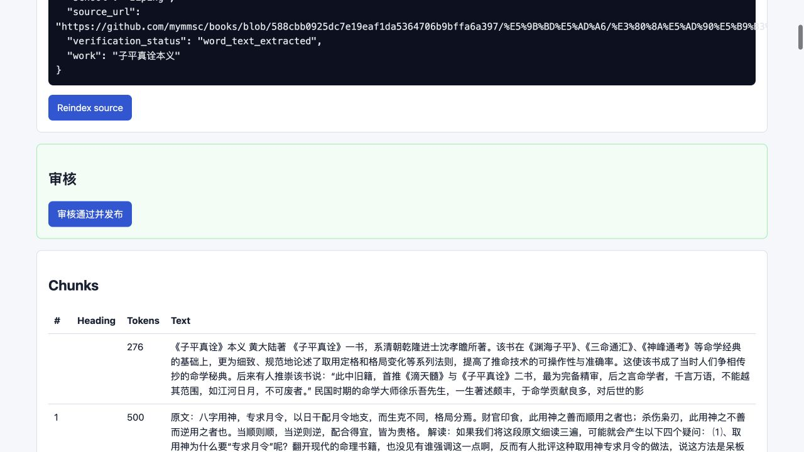
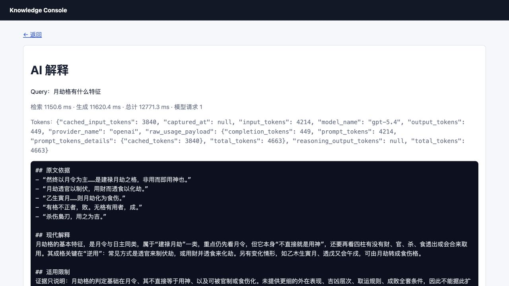

# 文档索引

这个目录保存 `marten-runtime` 的公开设计、运维文档和历史证据。CodeStable 提供目标世界、当前项目真相和文档生命周期入口。

## 从这里开始

1. [Project Spec](../.cs/spec/index.md)
   - 当前能力、主链、边界、质量约束和开发阅读路径
2. [Vision](../.cs/vision/index.md)
   - 目标用户旅程、能力版图和长期方向
3. [项目 README](../README.md)
   - 公开概览、快速开始和常用入口
4. [部署指南](./DEPLOYMENT.md)
   - 最短部署路径、配置、启动与排障
5. [架构演进](./ARCHITECTURE_EVOLUTION.md)
   - 当前架构快照与阶段叙事
6. [架构变更日志](./ARCHITECTURE_CHANGELOG.md)
   - 追加式时间线和验证证据
7. [ADR 索引](./architecture/adr/README.md)
   - 稳定架构决策
8. [配置面说明](./CONFIG_SURFACES.md)
9. [实链验证清单](./LIVE_VERIFICATION_CHECKLIST.md)
10. [文档生命周期台账](../.cs/notes/002-docs-lifecycle-inventory.md)
11. [归档索引](./archive/README.md)

## 文档职责层级

- `.cs/vision/`：目标产品世界、用户旅程与跨 Epic 方向。
- `.cs/spec/`：当前项目真相、能力边界、质量约束与修改入口。
- `docs/architecture/adr/`：长期稳定的架构决策。
- `ARCHITECTURE_CHANGELOG.md`：架构进入基线的时间线与验证证据。
- `DEPLOYMENT.md`、`CONFIG_SURFACES.md`、`LIVE_VERIFICATION_CHECKLIST.md`：公开运维契约。
- 日期型 design：某次变化的完整设计推理与阶段证据。
- `archive/`：已完成阶段的设计、审计、计划与压缩摘要。

## 推荐阅读顺序

- 理解当前系统：`Project Spec -> runtime main chain -> capability / operations 子规格 -> 相关 ADR`。
- 部署与排障：`Project Spec -> DEPLOYMENT -> CONFIG_SURFACES -> LIVE_VERIFICATION_CHECKLIST`。
- 追溯架构原因：`Project Spec -> ADR -> ARCHITECTURE_CHANGELOG -> 日期型 design / archive`。
- 规划长期方向：`Vision -> Project Spec -> 相关 Epic`。

## 文档生命周期

- 当前能力和边界变化同步进入 `.cs/spec/`，公开操作契约同步更新对应 `docs/` 主文档。
- 跨模块、多批推进且规格持续演化的需求进入 `.cs/epics/`。
- 可关闭行动与验证进入 `.cs/issues/`。
- 日期型 design 在变化完成后转为证据角色，长期结论进入 spec、ADR 或 changelog。
- 归档与清理前先完成结论吸收、引用检查和链接更新。
- 28 份 Markdown 的逐文件状态见 [文档生命周期台账](../.cs/notes/002-docs-lifecycle-inventory.md)。

## 每份文档的职责

- `DEPLOYMENT.md`
  - 给运维或部署场景的最短可行路径
- `ARCHITECTURE_EVOLUTION.md`
  - 用阶段叙事解释主链、边界和演进原因
- `ARCHITECTURE_CHANGELOG.md`
  - 记录架构基线如何变化、为什么变化、如何验证
- `architecture/adr/`
  - 保存不宜漂移的稳定架构决策
- `CONFIG_SURFACES.md`
  - 说明每类配置应该放在哪个文件
- `LIVE_VERIFICATION_CHECKLIST.md`
  - 提供真实 `Feishu -> LLM -> MCP -> Feishu` 链路的检查清单
- `2026-07-23-bazi-agent-design.md`
  - Bazi Agent、builtin Bazi、bundled `taibu-core`、Knowledge/RAG 与领域 Skill 组合方案
- `../.cs/spec/knowledge-runtime.md`
  - Knowledge/RAG 当前能力、语料发布、Console、索引 profile、检索评估与延期性能基准
- `archive/`
  - 保留少量仍有追溯价值的历史设计、审计和计划

## 说明

- 当前项目理解从 `.cs/spec/index.md` 开始，目标方向从 `.cs/vision/index.md` 开始。
- ADR 保存稳定决策，architecture changelog 保存进入基线的时间线，日期型 design 保存完整推理。
- Archive 保持精简，压缩摘要优先承接重复执行历史。
- 2026-04-09 branch-evolution 现在只保留一份归档说明：`docs/archive/branch-evolution/2026-04-09-fast-path-inventory-and-exit-strategy.md`
- 2026-04-11 repo slimming 工作已压缩到 `docs/archive/plans/2026-04-11-repo-slimming-summary.md`
- 2026-04-17 Langfuse observability design 保留在 `docs/2026-04-17-langfuse-observability-design.md`
- 2026-04-30 主链评测基础能力设计保留在 `docs/2026-04-30-main-chain-eval-foundation-design.md`
- 2026-07-23 Bazi Agent 方案设计见 `docs/2026-07-23-bazi-agent-design.md`
- 已完成的评测执行计划已压缩到 `docs/archive/plans/2026-05-01-eval-foundation-summary.md`
- 本地忽略的 `STATUS.md` 继续只承担分支执行看板角色

## 评测运维入口

主 HTTP 服务启动后，访问 `/evals` 查看当前评测链路状态、suite、历史 runs、分数变化、基线对比和报告入口。


| 入口 | 内容 |
| --- | --- |
| `/evals` | 评测总览、最近运行、套件、分数变化 |
| `/evals/suites` | HTML 套件清单；`Accept: application/json` 返回 JSON |
| `/evals/runs` | HTML 历史运行；`Accept: application/json` 返回 JSON |
| `/evals/runs/{eval_run_id}/view` | 单次运行详情、对比结果、稳定性、用例明细 |
| `/evals/reports/{eval_run_id}` | 完整 HTML 报告 |

CLI 入口：

```bash
PYTHONPATH=src .venv/bin/python scripts/run_eval.py \
  --suite main_chain_core \
  --mode scripted \
  --profile openai_gpt_5_4 \
  --baseline latest_passed
```

主要套件：

- `main_chain_core`：主链黄金任务
- `main_chain_mcp`：真实 MCP 工具链路，只用于 `live` mode
- `main_chain_subagent`：主线程与子代理链路
- `memory_long_horizon`：长期记忆收益
- `knowledge_retrieval`：RAG 检索、重排、namespace 隔离和知识库操作回归
- `subagent_task_progress`：子代理调度与非 MCP 任务推进
- `subagent_external_mcp_completion`：子代理外部 MCP 完成链路，只用于 `live` mode

`main_chain_mcp` 与 `subagent_external_mcp_completion` 的正式效果评估使用真实 provider、真实 MCP server 和真实 GitHub 返回：

```bash
PYTHONPATH=src .venv/bin/python scripts/run_eval.py \
  --suite main_chain_mcp \
  --mode live \
  --profile openai_gpt_5_4 \
  --baseline latest_passed

PYTHONPATH=src .venv/bin/python scripts/run_eval.py \
  --suite subagent_external_mcp_completion \
  --mode live \
  --profile openai_gpt_5_4 \
  --baseline latest_passed
```

产物位置：

- SQLite 历史：`data/evals.sqlite3`
- 报告目录：`reports/evals/<eval_run_id>/`
- 汇总报告：`summary.md`、`summary.json`、`summary.html`
- 单 case 详情：`cases/<case_id>.json`

边界：eval 运维面只复用 eval harness、SQLite store、报告层和 HTTP diagnostics；`/messages` 主链仍由 runtime loop 与 LLM 工具选择驱动。

## Knowledge 运维入口

配置 `KNOWLEDGE_OPERATOR_TOKEN` 后访问 `/knowledge/console`。Console 提供草稿上传、chunk/profile 预览、导入任务、来源审核、正式库、检索试查和 reindex。





操作与架构约束见 [Knowledge/RAG Runtime](../.cs/spec/knowledge-runtime.md)。

## 当前状态

当前项目能力、架构边界和质量约束由 [Project Spec](../.cs/spec/index.md) 统领。公开运行概览继续由 [项目 README](../README.md) 提供，稳定决策由 [ADR](./architecture/adr/README.md) 提供，架构时间线与验证证据由 [Architecture Changelog](./ARCHITECTURE_CHANGELOG.md) 提供。
