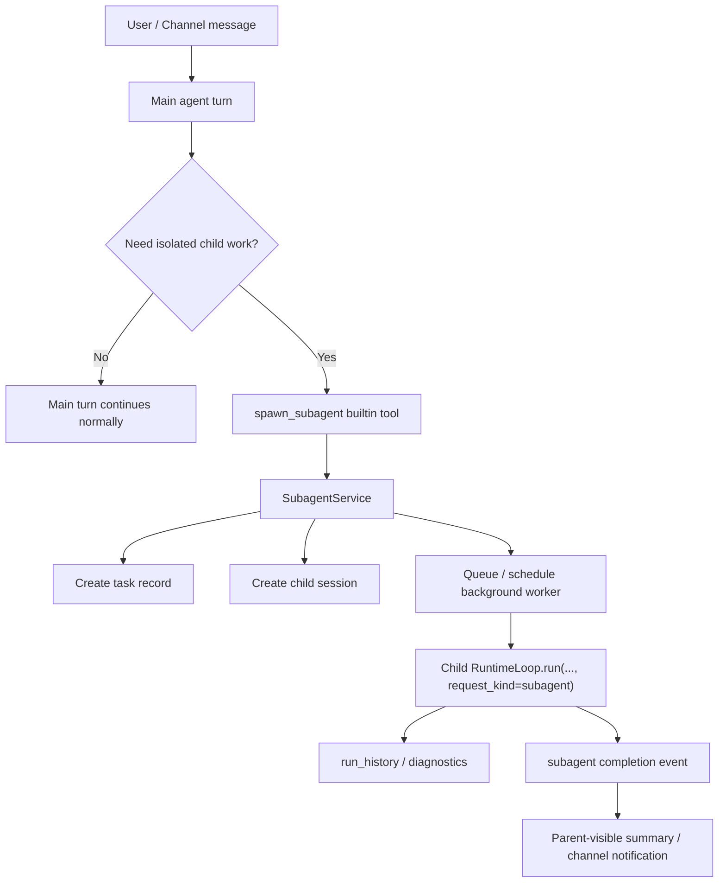

# Lightweight Subagent Design

## Goal

Add a thin, isolated subagent capability to `marten-runtime` so the main agent can delegate suitable work to background child agents without polluting the main conversation window with tool noise, long search traces, or intermediate execution artifacts.

This design intentionally targets the repository's existing runtime shape:

`channel -> binding -> runtime loop -> builtin tool / MCP / skill -> delivery / diagnostics`

The feature must strengthen that path rather than turn the runtime into a workflow platform, planner runtime, or swarm system.

## User-Confirmed Direction

This design locks the following decisions:

- long-term target: support **both** async background subagents and sync orchestrated child execution
- implementation order: **Phase 1 ships async background subagents first**
- child permissions: **mixed profile model**
  - the runtime substrate defaults child profile handling to `restricted`
  - the product entry surface may infer `standard` when the user explicitly asks for a subagent/background execution or when the delegated task clearly needs broader generic tool access
  - parent can still explicitly request a broader profile
  - child permissions must never exceed the parent's effective ceiling

## Problem Statement

Current `marten-runtime` already supports:

- one active runtime loop per turn
- isolated automation turns with dedicated session ids
- run/session diagnostics
- lane-based conversation serialization

However, it does **not** yet support a first-class parent/child execution model for agent tasks.

That gap matters because some work is better handled outside the main turn context:

- long-running research
- tool-heavy exploration
- background inspection / review
- non-urgent follow-up tasks that should complete later
- tasks whose intermediate output would distract or pollute the main thread

The desired runtime behavior is:

1. main agent decides a task is suitable for delegation
2. runtime spawns a child execution unit with isolated session state
3. child runs independently in the background
4. main thread receives only acceptance + later structured completion status
5. diagnostics allow operators to trace parent session -> task -> child session -> child run

## Why a Thin Subagent Design Fits This Repo

### Current strengths we can build on

`marten-runtime` already has several pieces that make a thin subagent slice realistic:

- `RuntimeLoop.run(...)` is the narrow execution core
- `SessionRecord` already has `parent_session_id`
- `run_history` already provides run-level traceability
- `/diagnostics/session/{session_id}` and `/diagnostics/run/{run_id}` already exist
- automation isolated turns already prove the repo can run side sessions outside the main interactive turn
- lane management already provides conversation serialization semantics

### Current gaps we must fill

The repo does not yet have stable source-of-truth support for:

- subagent task lifecycle management
- child session creation as a first-class runtime concept
- structured spawn / cancel / status APIs
- child result announcement back to the parent runtime surface
- child-specific prompt/context/tool profiles

### Architectural consequence

The right move is **not** to overload automation semantics and **not** to embed orchestration logic deep inside `RuntimeLoop`.

Instead, the repo should add a **thin subagent substrate**:

- one small state model for child tasks
- one thin service that spawns and tracks child execution
- one narrow builtin tool for the main agent
- one structured event path for result completion

## Non-Goals

This design explicitly does **not** attempt to build:

- a planner runtime
- a DAG/workflow engine
- recursive multi-level agent trees
- autonomous task decomposition
- automatic swarm / committee / voting patterns
- a general-purpose async job platform for arbitrary future features
- full transcript replay of child execution into the parent session

Phase 1 also does **not** include:

- nested child-of-child spawning
- model-driven dynamic privilege escalation
- complex scheduling policies beyond bounded concurrency + simple queueing
- generic shared memory across parent and child sessions

## Design Invariants

### Invariant 1: keep the harness thin

Subagents must remain a narrow extension of the existing runtime path, not a second control plane.

### Invariant 2: parent owns orchestration, child owns execution

The main agent decides whether to spawn, what to delegate, and how to synthesize results.
Child agents execute one bounded task and return status + summary.

### Invariant 3: context isolation is the default

Child sessions must not inherit the entire parent conversation transcript by default.
The baseline child context is a structured task brief, not a fork of the full parent thread.

### Invariant 4: results are summarized, not replayed

The parent session should receive:

- accepted/queued/running/completed/failed state
- short summary
- diagnostics reference

The parent session should not automatically receive:

- full tool logs
- intermediate failed attempts
- full child transcript

### Invariant 5: child permissions never exceed parent permissions

Even when a parent requests a broader child profile, runtime enforcement must cap the child at the parent's effective ceiling.

### Invariant 6: Phase 1 optimizes for async background execution

The first slice must solve the user's main need:

- offload work
- isolate tool/context noise
- deliver results later

Sync wait-style orchestration is a later extension.

## Reference-Informed Design Summary

### OpenClaw pattern adopted

Adopt:

- main agent as coordinator
- child session isolation
- reduced child prompt/context
- structured status/result announcement

Do not adopt:

- fully general multi-agent binding/routing substrate as part of this slice

### Claude Code pattern adopted

Adopt:

- fresh child agent as the default
- child runs independently
- parent receives completion notification rather than full child trace
- use fresh child for low-context-overlap work

Do not adopt in Phase 1:

- full parent-context fork as default behavior
- advanced session continuation semantics

### OpenCode pattern adopted

Adopt:

- subagents as specialized execution units
- separate primary vs subagent roles
- task-level child sessions

Do not adopt in Phase 1:

- broad configurable agent marketplace semantics
- general interactive child-session navigation UI concerns inside runtime core

### nanobot pattern adopted

Adopt:

- thin `spawn` surface
- background task manager
- child-specific focused prompt
- child result announcement via structured internal message

Improve beyond nanobot for this repo by adding:

- stronger diagnostics linkage
- explicit permission profiles
- explicit parent/child session references
- strict no-parent-context-pollution rule

## Architecture Options Considered

## Option A — model subagents as internal automation jobs

### Shape

Wrap every child task as a special automation dispatch.

### Pros

- low initial implementation cost
- reuses isolated-turn machinery

### Cons

- wrong long-term semantics: automation is schedule-driven, subagenting is parent-turn-driven
- awkward parent/child linkage
- future sync orchestration path remains unnatural
- risks hard-coding child execution into automation concepts

### Decision

Reject as the primary architecture. Keep automation isolated turns as a compatibility pattern only.

## Option B — run child loops directly inside `RuntimeLoop`

### Shape

`RuntimeLoop` directly invokes another `RuntimeLoop.run(...)` as part of the parent turn.

### Pros

- straightforward for future sync orchestration

### Cons

- mixes parent control flow and child lifecycle
- async background management becomes messy
- cancellation, queueing, and diagnostics get entangled with main loop logic
- risks turning `RuntimeLoop` into orchestration infrastructure

### Decision

Reject for Phase 1.

## Option C — thin `SubagentService` above the runtime loop (**recommended**)

### Shape

Add a dedicated thin subagent layer that:

- validates spawn requests
- creates task + child session state
- schedules background execution
- invokes `RuntimeLoop.run(...)` for the child turn
- records results
- emits parent-visible completion events

### Pros

- narrow change surface
- keeps `RuntimeLoop` execution-focused
- easy to add async first, sync later
- aligns with current repo style

### Cons

- requires a small new state model and service surface

### Decision

Adopt.

## High-Level Architecture

## Phase 1 Scope

### Included

1. async background subagent spawning
2. one child task = one isolated child session
3. bounded child task store/state model
4. substrate-default child tool profiles plus constrained product-level profile inference
5. structured completion/failure announcements
6. diagnostics endpoints for subagent state
7. cancellation support
8. queueing + timeout + concurrency cap

### Excluded

1. nested subagent trees
2. sync wait-style child orchestration
3. persistent continuation of prior child sessions
4. parent-context fork as default mode
5. autonomous planner decomposition
6. arbitrary cross-feature job orchestration

## Core Domain Model

## `SubagentTask`

Introduce a narrow runtime model:

- `task_id`
- `label`
- `status`
  - `queued`
  - `running`
  - `succeeded`
  - `failed`
  - `cancelled`
  - `timed_out`
- `parent_session_id`
- `parent_run_id`
- `parent_agent_id`
- `child_session_id`
- `child_run_id` (nullable until child run starts)
- `app_id`
- `agent_id`
- `tool_profile`
- `context_mode`
- `task_prompt`
- `acceptance_message`
- `result_summary`
- `error_text`
- `created_at`
- `started_at`
- `finished_at`
- `notify_on_finish`

This model should remain minimal. If a field does not help execution, operator diagnostics, or parent correlation, it probably does not belong.

## Child session identity

Use a dedicated internal conversation/session identity shape such as:

- conversation id: `subagent:{task_id}`
- session record with `parent_session_id = <parent session>`
- `session_kind = "subagent"`
- `lineage_depth = parent.lineage_depth + 1`

This keeps child runs inspectable through the existing session diagnostics surface while preserving a clear lineage.

The implementation should not hand-roll child `SessionRecord` creation in multiple places. The session store must expose one narrow child-session creation path so parent linkage, kind, and lineage semantics stay consistent.

## Child tool profile model

Phase 1 uses three named profiles:

- `restricted`
- `standard`
- `elevated`

The profile selected at spawn time is only a **requested** profile. Effective permissions are:

`effective child profile = min(requested child profile, parent effective ceiling)`

### Recommended semantics

#### `restricted` (substrate default)

Suitable for most background tasks:

- runtime inspection
- time
- read-only skill use
- read-only or low-risk builtin tools
- approved MCP tools that do not mutate repo state or execute high-risk side effects

Disallow by default:

- arbitrary file writes
- dangerous shell / external process execution
- recursive child spawning

Profile definitions should be expressed in terms of the repo's existing `AgentSpec.allowed_tools` / `ToolRegistry.build_snapshot()` selector model rather than as a second unrelated permission system. If a profile cannot be rendered deterministically into the current allowed-tool selector scheme, the design is drifting.

#### `standard`

Allows a broader child surface when explicitly requested, but still below unrestricted execution.

#### `elevated`

Reserved for explicitly approved future use. Phase 1 should model it in the contract but may keep runtime support conservative.

## Product-level spawn policy

Phase 1 keeps the **service substrate** conservative while making the **product entry** usable.

### Policy goals

- users should not need a long parameter-heavy prompt just to force child execution
- when a user explicitly says things like “开启子代理 / 后台处理 / 不要污染主线程 / 不要污染上下文”, the main agent should strongly prefer `spawn_subagent`
- when the delegated task clearly implies broader generic tool access (for example MCP / external API / remote URL style work), the entry surface may infer `tool_profile = standard`
- this inference is **generic**, not GitHub-specific and not tied to one MCP server

### Policy boundaries

- inference happens only at the product entry / builtin-tool surface; `SubagentService` still treats the incoming request deterministically
- inferred `standard` is still capped by the parent `allowed_tools` ceiling
- child snapshots must still exclude recursive `spawn_subagent`
- if no explicit subagent intent and no broader-tool signal exist, the request remains `restricted`

This split keeps the harness thin: the runtime substrate remains stable and auditable, while the product surface becomes predictable enough for short natural-language requests.

## Child context model

Phase 1 supports two modes:

- `brief_only` (default)
- `brief_plus_snapshot`

### `brief_only`

Pass only:

- delegated task description
- essential constraints
- success criteria
- optional short background block

### `brief_plus_snapshot`

Pass the above plus a narrow structured snapshot such as:

- compacted context summary
- last few high-signal conversation summaries
- active app/agent constraints relevant to the child task

Phase 1 should **not** support full parent transcript inheritance by default.

## Spawn Surface

## Builtin tool: `spawn_subagent`

Expose a new builtin tool to the main agent.

### Input shape

- `task`: required; the child task brief
- `label`: optional short label
- `tool_profile`: optional; substrate default is `restricted`, but the product entry may infer `standard` under explicit subagent intent / broader-tool-need policy before the request reaches the service
- `agent_id`: optional; defaults to a configured internal child-capable agent identity or current agent-compatible execution identity
- `context_mode`: optional; default `brief_only`
- `notify_on_finish`: optional; default `true`

### Immediate return shape

The tool should immediately return an accepted payload, for example:

- `status = accepted`
- `task_id`
- `child_session_id`
- `effective_tool_profile`
- `queue_state`

This allows the parent model to respond naturally in the main thread, such as “I started a background task and will notify you when it finishes.”

## Parent/Child Correlation Requirements

Phase 1 must preserve both session lineage and run lineage. That means:

- `SubagentTask.parent_session_id` must point at the interactive parent session
- `SubagentTask.parent_run_id` must come from the spawning tool call's `tool_context.run_id`
- child session records must persist `parent_session_id`
- child run records should persist `parent_run_id` so run diagnostics can be traced upward directly

This is important because the current repo already has `SessionRecord.parent_session_id` and `RunRecord.parent_run_id` fields, but they are not yet fully wired into a subagent execution path. Phase 1 should use those existing lineage fields instead of inventing a parallel correlation scheme.

## Notification Sink For Phase 1

Phase 1 should use one explicit completion sink so implementers do not drift into transcript replay.

Required parent-visible completion behavior:

- on child completion/failure/cancellation, append one concise `SessionMessage.system(...)` entry to the **parent** session
- the message must contain only structured summary/state information, not the child transcript or tool log
- the parent session entry exists so later turns can discover the outcome without inventing an extra hidden store

Optional channel-visible behavior:

- if the originating channel is Feishu and `notify_on_finish = true`, runtime may also send a short completion notice through the existing delivery path
- HTTP-only callers are not required to receive an out-of-band push in Phase 1; diagnostics + parent session event are sufficient

## Runtime Lifecycle

## 1. Spawn acceptance

When the builtin tool is called:

1. validate task parameters
2. resolve effective child profile
3. create `SubagentTask`
4. create child session record
5. enqueue background execution
6. return accepted payload

## 2. Background execution

A background worker should:

1. mark the task `running`
2. build child context according to `context_mode`
3. build a child tool snapshot from the effective profile
4. run `RuntimeLoop.run(..., request_kind="subagent")`
5. capture the child run id from emitted events / run history
6. summarize the final child outcome into `result_summary` or `error_text`

## 3. Completion

On success:

- set `status = succeeded`
- persist `child_run_id`
- persist `result_summary`
- emit `subagent.completed`

On failure:

- set `status = failed` or `timed_out`
- persist `child_run_id` if available
- persist `error_text`
- emit `subagent.failed`

On cancellation:

- set `status = cancelled`
- emit `subagent.cancelled`

## 4. Notification

Phase 1 should support two notification targets:

### Parent-visible internal event

Write a structured parent-correlated runtime event that can later be surfaced into the parent session or channel delivery flow.

### Optional channel-visible summary

If the original request came from a deliverable channel and `notify_on_finish = true`, emit a short user-facing summary using existing channel delivery paths.

## Event Model

Introduce narrow event types for child lifecycle visibility:

- `subagent.accepted`
- `subagent.started`
- `subagent.completed`
- `subagent.failed`
- `subagent.cancelled`
- `subagent.timed_out`

Each payload should remain short and structured:

- `task_id`
- `label`
- `status`
- `parent_session_id`
- `child_session_id`
- `child_run_id` (when known)
- `summary`
- `diagnostics_ref`

This gives operators and future parent-session summarization logic enough information without replaying the full child transcript.

## Prompt / Request Shape for Child Turns

Extend runtime request semantics with a narrow child mode:

- `request_kind = "subagent"`

The child request should use a thinner prompt/context assembly than the normal interactive path.

### Child prompt goals

- preserve core behavioral constraints
- keep tool-use rules explicit
- keep child focused on the delegated task
- avoid carrying unnecessary personality/history material

### Child prompt should include

- stable app/agent constraints needed for safe execution
- tool profile constraints
- task brief
- result contract: child must end with a concise usable summary

### Child prompt should avoid

- full parent conversation history
- unrelated always-on content if not relevant to the child task
- broad prompt bloat that defeats the context-isolation goal

## Service Lifecycle Requirements

Because Phase 1 is async background execution, the subagent service must have an explicit runtime lifecycle.

Required behavior:

- background child tasks must be tracked by the service
- the HTTP runtime/app lifespan must drain or cancel outstanding child tasks during shutdown
- tests must prove shutdown does not silently leak detached tasks

Implementers should not create untracked fire-and-forget `asyncio.create_task(...)` calls in multiple locations. One narrow tracked task set owned by the service is required.

## Diagnostics and Operator Visibility

Add a dedicated subagent diagnostics surface.

### Endpoints

- `/diagnostics/subagents`
- `/diagnostics/subagent/{task_id}`

### Minimum required fields

- task identity and status
- timestamps
- parent session id
- child session id
- child run id
- requested vs effective tool profile
- context mode
- summary / error text

This should complement, not replace, existing diagnostics:

- `/diagnostics/session/{session_id}`
- `/diagnostics/run/{run_id}`

## Cancellation and Resource Controls

Phase 1 must include hard limits so the feature stays thin and safe.

### Required controls

- `max_concurrent_subagents`
- `max_subagents_per_parent_session`
- `subagent_timeout_seconds`
- `max_queued_subagents`

### Cancellation surfaces

- builtin tool or internal admin surface: `cancel_subagent(task_id)`
- optional parent-session cascade cancellation on session stop / teardown

### Queueing policy

Keep Phase 1 simple:

- if under concurrency cap -> start immediately
- else -> remain queued
- queue order can be FIFO

No priority scheduler is needed in Phase 1.

## Why full parent-context fork is deferred

Although some systems support full parent-context inheritance for child agents, this repo should defer that behavior because:

1. the user's explicit goal is to avoid main-window context pollution
2. fresh child tasks are cheaper and cleaner for low-overlap work
3. the repo currently favors thin, explicit runtime surfaces over broad hidden context sharing
4. full-fork semantics would create more complexity around token cost, history reuse, and drift control than Phase 1 needs

A future Phase 2 may add a controlled `fork-lite` style mode if real use cases justify it.

## Integration Points in the Current Repo

### New modules

Recommended additions:

- `src/marten_runtime/subagents/models.py`
- `src/marten_runtime/subagents/store.py`
- `src/marten_runtime/subagents/service.py`
- `src/marten_runtime/tools/builtins/spawn_subagent_tool.py`
- `src/marten_runtime/tools/builtins/cancel_subagent_tool.py` (or equivalent narrow admin tool)

### Existing modules likely touched

- `src/marten_runtime/interfaces/http/bootstrap.py`
  - wire subagent store/service
  - register builtin tool(s)
- `src/marten_runtime/interfaces/http/bootstrap_handlers.py`
  - allow parent-aware internal completion delivery if needed
- `src/marten_runtime/interfaces/http/app.py`
  - add diagnostics endpoints
- `src/marten_runtime/runtime/loop.py`
  - support `request_kind="subagent"`
  - respect thinner child prompt/context assembly
- `src/marten_runtime/tools/registry.py`
  - ensure child tool snapshots can be built from profiles cleanly
- `src/marten_runtime/session/*`
  - leverage `parent_session_id` and child session persistence cleanly

### Existing modules intentionally not repurposed as core architecture

- `automation/*`
  - may inspire isolated execution patterns, but should not become the permanent semantic home of subagents

## Phase 1 Acceptance Criteria

Phase 1 is complete only when all of the following are true:

1. main agent can invoke `spawn_subagent`
2. runtime returns an accepted payload immediately
3. child work runs in a separate child session
4. child tool activity does not automatically pollute the parent session transcript
5. task completion updates task state and stores a summary/error
6. parent-visible completion notification exists
7. diagnostics show parent session -> task -> child session -> child run correlation
8. substrate-level restricted default and product-level constrained profile inference are both documented and enforced by tests
9. parent cannot grant child permissions above its own ceiling
10. concurrency cap, timeout, and cancellation are implemented and covered by tests

## Phase 2 Evolution Path

If Phase 1 succeeds, future extensions can remain thin:

### Phase 2A — synchronous orchestrated child waits

Allow the parent turn to spawn a child, wait for completion, and continue the current reasoning loop with only the child summary injected back.

### Phase 2B — child session continuation

Allow a parent to continue a previously created child session when high context overlap makes reuse worthwhile.

### Phase 2C — richer context modes

Potential additions:

- `fork_lite`
- child-only skill set tuning
- more selective context snapshots

These should be justified by real runtime evidence, not designed upfront.

## Risks and Mitigations

### Risk 1: feature drifts into orchestration-platform growth

Mitigation:

- single-level child tasks only in Phase 1
- no DAG/workflow support
- no planner decomposition
- keep service/store/tool surfaces narrow

### Risk 2: parent session pollution returns through notifications

Mitigation:

- only structured summary/status events are delivered back
- no automatic transcript replay

### Risk 3: permission boundary confusion

Mitigation:

- explicit tool profiles
- enforce parent ceiling cap
- cover escalation boundary with targeted tests

### Risk 4: diagnostics fragmentation

Mitigation:

- store parent/child correlations explicitly
- expose task-level diagnostics endpoints
- require task -> child session -> child run traceability in acceptance criteria

### Risk 5: async child failures become invisible

Mitigation:

- explicit failed/timed_out/cancelled task states
- persistent error summary
- visible diagnostics endpoint and completion event surface

## Final Design Decision

`marten-runtime` should add subagent support as a **thin background child execution substrate**.

The first implementation slice should:

- focus on async background execution
- use fresh isolated child sessions
- keep the service substrate defaulting to restricted permissions while allowing constrained product-level inference to `standard` when explicit subagent intent / broader-tool needs are present
- return only structured status + summary to the parent surface
- preserve future expansion toward sync waits without committing to heavy orchestration design now

This achieves the user's goal — reducing main-agent load and avoiding context/tool-call pollution — while staying aligned with the repository's thin-harness architecture.
