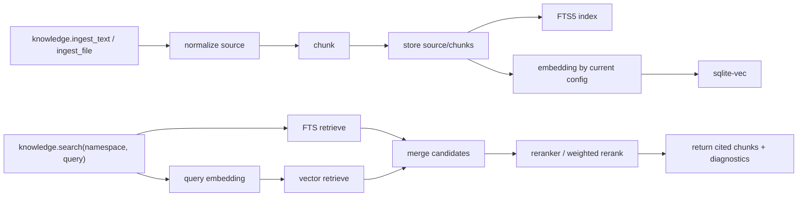

## 0. 术语约定

| 术语 | 定义 | 防冲突结论 |
|---|---|---|
| Knowledge Runtime | runtime 内通用知识检索能力，负责存储、chunk、embedding、索引、检索、重排、引用和 eval | 现有代码没有同名模块；新建 `src/marten_runtime/knowledge/` |
| namespace | 知识库逻辑命名空间，类似库名；如 `fanqie`、`bazi`、`personal` | 现有配置中没有 runtime 级 namespace；仅作为 knowledge 数据隔离键 |
| source | 一次入库的原始知识来源，如一本小说、一份 markdown、一批章节 | 现有 memory 的 `source_excerpt/source_run_id` 语义不同 |
| chunk | source 切分后的最小检索单元 | 现有 session compaction 不使用 chunk 概念；可新增 |
| embedding_config_hash | 当前 embedding 配置的哈希，包含 model、dimension、local_path 等影响向量空间的字段 | 用来判断 namespace 是否需要 reindex |
| vector store | 存储和查询 chunk 向量的轻量本地索引 | 现有 SQLite memory 使用 FTS5；knowledge 独立建表 |
| FTS5 | SQLite 全文倒排索引，负责关键词召回 | FTS5 不是向量库 |
| rerank | 对候选 chunk 二次排序的统一阶段 | 现有 eval grader 有 score，不承担检索排序 |
| reindex | 对已有 chunks 用当前 embedding 配置重新生成向量 | 切换 embedding 后需要 |

术语 grep 结果：`knowledge` 未作为 runtime 模块；`namespace` 未作为 runtime 级数据隔离概念；`chunk` 未作为核心模型；`embedding` 只在早期设计中明确排除过，当前适合作为新 capability 引入。

## 1. 决策与约束

### 需求摘要

实现通用 RAG Runtime Capability。任意上层 agent 通过 `namespace` 使用同一套底层能力：入库、chunk、embedding、FTS/vector/hybrid 检索、rerank、引用、eval。第一阶段只做 runtime 通用能力；番茄小说、八字、个人助手等领域 agent 和采集 adapter 后续接入。

成功标准：

- `knowledge.ingest_text` 能把小文本 source 同步写入指定 namespace，并产生 chunks、FTS 索引和当前 embedding 配置的向量记录。
- `knowledge.ingest_file` 能创建大文件异步入库 job，并返回 `job_id`。
- `knowledge.ingest_status` 能查询大文件入库进度。
- `knowledge.search` 能在指定 namespace 内返回带 score、source、chunk_id、metadata、diagnostics 的结果。
- `knowledge.get_chunk` 能按 namespace + chunk_id 读取原文片段。
- `knowledge.delete_source` 能按 namespace + source_id 软删除 source、chunks 和向量记录。
- `knowledge.reindex` 能按 namespace/source 手动重建向量，并更新 namespace 的 embedding_config_hash。
- eval 能验证关键词召回、语义召回、rerank 排序提升、namespace 隔离、config mismatch 提示。

明确不做：

- 不实现番茄小说、八字或其他领域 agent。
- 不实现网页抓取、登录、反爬、小说站搜索 adapter。
- 不引入外部向量数据库服务。
- 不把 knowledge 注入每轮 prompt；只通过工具调用按需使用。
- 不替换现有 memory；memory 继续存用户偏好和稳定事实。
- 不做 GraphRAG、多模态解析、PDF 表格解析。
- 不把模型文件提交到代码库。

### 关键决策

1. **放置位置**：新增 `src/marten_runtime/knowledge/`，作为 runtime capability，与 `memory/`、`skills/`、`mcp/` 同层。
2. **工具面**：新增 builtin family tool `knowledge`，action 包含 `ingest_text/ingest_file/ingest_status/cancel_ingest/search/get_chunk/delete_source/reindex/stats`。eval 通过 CLI/service 调用。
3. **Skill 辅助面**：新增轻量 `knowledge_management` skill，只说明何时使用 knowledge、namespace 缺失如何追问、搜索如何引用来源、删除/reindex 需要确认；真正执行仍走 builtin tool。
4. **数据隔离**：所有表带 `namespace` 字段；同一个 `source_id` 在不同 namespace 下互相隔离。
5. **默认模型配置**：embedding 使用 `BAAI/bge-small-zh-v1.5`，reranker 使用 `BAAI/bge-reranker-base`。
6. **模型资产边界**：模型文件不进入代码库；通过 `config/knowledge.toml` 指向本地路径，默认放在被 git 忽略的 `data/models/` 下，adapter 懒加载。
7. **模型切换边界**：embedding/reranker 都可通过配置切换；namespace 记录索引时的 embedding_config_hash；切换 embedding 后需要手动执行 `knowledge.reindex --namespace xxx`；第一版不做在线平滑切换。切换 reranker 只影响查询时排序。
8. **向量存储**：第一版使用 SQLite + FTS5 + `sqlite-vec`。FTS5 负责全文倒排索引，`sqlite-vec` 负责向量相似度检索。
9. **检索策略**：默认 hybrid：FTS 候选 + vector 候选合并，再用 reranker 排序；reranker 不可用时退化为 weighted rerank。
10. **测试模型**：单元测试使用 deterministic fake embedder/fake reranker，避免测试依赖模型下载和硬件。

### 技术选型调研

调研记录：`easysdd/features/2026-05-19-knowledge-rag-runtime/knowledge-rag-runtime-selection-research.md`。

当前推荐配置：

```text
Embedding: BAAI/bge-small-zh-v1.5
Reranker: BAAI/bge-reranker-base
Vector store: SQLite + sqlite-vec
Text index: SQLite FTS5
```

重建向量成本是核心原因之一：embedding 模型切换会改变向量空间，旧向量不能与新 query 向量混用。项目仍在第一版设计期，直接使用更强默认模型可降低后续迁移概率。第一版只支持手动 reindex，不做双索引在线迁移、后台 reindex job 或自动增量迁移。

### 主流程概述



关键边界：

- namespace 缺失或非法：返回参数错误。
- source 内容为空：拒绝入库。
- 大文件入库不阻塞对话 turn；`ingest_file` 返回 job_id 后后台处理，Feishu 可通过后续通知或 status 查询反馈进度。
- embedding 未配置或本地模型缺失：ingest 写 source/chunks/FTS，返回 `embedding_status=missing_model` 或 `disabled`；search 的 query embedding 不可用时返回 `KNOWLEDGE_QUERY_EMBEDDING_UNAVAILABLE` 和 `embedding_status`。
- search 发现 namespace 的 embedding_config_hash 与当前 embedding 配置不一致：退化为 FTS-only，返回 `vector_status=config_mismatch`，提示 `knowledge.reindex --namespace xxx`。
- reranker 未配置或本地模型缺失：使用 weighted rerank，返回 `rerank_status=missing_model` 或 `disabled`。
- `sqlite-vec` 可用：512 维 bge-small-zh-v1.5 向量写入 sqlite-vec 索引并用于向量召回；同时保留 JSON 向量记录用于诊断和测试。
- `sqlite-vec` 不可用：允许向量检索 disabled，search 继续走 FTS，并返回 `vector_status=disabled`。
- `sqlite-vec` 已启用但索引行与 embedding 记录不一致：返回 `vector_status=backend_error`，提示执行 `knowledge.reindex --namespace xxx`。
- 同一 namespace 下重复导入相同 `uri + version`：复用原 `source_id` 并替换该 source 的 chunks，避免重复搜索结果。
- delete source：软删除，保留 search/eval run 可追溯记录。
- ingest job 状态持久化到 SQLite；进程重启后 terminal 状态可查询，running 状态按 failed/retryable_degraded 处理，不承诺断点续跑。

## 2. 接口契约

### 2.1 builtin tool: `knowledge`

注册位置：`/Users/litiezhu/workspace/github/marten-runtime/src/marten_runtime/interfaces/http/runtime_tool_registration.py register_family_tools`

#### ingest_text

输入：

```json
{
  "action": "ingest_text",
  "namespace": "fanqie",
  "source": {
    "title": "示例小说第一卷",
    "kind": "text",
    "uri": "local://fanqie/demo-001",
    "text": "第一章 ...\n\n第二章 ...",
    "metadata": {"domain": "novel", "novel_id": "demo-001", "author": "unknown"}
  }
}
```

输出：

```json
{
  "ok": true,
  "action": "ingest_text",
  "namespace": "fanqie",
  "source_id": "src_abc123",
  "chunk_count": 12,
  "embedding_status": "embedded",
  "vector_store_status": "indexed"
}
```

错误：

```json
{"ok": false, "error_code": "KNOWLEDGE_SOURCE_TEXT_REQUIRED", "message": "source.text is required for text ingest"}
```

// 来源：`runtime_tool_registration.py register_family_tools` 的 builtin family tool 模式


#### ingest_file

输入：

```json
{
  "action": "ingest_file",
  "namespace": "fanqie",
  "file_path": "/absolute/path/to/novel.txt",
  "source": {
    "title": "示例小说全集",
    "kind": "txt",
    "uri": "file:///absolute/path/to/novel.txt",
    "metadata": {"domain": "novel", "novel_id": "demo-001"}
  }
}
```

输出：

```json
{
  "ok": true,
  "action": "ingest_file",
  "namespace": "fanqie",
  "job_id": "kjob_abc123",
  "status": "queued",
  "message": "已开始写入知识库，可用 knowledge.ingest_status 查询进度"
}
```

#### ingest_status

输入：

```json
{"action": "ingest_status", "namespace": "fanqie", "job_id": "kjob_abc123"}
```

输出：

```json
{
  "ok": true,
  "job_id": "kjob_abc123",
  "status": "embedding",
  "source_title": "示例小说全集",
  "chunks_total": 3000,
  "chunks_embedded": 860,
  "percent": 28.6,
  "message": "正在写入知识库：已完成 860/3000 chunks"
}
```

job 状态：`queued/reading/chunking/embedding/completed/failed/cancelled`。

#### cancel_ingest

输入：

```json
{"action": "cancel_ingest", "namespace": "fanqie", "job_id": "kjob_abc123"}
```

输出：

```json
{"ok": true, "job_id": "kjob_abc123", "status": "cancelled"}
```

Feishu 对话约束：大文件入库期间，channel 侧应先回复已开始，后续通过进度查询或完成通知反馈；不让用户等待整个入库过程结束。

#### search

输入：

```json
{
  "action": "search",
  "namespace": "fanqie",
  "query": "主角第一次遇到师父是哪一章",
  "top_k": 5,
  "filters": {"novel_id": "demo-001"}
}
```

输出：

```json
{
  "ok": true,
  "action": "search",
  "namespace": "fanqie",
  "query": "主角第一次遇到师父是哪一章",
  "retrieval_mode": "hybrid_rerank",
  "embedding_status": "available",
  "vector_status": "available",
  "rerank_status": "available",
  "results": [
    {
      "chunk_id": "chk_001",
      "source_id": "src_abc123",
      "source_title": "示例小说第一卷",
      "heading": "第三章 山门相遇",
      "text": "...",
      "score": 0.87,
      "score_parts": {"fts": 0.42, "vector": 0.78, "reranker": 0.91, "metadata": 0.1},
      "metadata": {"novel_id": "demo-001", "chapter_order": 3}
    }
  ]
}
```

config mismatch 输出：

```json
{
  "ok": true,
  "retrieval_mode": "fts_only",
  "vector_status": "config_mismatch",
  "degraded_reason": "Namespace fanqie was indexed with a different embedding config. Run knowledge.reindex --namespace fanqie before using current embedding vectors."
}
```

// 来源：`ToolRegistry.register` 的 `parameters_schema` + `tool_metadata` 暴露模式

#### get_chunk

输入：

```json
{"action": "get_chunk", "namespace": "fanqie", "chunk_id": "chk_001"}
```

输出：

```json
{"ok": true, "chunk": {"chunk_id": "chk_001", "source_id": "src_abc123", "text": "完整 chunk 文本", "metadata": {"chapter_order": 3}}}
```

#### delete_source

输入：

```json
{"action": "delete_source", "namespace": "fanqie", "source_id": "src_abc123"}
```

输出：

```json
{"ok": true, "deleted_source_id": "src_abc123", "deleted_chunk_count": 12}
```

#### reindex

输入：

```json
{"action": "reindex", "namespace": "fanqie", "source_id": "src_abc123"}
```

输出：

```json
{
  "ok": true,
  "action": "reindex",
  "namespace": "fanqie",
  "model_id": "BAAI/bge-small-zh-v1.5",
  "reindexed_chunk_count": 12,
  "embedding_config_hash_updated": true
}
```

说明：`knowledge.reindex --namespace xxx` 总是读取当前 `config/knowledge.toml [knowledge.embedding]` 配置生成向量。

切换 embedding 标准流程：

```text
1. 修改 config/knowledge.toml 的 [knowledge.embedding]
2. 准备对应 local_path 模型文件
3. 执行 knowledge.reindex --namespace fanqie
4. search 使用新的 embedding_config_hash 对应向量
```

### 2.2 Python service API

新增服务：`KnowledgeService`

```python
service.ingest_text(namespace: str, source: KnowledgeSourceInput) -> KnowledgeIngestResult
service.ingest_file(namespace: str, file_path: str, source: KnowledgeSourceInput) -> KnowledgeIngestJobResult
service.ingest_status(namespace: str, job_id: str) -> KnowledgeIngestJobStatus
service.cancel_ingest(namespace: str, job_id: str) -> KnowledgeIngestJobStatus
service.search(namespace: str, query: str, filters: dict | None, top_k: int) -> KnowledgeSearchResult
service.get_chunk(namespace: str, chunk_id: str) -> KnowledgeChunk | None
service.delete_source(namespace: str, source_id: str) -> KnowledgeDeleteResult
service.reindex(namespace: str, source_id: str | None = None) -> KnowledgeReindexResult
service.stats(namespace: str | None = None) -> KnowledgeStats
```

// 来源：`ThinMemoryService` 的 service/store 分层模式

### 2.3 数据模型

SQLite 主库：`data/knowledge/knowledge.sqlite3`

```text
knowledge_sources(namespace, source_id, kind, title, uri, version, metadata_json, status, created_at, updated_at)
knowledge_chunks(namespace, chunk_id, source_id, heading, ordinal, text, token_estimate, metadata_json, status, created_at, updated_at)
knowledge_namespaces(namespace, embedding_config_hash, created_at, updated_at)
knowledge_embeddings(namespace, chunk_id, model_id, dimension, embedding_config_hash, vector_json, status, created_at, updated_at)
knowledge_embedding_vec_map(vec_rowid, namespace, chunk_id, embedding_config_hash, dimension, created_at, updated_at)
knowledge_ingest_jobs(namespace, job_id, source_title, status, chunks_total, chunks_embedded, percent, message, error, created_at, updated_at)
knowledge_search_runs(run_id, namespace, query, filters_json, result_count, retrieval_mode, degraded_reason, created_at)
```

FTS：

```text
knowledge_chunks_fts(chunk_id UNINDEXED, namespace UNINDEXED, title, heading, text)
```

### 2.4 配置面

新增 `config/knowledge.example.toml`，本地覆盖 `config/knowledge.toml`：

```toml
[knowledge]
db_path = "data/knowledge/knowledge.sqlite3"
default_namespace = "personal"
model_idle_ttl_seconds = 300

[knowledge.chunking]
target_chars = 1000
overlap_chars = 150
max_chars = 1600
batch_size = 64

# chunking 参数是 RAG 效果调参入口。修改后需重新 ingest 或 reindex 对应 namespace。

[knowledge.embedding]
enabled = true
provider = "flag_embedding"
model = "BAAI/bge-small-zh-v1.5"
local_path = "data/models/embeddings/BAAI/bge-small-zh-v1.5"
dimension = 512
allow_remote_download = false
use_fp16 = false

[knowledge.reranker]
enabled = true
provider = "flag_embedding"
model = "BAAI/bge-reranker-base"
local_path = "data/models/rerankers/BAAI/bge-reranker-base"
allow_remote_download = false
use_fp16 = false
top_n = 10

[knowledge.vector_store]
backend = "sqlite_vec"
enabled = true

[knowledge.search]
default_top_k = 5
candidate_pool = 30
fts_weight = 0.35
vector_weight = 0.55
metadata_weight = 0.10
reranker_weight = 0.70
```


### 2.5 Skill 辅助契约

新增文件型 skill：`skills/knowledge_management/SKILL.md`。

职责：

- 说明用户要求“写入知识库 / 搜索知识库 / 查看入库进度 / 重建索引 / 删除知识源”时应使用 `knowledge` builtin tool。
- namespace 缺失时只追问一个最小问题：写入或搜索哪个 namespace。
- 大文件入库时先调用 `knowledge.ingest_file`，拿到 `job_id` 后给用户返回“已开始 + 如何查进度”。
- 搜索结果必须带引用来源：`source_id/title/heading/chunk_id`。
- 删除 source、取消 ingest、reindex 属于有影响操作，执行前需要用户明确确认。

边界：

- skill 不执行入库、检索、删除、reindex。
- skill 不保存状态。
- skill 不做 host 侧意图识别。
- LLM 根据当前消息和 skill 规则决定是否调用 builtin `knowledge`。

示例：

```text
用户：把这个小说文件写入 fanqie 知识库
LLM：调用 knowledge.ingest_file(namespace="fanqie", ...)

用户：查 fanqie 知识库里主角第一次遇到师父是哪一章
LLM：调用 knowledge.search(namespace="fanqie", query="主角第一次遇到师父是哪一章")
```

## 3. 实现提示

### 改动计划

新增模块优先：

- 新建 `src/marten_runtime/knowledge/models.py`
- 新建 `src/marten_runtime/knowledge/config.py`
- 新建 `src/marten_runtime/knowledge/chunking.py`
- 新建 `src/marten_runtime/knowledge/embeddings.py`
- 新建 `src/marten_runtime/knowledge/rerankers.py`
- 新建 `src/marten_runtime/knowledge/sqlite_store.py`
- 新建 `src/marten_runtime/knowledge/retrieval.py`
- 新建 `src/marten_runtime/knowledge/jobs.py`
- 新建 `src/marten_runtime/knowledge/service.py`
- 新建 `src/marten_runtime/tools/builtins/knowledge_tool.py`
- 新建 `skills/knowledge_management/SKILL.md`
- 追加 `src/marten_runtime/runtime/capabilities.py`：knowledge capability declaration
- 追加 `src/marten_runtime/interfaces/http/bootstrap_runtime.py`：初始化 `KnowledgeService`
- 追加 `src/marten_runtime/interfaces/http/runtime_tool_registration.py`：注册 `knowledge`
- 追加 `config/knowledge.example.toml`
- 追加 `.gitignore`：`data/models/`
- 追加 eval suite：`evals/suites/knowledge_retrieval.toml`
- 追加 eval cases：`evals/cases/knowledge_retrieval/*.toml`

### 推进顺序

1. **配置解析**：解析 `config/knowledge*.toml`，支持 embedding/reranker 的 model、local_path、allow_remote_download。退出信号：配置解析测试通过。
2. **数据模型与 SQLite store**：完成 sources/chunks/FTS/embeddings 表、namespace 过滤、软删除。退出信号：store 单测通过。
3. **chunking**：实现中文友好的 heading/paragraph chunker，chunk size / overlap / batch_size 全部来自配置。退出信号：chunk overlap、ordinal、metadata 继承和配置调参单测通过。
4. **embedding adapter**：实现 fake embedder + BGE adapter，懒加载模型，缺失时 degraded。退出信号：fake embedder、missing model、config mismatch 单测通过。
5. **vector store adapter**：接入 `sqlite-vec`，不可用时保留 FTS-only。退出信号：向量写入/查询或 degrade 单测通过。
6. **reranker adapter**：实现 fake reranker + BGE reranker adapter，缺失时 weighted rerank。退出信号：fake reranker 和 disabled degrade 单测通过。
7. **retrieval + rerank**：实现 FTS/vector merge、score_parts、metadata filter、top_k、reranker top_n。退出信号：namespace 隔离和 hybrid+rerank 排序单测通过。
8. **reindex**：实现手动 `knowledge.reindex --namespace xxx`，按 namespace/source 重建向量并更新 namespace embedding_config_hash。退出信号：config mismatch 时 search 提示 reindex，reindex 后恢复 vector 检索。
9. **大文件异步 ingest job**：实现 `ingest_file/ingest_status/cancel_ingest`，分批读取、分批 chunk、分批 embedding、记录进度。退出信号：几百万字 fixture 可返回 job_id 并查询进度，取消可生效。
10. **knowledge tool + skill 接入 runtime**：注册 family tool，补 capability schema，新增 `knowledge_management` skill。退出信号：runtime tool 注册测试和 skill load 测试通过。
11. **eval suite**：增加 retrieval eval family/cases/report 字段。退出信号：`knowledge_retrieval` scripted eval 通过。
12. **docs/config**：补 README/CONFIG_SURFACES/ARCHITECTURE_CHANGELOG。退出信号：文档路径可从 README 找到，配置模板解析测试通过。

### 测试设计

- Config：embedding/reranker model、local_path、allow_remote_download、模型路径缺失错误。
- Store：namespace 隔离、source soft delete、FTS 不返回 deleted chunks。
- Chunking：中文段落、标题、长段落切分、chunk size 配置、overlap、metadata 继承。
- Embedding：fake embedder deterministic；BGE adapter 可被 mock；模型加载失败进入 degraded；namespace config mismatch 被识别并提示 reindex。
- Vector：sqlite-vec 可用路径和 unavailable degrade。
- Reranker：fake reranker 排序、BGE reranker adapter mock、reranker disabled degrade。
- Retrieval：FTS-only、vector-only、hybrid merge、metadata filter、top_k、rerank 排序提升。
- Reindex：手动按 namespace/source 重建，config mismatch 提示，完成后 namespace embedding_config_hash 更新。
- Tool：ingest_text/ingest_file/ingest_status/cancel_ingest/search/get_chunk/delete_source/reindex 参数校验和错误码。
- Skill：namespace 缺失时追问、搜索要求引用来源、删除/reindex 需要确认、只说明流程不执行状态变更。
- Eval：关键词召回、语义召回、rerank 顺序提升、namespace 隔离、config mismatch 提示。
- Runtime：`allowed_tools` 中包含 `knowledge` 时可见；未包含时不可见。

### 高风险约束

- 模型下载不能阻塞普通 runtime 启动；embedding/reranker adapter 必须懒加载。
- 模型文件不能提交进仓库；`data/models/` 必须加入 `.gitignore`。
- 第一版 `allow_remote_download=false`，避免请求过程中隐式下载大模型。
- embedding 模型切换后必须通过 `model_id + dimension + embedding_config_hash` 区分旧向量，避免混用不同模型生成的向量。
- reindex 可能慢；第一版只提供手动同步命令用于小规模闭环，后续再评估后台 job。
- 第一版不实现双索引在线迁移、后台 reindex job、自动增量迁移或旧/新模型混用。
- 默认依赖不能强制所有部署安装大模型运行库；`FlagEmbedding`、`sentence-transformers` 和 `sqlite-vec` 应作为可选依赖或明确进入 requirements 后给出 degrade 策略。
- `knowledge` 不能变成 memory 替代品；memory 写偏好，knowledge 写可检索文档。
- 不写 host 侧意图识别器；用户意图由 LLM 结合 `knowledge_management` skill 和 capability declaration 判断。
- 大文件入库可能持续数分钟；Feishu 等 channel 必须给出已开始/进行中/完成/失败反馈，不同步等待整个 job 完成。
- 第一版 ingest job 只保证状态可查询和取消请求生效；不承诺断点续跑。

## 4. 与项目级架构文档的关系

关联文档：

- `README.md`：新增 Knowledge Runtime。
- `docs/CONFIG_SURFACES.md`：新增 `config/knowledge.example.toml`、`data/knowledge/`、`data/models/`。
- `docs/ARCHITECTURE_EVOLUTION.md`：把 Knowledge Runtime 描述成 capability surface 的新切片。
- `docs/ARCHITECTURE_CHANGELOG.md`：记录能力进入主链的原因和验证命令。
- `docs/architecture/adr/0001-thin-harness-boundary.md`：保持 host 侧只做检索基础设施，工具选择仍在 LLM path。

外部选型依据见调研文档“来源”章节。


## Model unload policy update

- Local embedding/reranker models use lazy loading. Service startup creates adapters only.
- `knowledge.model_status` returns `not_loaded` / `loaded`, `model_id`, `last_used_at`, and `idle_ttl_seconds`.
- `knowledge.unload_models` manually releases embedding and reranker model objects and runs Python/accelerator cache cleanup.
- `model_idle_ttl_seconds` controls automatic unload at knowledge tool boundaries.
- Each knowledge operation checks idle TTL before and after model work.
